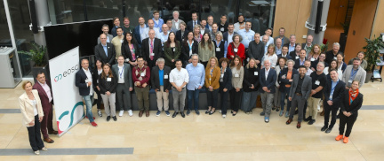
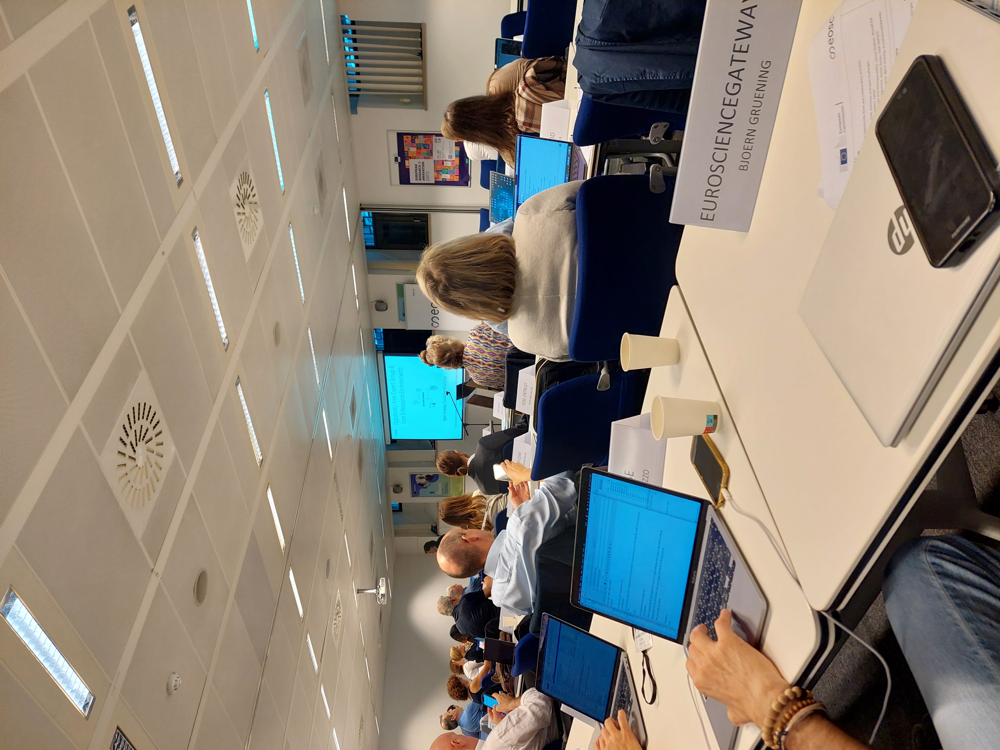
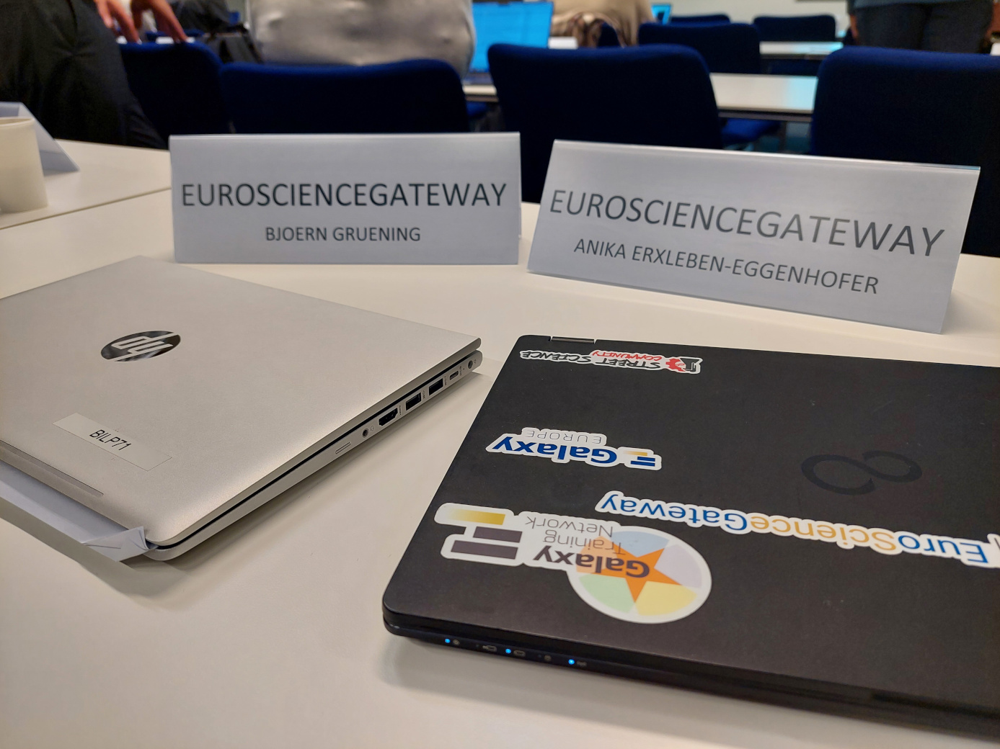
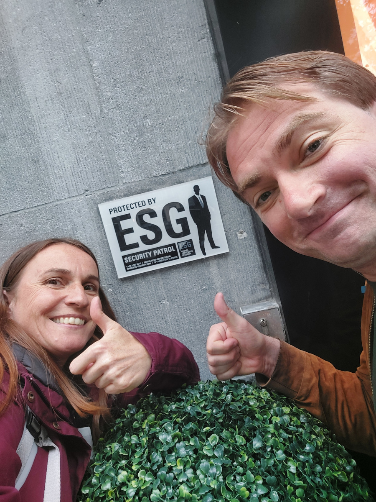

# EOSC Coordination Meeting, Brussels: June 20-21, 2024

The European Commission gathers all 25 EOSC-related projects to align on the next steps for EOSC implementation. The European Galaxy Team as part of the EOSC EuroScienceGateway project were joining this political meeting.

**The European Open Science Cloud (EOSC) has two major roles:**

- A policy process to mobilise, align and scale resources to accelerate Open Science, higher quality and productivity and reproducibility in research; and
- A trusted federation of collaborative and autonomous infrastructures combined into a system of systems to enable European researchers to store, share, process, analyse and reuse research digital objects.

**EOSC Opportunity Area (OA) Expert Groups**

EOSC has 6 Expert groups on different topics:

- OA Expert Group 1: Persistent Identifiers
- OA Expert Group 2: Metadata, Ontologies and Interoperability
- OA Expert Group 3: FAIR Assessment and Alignment
- OA Expert Group 4: User and Resource Environments
- OA Expert Group 5: Skills, Training, Rewards, Recognition and Upscaling
- OA Expert Group 6: Open Scholarly Communication

Björn presented results from OA4.

## EOSC Federation

The vision for EOSC is to put in place a system in Europe to find and access data and services for research and innovation. This is to help researchers store, share, process, analyse and reuse FAIR research outputs within and across disciplines and borders.
The deployment of a network between data repositories and services will be instrumental for Open Science to progress in Europe. For this, the EOSC Federation of nodes is being created. The [EuroScienceGateway project](https://eurosciencegateway.eu) is heavily build on the Galaxy infrastructure, and Galaxy-EU is discussing its potential role here.

## The Brussels Trip

Coordination meetings are quite intense and are very different from scientific meetings. We were happy to meet friends and project partners there and spent two nice days in Brussels.

