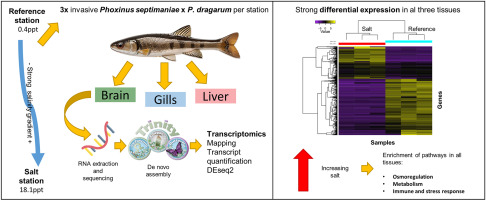

# Galaxy in Research: Molecular secrets of minnow adaptation to salinity stress

Freshwater salinization poses a growing threat to freshwater biodiversity worldwide, particularly impacting fish populations. A recent study conducted by Camilo Escobar-Sierra, Miguel Cañedo-Argüelles, Dolors Vinyoles, and Kathrin P. Lampert delves into this issue, exploring the molecular responses of non-native minnows to salinity stress in the Llobregat River, Barcelona, Spain. With the help of Galaxy, the research provides crucial insights into the genetic and physiological adaptations of these fish in a salinized environment.

## Research Overview
The study, titled "Unraveling the molecular mechanisms of fish physiological response to freshwater salinization: A comparative multi-tissue transcriptomic study in a river polluted by potash mining," focuses on a non-native minnow species (Phoxinus septimaniae x P. dragarum) exposed to saline effluents from potash mines. Through high-throughput mRNA sequencing and differential gene expression analyses on brain, gill, and liver tissues from fish collected upstream and downstream of the saline effluent discharge, the researchers uncovered the intricate molecular mechanisms underlying salinity stress responses.

(Escobar-Sierra et al., 2024)

## Key Findings

•	__Adaptation to Salt Stress:__ Minnows demonstrate crucial molecular responses for survival under salt stress.

•	__Transcriptomic Insights:__ Salinity stress impacts gill, liver, and brain pathways, with the brain showing the highest number of differentially expressed genes, highlighting its unique sensitivity.

•	__Pathway Analysis:__ Ion transport and osmoregulation pathways were enriched across all tissues. Additionally, tissue-specific pathways related to stress, reproduction, growth, immune responses, methylation, and neurological development were identified.

•	__Conservation Strategies:__ The findings offer potential strategies for the conservation and management of freshwater ecosystems facing salinization.

## Galaxy's Role

Galaxy played an important role in this research, facilitating the comprehensive transcriptomic analysis. The platform's robust tools enabled high-throughput mRNA sequencing and differential gene expression analyses, ensuring the accuracy and consistency of the findings through rigorous validation with quantitative PCR (qPCR).

## Significance of Study

This study helps broaden researchers' understanding of the genetic and physiological mechanisms driving fish responses to salinity stress, offering essential knowledge for preserving and managing freshwater ecosystems. By leveraging Galaxy, the researchers unveiled the intricate molecular adaptations of minnows, providing a foundation for future conservation efforts in salinized environments.

## Acknowledgement 

Galaxy sends a huge ‘thank you’ to the authors, Camilo Escobar-Sierra, Miguel Cañedo-Argüelles, Dolors Vinyoles, and Kathrin P. Lampert, for their outstanding research and valuable contributions to understanding fish physiological responses to freshwater salinization. Their work not only advances scientific knowledge but also demonstrates the versatility and power of the Galaxy platform in facilitating comprehensive transcriptomic analyses. Thank you for choosing Galaxy to support your important research.

*Stay tuned for more updates on Galaxy-enabled research and scientific discovery.*

--- <be> 

Camilo Escobar-Sierra, Miguel Cañedo-Argüelles, Dolors Vinyoles, Kathrin P. Lampert,
Unraveling the molecular mechanisms of fish physiological response to freshwater salinization: A comparative multi-tissue transcriptomic study in a river polluted by potash mining, Environmental Pollution, Volume 357, 2024, 124400, ISSN 0269-7491, https://doi.org/10.1016/j.envpol.2024.124400.

