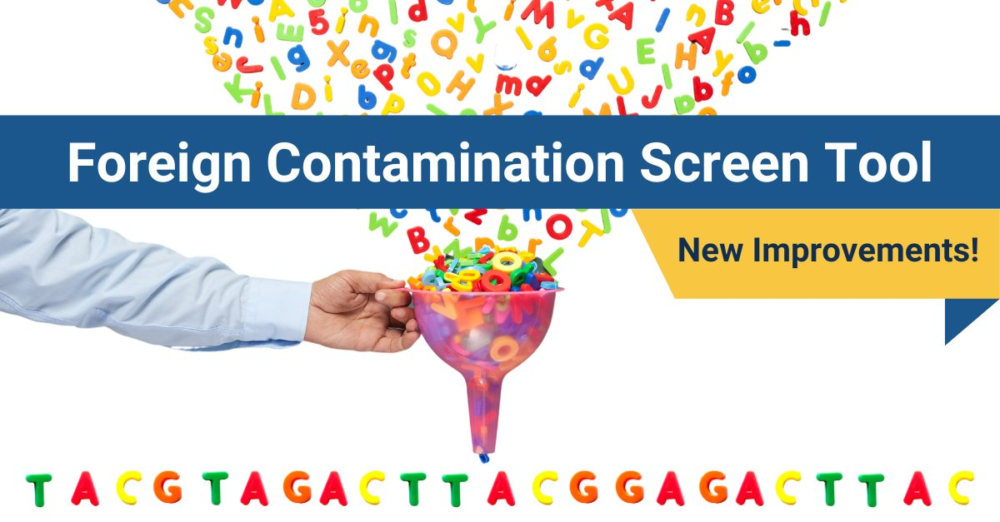

# Foreign Contamination Screen Tool: Now Available in Galaxy!
## *Check out our latest enhancements.*
Do you submit genome assembly data to [GenBank](https://www.ncbi.nlm.nih.gov/genbank/?utm_source=ncbi_insights&utm_medium=referral&utm_campaign=fcs-enhancements-20240307)? If so, try out NCBI’s [Foreign Contamination Screen (FCS) tool](https://github.com/ncbi/fcs), a quality assurance process that you can run yourself. We will screen all prokaryotic and eukaryotic genome submissions to GenBank with this tool, but we encourage you to screen your data before submitting to save time. FCS offers sensitive contaminant detection to increase the quality of your genome submissions to GenBank. As part of our ongoing effort to improve your experience, we recently made several enhancements. 

### What's new?
- Now available in Galaxy for [genome cross-species screening (GX)](https://usegalaxy.org/?tool_id=toolshed.g2.bx.psu.edu%2Frepos%2Fiuc%2Fncbi_fcs_gx%2Fncbi_fcs_gx%2F0.5.0%2Bgalaxy0&version=latest) and [adaptor screening](https://usegalaxy.org/root?tool_id=toolshed.g2.bx.psu.edu%2Frepos%2Frichard-burhans%2Fncbi_fcs_adaptor%2Fncbi_fcs_adaptor%2F0.5.0%2Bgalaxy0) to make it even easier to run
- Further reduced false positives
- Improved and updated documentation
- Better detection of adaptor sequences

See our (NCBI) [release notes](https://github.com/ncbi/fcs/releases/tag/v0.5.0) for additional details.  

### Learn More
FCS is available on [GitHub](https://github.com/ncbi/fcs/). For more information about FCS and for step-by-step instructions on how to use it, check out our [help documentation](https://github.com/ncbi/fcs/wiki/FCS-GX).

Read all about FCS in our [recent publication](https://www.ncbi.nlm.nih.gov/pmc/articles/PMC10898089/?utm_source=ncbi_insights&utm_medium=referral&utm_campaign=fcs-enhancements-20240307) in Genome Biology.

### Stay up to Date
FCS is part of the [NIH Comparative Genomics Resource (CGR)](https://www.ncbi.nlm.nih.gov/datasets/cgr/). CGR facilitates reliable comparative genomics analyses for all eukaryotic organisms through an NCBI Toolkit and community collaboration.  

Follow us on social [@NCBI](https://twitter.com/ncbi) and join our [mailing list](https://public.govdelivery.com/accounts/USNLMOCPL/subscriber/new?topic_id=USNLMOCPL_50%22) to keep up to date with FCS and other CGR news.

### Questions?
We want to hear from you! Try it out and let us know what you think. We are making ongoing improvements based on your feedback. If you have questions or would like to provide feedback, please reach out to us at info@ncbi.nlm.nih.gov.  

