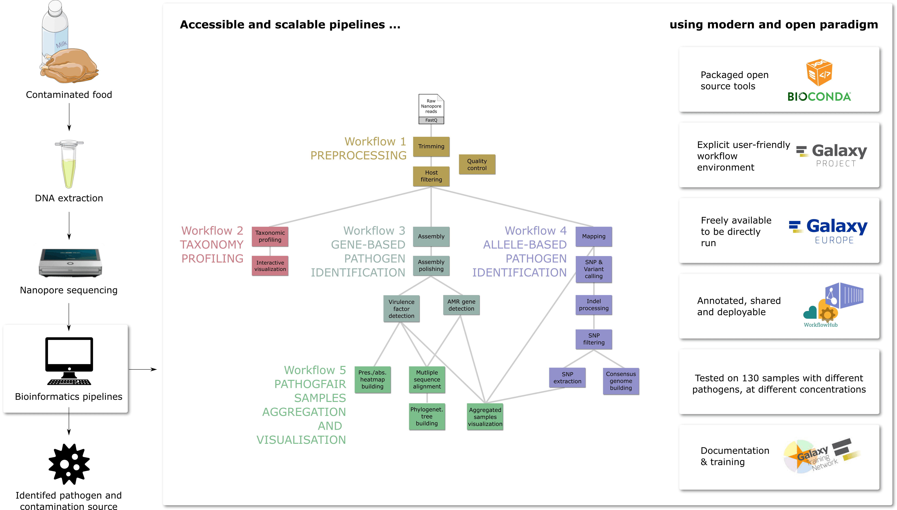

We are happy to share our new preprint bioRXiv: [**PathoGFAIR: a collection of FAIR and adaptable (meta)genomics workflows for (foodborne) pathogens detection and tracking**](https://www.biorxiv.org/content/10.1101/2024.06.26.600753v1).

## Background

Food contamination by pathogens poses a global health threat, affecting an estimated 600 million people annually. During a foodborne outbreak investigation, microbiological analysis of food vehicles detects responsible pathogens and traces contamination sources. Metagenomic approaches offer a comprehensive view of the genomic composition of microbial communities, facilitating the detection of potential pathogens in samples. Combined with sequencing techniques like Oxford Nanopore sequencing, such metagenomic approaches become faster and easier to apply. **A key limitation of these approaches is the lack of accessible, easy-to-use, and openly available pipelines for pathogen identification and tracking from (meta)genomic data.**

### PathoGFAIR

PathoGFAIR is a collection of **5 Galaxy-based FAIR** workflows employing state-of-the-art tools to **detect and track pathogens from metagenomic Nanopore sequencing**. Although initially developed for foodborne pathogen data, the workflows can **be applied to any metagenomic Nanopore pathogenic data**. PathoGFAIR incorporates **visualisations and reports** for comprehensive results. 

We tested PathoGFAIR on **130 benchmark samples** containing different pathogens from multiple hosts under various experimental conditions. Workflows have successfully detected and tracked expected pathogens at least at the species rank in both pathogen-isolated and non-pathogen-isolated samples with sufficient Colony-forming unit and Cycle Threshold values.

PathoGFAIR detects the pathogens or the subspecies of the pathogens in any sample, regardless of whether the sample is isolated or incubated before sequencing. 

Importantly, PathoGFAIR is **easy to use** and can be **straightforwardly adapted and extended** for other types of analysis and sequencing techniques, making it usable in various pathogen detection scenarios.

[PathoGFAIR Webpage](https://usegalaxy-eu.github.io/PathoGFAIR/)

## Workflows

| Workflow Name | WorkflowHub | Dockstore | Galaxy Servers |
|---------------|-------------|-----------|----------------|
| Nanopore **Preprocessing**  (v 0.1)  | [ID 1061 v 0.1](https://workflowhub.eu/workflows/1061) | [nanopore-pre-processing/main:v0.1](https://dockstore.org/workflows/github.com/iwc-workflows/nanopore-pre-processing/main) | [European Galaxy Server](https://usegalaxy.eu/published/workflow?id=a705370bc2c13d5c), [United States Galaxy Server](https://usegalaxy.org/published/workflow?id=574e42683dc3961b), [Australian Galaxy Server](https://usegalaxy.org.au/published/workflow?id=25d52afddaa3451b) |
| **Taxonomy Profiling** and Visualization with Krona  (v 0.1)  | [ID 1059 v 0.1](https://workflowhub.eu/workflows/1059) | [taxonomy-profiling-and-visualization-with-krona/main:v0.1](https://dockstore.org/workflows/github.com/iwc-workflows/taxonomy-profiling-and-visualization-with-krona/main) | [European Galaxy Server](https://usegalaxy.eu/published/workflow?id=10101558b211a782), [United States Galaxy Server](https://usegalaxy.org/published/workflow?id=8f5904693b5f74f4), [Australian Galaxy Server](https://usegalaxy.org.au/published/workflow?id=d9ba165e6ae55417) |
| **Gene-based Pathogen Identification**  (v 0.1)  | [ID 1062 v 0.1](https://workflowhub.eu/workflows/1062) | [gene-based-pathogen-identification/main:v0.1](https://dockstore.org/workflows/github.com/iwc-workflows/gene-based-pathogen-identification/main) | [European Galaxy Server](https://usegalaxy.eu/published/workflow?id=585c21b7b1d864fc), [United States Galaxy Server](https://usegalaxy.org/published/workflow?id=cce88bc57b180d09), [Australian Galaxy Server](https://usegalaxy.org.au/published/workflow?id=ef8c22c2525063a2) |
| **Allele-based Pathogen Identification**  (v 0.1)  | [ID 1063 v 0.1](https://workflowhub.eu/workflows/1063) | [allele-based-pathogen-identification/main:v0.1](https://dockstore.org/workflows/github.com/iwc-workflows/allele-based-pathogen-identification/main) | [European Galaxy Server](https://usegalaxy.eu/published/workflow?id=09c7069ae409c362), [United States Galaxy Server](https://usegalaxy.org/published/workflow?id=38911ba6f66d80f6), [Australian Galaxy Server](https://usegalaxy.org.au/published/workflow?id=244ea5e94237ebad) |
| Pathogen Detection **PathoGFAIR Samples Aggregation and Visualisation**  (v 0.1)  | [ID 1060 v 0.1](https://workflowhub.eu/workflows/1060) | [pathogen-detection-pathogfair-samples-aggregation-and-visualisation/main:v0.1](https://dockstore.org/workflows/github.com/iwc-workflows/pathogen-detection-pathogfair-samples-aggregation-and-visualisation/main) | [European Galaxy Server](https://usegalaxy.eu/published/workflow?id=376119528377a3ae), [United States Galaxy Server](https://usegalaxy.org/published/workflow?id=2d3063882d8239ff), [Australian Galaxy Server](https://usegalaxy.org.au/published/workflow?id=eda40b58616a0fe4)|
| **PathoGFAIR** 5in1  (v 0.1)  | Soon | Soon | [European Galaxy Server](https://usegalaxy.eu/published/workflow?id=0dce37adb369492c), [United States Galaxy Server](https://usegalaxy.org/published/workflow?id=e55593af91337a05), [Australian Galaxy Server](https://usegalaxy.org.au/published/workflow?id=f5f9808fb50b6f2c)|

## Training Material

To assist users in understanding and using the workflows, we have provided extensive training material as a [tutorial via the Galaxy Training Network (GTN)](https://bit.ly/pathogen-tuto).

This tutorial has been used as training support in multiple workshops and conferences' training sessions:

1. A [1-day workshop early 2023](/events/2023-02-02-foodborne-pathogen-detection-workshop/) in FHNW in Muttenz, Switzerland that received [highly positive feedback](/news/2023-03-21-foodborne-training/)
2. A 1-day session in several **High-Throughput Data Analysis with Galaxy** workshops delivered in Freiburg with the next iteration will be on [July 26th 2024](/events/2024-07-22-galaxy-workshop-freiburg/).
3. A 2-hour workshop during the Galaxy Community Conference [GCC 2024](/events/gcc2024/training/microbiome-analysis).

## Funding

The PathoGFAIR project was funded via [EOSC life industry call 2021](https://www.eosc-life.eu/industrycall/) ([news about the award](/news/2021-12-08-pathogen-detection-eosc-life-grant/))

<embed src="https://www.biorxiv.org/content/10.1101/2024.06.26.600753v1.full.pdf" width="100%" height="700" type='application/pdf'>

