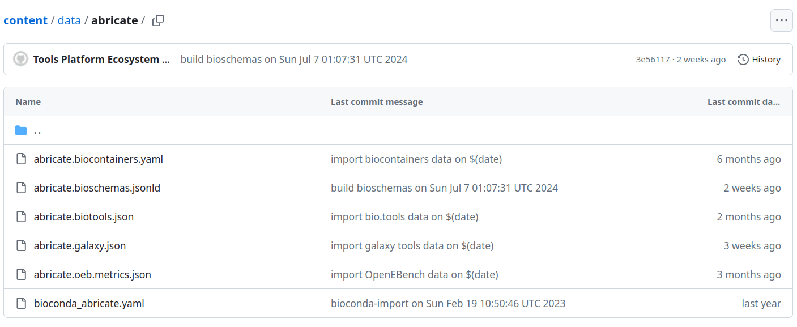

# The ELIXIR Research Software Ecosystem (RSEc) and the Galaxy Codex - powerful GitHub Bot architectures to collect research software metadata

## ELIXIR Research Software Ecosystem (RSEc)

The [ELIXIR Research Software Ecosystem (RSEc)](https://research-software-ecosystem.github.io/index) is supported and coordinated by [ELIXIR Europe](https://elixir-europe.org/).
It makes use of a sophisticated CI architecture that collects metadata for research software metadata, providing a unified resource for researchers, developers and curators. 

The RSEc collects metadata from [bio.tools](https://bio.tools), [Bioconda](https://bioconda.github.io/), BioContainers, [Debian Med](https://www.debian.org/devel/debian-med/index.de.html), [Galaxy CoDex](https://github.com/galaxyproject/galaxy_codex),
[OpenEBench](https://openebench.bsc.es), and [WorkflowHub](https://workflowhub.eu/). This metadata is made available in the [RSEc content repository](https://github.com/research-software-ecosystem/content).
More information about the sources can be found [here](https://research-software-ecosystem.github.io/sources).

The CI architecture is [openly available](https://github.com/research-software-ecosystem/utils) and can be adapted and leveraged to integrate other metadata sources as well.
The architecture was recently extended to include metadata from the Galaxy Codex.

The CI bots perform the following tasks weekly:

* Download dumps of all metadata sources into the content repository
* Store the metadata entries for each tool, from all sources, in a dedicated folder in the content repository

## The Galaxy Codex

[Galaxy Communities Dock aka Galaxy Codex](https://github.com/galaxyproject/galaxy_codex) is a catalog of Galaxy resources (tools, training, workflows) that can be filtered for any community.
In this blog post, we only cover the tool aspect of the catalog since this is used as the source for the contribution of Galaxy to the RSEc.

### Tool metadata collection

A GitHub action performs the following steps every week:

- Extract all tools by
    1. Parsing tool GitHub repository from [Planemo monitor listed](https://github.com/galaxyproject/planemo-monitor)
    2. Checking in each repo, their `.shed.yaml` file and filter for categories, such as metagenomics 
    3. Extracting metadata from the `.shed.yaml`
    4. Extracting the `requirements` from the Galaxy tool metadata (XML files) to get the exact version supported in Galaxy
    5. Checking available against conda version
    6. Extracting bio.tools information from the Galaxy tool metadata (XML files) if available
    7. Checking the availability of the tool on one of the 3 main Galaxy instances (usegalaxy.eu, usegalaxy.org, usegalaxy.org.au)
    8. Getting usage statistics from usegalaxy.eu
- Create an interactive table for all tools: [All tools](https://galaxyproject.github.io/galaxy_codex/)
- Filter the tool suite per community
- Create a separate interactive table for all registered communities, e.g. [microGalaxy](https://galaxyproject.github.io/galaxy_tool_metadata_extractor/microgalaxy/)

### Tool metadata output

The script will generate a registry with each tool found in the list of GitHub repositories and metadata for these tools:

* Galaxy wrapper id (the name of the suite folder)
* Galaxy tool ids (IDs of the tools in the suite)
* Description (Description from the .shed file)
* bio.tool id (the bio.tools ID from the wrapper - the first found in the suite)
* bio.tool ids (all bio.tools IDs if there are multiple for the wrappers)
* bio.tool name (the name used by bio.tools)
* biii (BIII entry in the wrapper)
* bio.tool description (description given by bio.tools)
* EDAM operation (by bio.tools)
* EDAM topic (by bio.tools)
* Status (Comparing the wrapper version with the conda version of the tool)
* Source (from the .shed file)
* ToolShed categories (from the .shed file)
* ToolShed id (from the .shed file)
* Galaxy wrapper owner (from the .shed file)
* Galaxy wrapper source (from the .shed file)
* Galaxy wrapper parsed folder (the actual GitHub repository where the folder wa parsed)

* Galaxy wrapper version (from the GitHub wrapper)
* Conda id (from the GitHub wrapper)
* Conda version (from the GitHub wrapper)
* EDAM operation (no superclasses) (a subset of the EDAM operations where only the lowest classes are shown)
* EDAM topic (no superclasses) (a subset of the EDAM operations where only the lowest classes are shown)
* Available on `*` (shows the number of wrappers available on that server)
* No. of tool users (2022-2023) `*` (No. of users that used that tool at least ones on that server)
* Total tool usage `*` (Total number of tool runs on that server)

The data is stored as [TSV](https://github.com/galaxyproject/galaxy_codex/blob/main/results/all_tools.tsv) and [JSON](https://github.com/galaxyproject/galaxy_codex/blob/main/results/all_tools.json) in the CoDex repository.

### RSEc integration

The output of the CoDex was integrated into the RSEc by the development of a [Galaxy Tool Metadata GitHub Action](https://github.com/research-software-ecosystem/utils/tree/main/galaxytool-import),
which populates the RSEc entries with metadata from the CoDex.
An example of a tool that has metadata from multiple sources, including Galaxy is [abricate](https://github.com/research-software-ecosystem/content/tree/c840b13928330e97c7eb6ccb6a779ff9b0f37835/data/abricate).

## Perspectives

The centralized large scale collection of metadata from various sources in a simple to access FAIR repository allows for various exciting downstream tasks, such as the comparison of metadata from different sources to discover discrepancies that can be fed back to the original source and the development of a query frontend, that allows for the retrieval of multi-source metadata.
