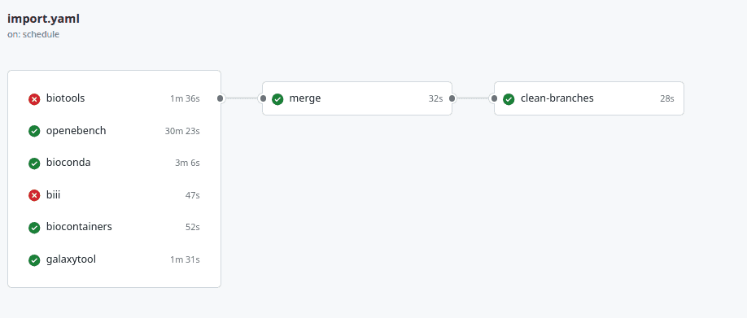

# The ELIXIR Research Software Ecosystem (RSEc) and the Galaxy Codex - powerful GitHub Bot architectures to collect research software metadata

## ELIXIR Research Software Ecosystem (RSEc)

The [ELIXIR Research Software Ecosystem (RSEc)](https://research-software-ecosystem.github.io/index) is supported and coordinated by ELIXIR Europe. It makes use of a sophisticated CI architecture that collects metadata for research software metadata, providing a unified resource for researchers. 

The RSEc collects currently metadata from bio.tools, Bioconda, BioContainers, Debian Med, Galaxy CoDex, OpenEBench, and WorkflowHub available in the [Content repositroy](https://github.com/research-software-ecosystem/content). More information about the sources can be found [here](https://research-software-ecosystem.github.io/sources).

The CI architecture is [openly available](https://github.com/research-software-ecosystem/utils) and can be adapted and leveraged to integrate other metadata sources as well. Recently the architecture was extended to also include metadata provided by the Galaxy Codex.

The CI bots perform the following tasks on a weekly basis:

* Downloads dumps of all meta sources into the content repository
* Stores the meta data entries of each tool from all sources into a dedicated folder in the content repository

## The Galaxy Codex

[Galaxy Communities Dock aka Galaxy Codex](https://github.com/galaxyproject/galaxy_codex) is a catalog of Galaxy resources (tools, training, workflows) that can be filtered for any community.
In this blog post we only cover the tool aspect of the catalog since this is used as source for the contribution of Galaxy to the RSEc.

### Tool metadata collection

A GitHub action performs every week the following steps:

- Extract all tools by
    1. Parsing tool GitHub repository from [Planemo monitor listed](https://github.com/galaxyproject/planemo-monitor)
    2. Checking in each repo, their `.shed.yaml` file and filter for categories, such as metagenomics 
    3. Extracting metadata from the `.shed.yaml`
    4. Extracting the requirements in the macros or xml to get version supported in Galaxy
    5. Checking available against conda version
    6. Extracting bio.tools information if available in the macros or xml
    7. Checking available on the 3 main galaxy instances (usegalaxy.eu, usegalaxy.org, usegalaxy.org.au)
    8. Getting usage statistics form usegalaxy.eu
- Create an interactive table for all tools: [All tools](https://galaxyproject.github.io/galaxy_tool_metadata_extractor/)
- Filter the tool suite per community
- Create an interactive table for all registered communities, e.g. [microGalaxy](https://galaxyproject.github.io/galaxy_tool_metadata_extractor/microgalaxy/)

### Tool metadata output

The script will generate a TSV file with each tool found in the list of GitHub repositories and metadata for these tools:

1. Galaxy wrapper id
2. Description
3. bio.tool id
4. bio.tool name
5. bio.tool description
6. EDAM operation
7. EDAM topic
8. Status
9. Source
10. ToolShed categories
11. ToolShed id
12. Galaxy wrapper owner
13. Galaxy wrapper source
14. Galaxy wrapper version
15. Conda id
16. Conda version

The data is stored as TSV and JSON in the CoDex repository.

### RSEc integration

The output of the CoDex was also integrated into the RSEc by development of a [Galaxy Tool Metadata GitHub Action](https://github.com/research-software-ecosystem/utils/tree/main/galaxytool-import), which populates the RSEc entries with metadata from the CoDex.
An example of a tool that has meta data from multiple sources, including Galaxy is [abricate](https://github.com/research-software-ecosystem/content/tree/c840b13928330e97c7eb6ccb6a779ff9b0f37835/data/abricate).
