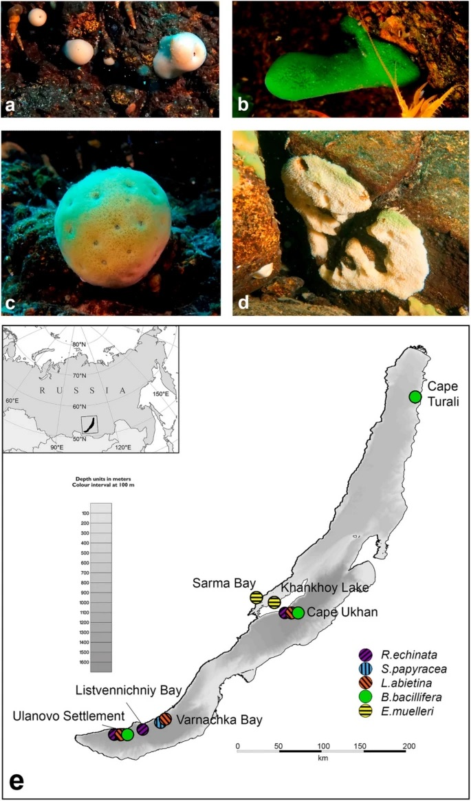

# Galaxy in Research: Unlocking genetic secrets of Lake Baikal’s endemic sponges 

Lake Baikal, the world's deepest and oldest freshwater lake, is located in Siberia. It is a natural wonder teeming with endemic species, including sponges, vital bioindicators of aquatic ecosystem health. Due to recent ecological changes in the lake, continuous monitoring is essential. The latest study by Alena Yakhnenko, Yurij Bukin, Igor Khanaev, and Valeria Itskovich leverages high-resolution microsatellite markers to explore the genetic diversity of Baikal’s sponges, revealing crucial insights into their interspecies and population dynamics.

## Research Overview

The paper, titled "Genetic diversity studies of Baikal endemic sponges at the interspecies and population levels using high-resolution microsatellite markers," addresses the need for advanced genetic tools to study the unique sponge species of Lake Baikal. Traditional genetic markers were insufficient for this task, prompting the development of new, high-resolution microsatellite markers. These markers were tested on four endemic sponge species, successfully distinguishing between the different genera within the Lubomirskiidae family.

(Yakhnenko et al., 2024)

## Key Findings

•	__Microsatellite Marker Development:__ The researchers created a set of high-resolution microsatellite markers specific to Lake Baikal sponges.
•	__Effective Differentiation:__ These markers effectively differentiated between species within the Lubomirskiidae family.
•	__Potential for Species Identification:__ The markers are promising tools for identifying species, crucial for monitoring sponge health and responding to disease outbreaks.
•	__Broad Applicability:__ The methods developed have potential applications for studying other endemic sponges in ancient lakes worldwide.

## Galaxy's Role

The researchers used Galaxy and the SSRome tool to search for microsatellite sequences in the draft genome of *L. baikalensis*. Additionally, they used the *E. muelleri* genome as an outgroup to identify conserved genomic regions with microsatellite markers. Alignment of these sequences was performed using the Local BLAST software package.

## Significance of Study

This study significantly advances our understanding of the genetic diversity and evolutionary relationships among Lake Baikal's endemic sponges. The developed microsatellite markers offer a powerful tool for future genetic studies and conservation efforts. By applying these markers, researchers can better monitor and manage the health of these crucial bioindicators, ensuring the preservation of Lake Baikal’s unique ecosystem. The approach also holds promise for broader applications, potentially aiding in studying other ancient lake ecosystems.

## Acknowledgements

Thank you to Alena Yakhnenko, Yurij Bukin, Igor Khanaev, and Valeria Itskovich for their exceptional research. Facilitated by the Galaxy platform, their work enhances scientific knowledge and supports crucial conservation initiatives. Thank you for choosing Galaxy for your research!

*Stay tuned for more updates on Galaxy-enabled research and scientific discovery!*

--- <be> 

Yakhnenko, A., Bukin, Y., Khanaev, I. et al. Genetic diversity studies of Baikal endemic sponges at the interspecies and population levels using high-resolution microsatellite markers. Aquat Sci 86, 85 (2024). https://doi.org/10.1007/s00027-024-01096-5

