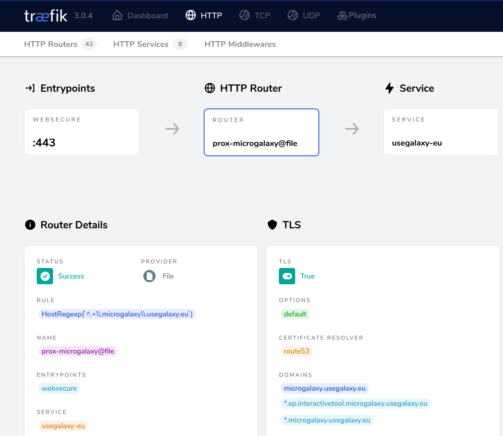

## 🗄️ A Tale of Two Head Nodes
Sometimes you have to update your operating system. But what do you do when you serve Galaxy for  
~ 100.000 registered users on that system? You could schedule a day of downtime, go to your data center, update and hope you are done by the evening and everything works.
But that means stress for you as administrator and, above all, interrupts the work of so many hard-working scientists.  
The smoother alternative would be: Having two servers, with a load balancer in front. This lets you shut down one server for maintenance without anyone noticing. 
Additionally, you can test features by using rules based on [client IP](https://doc.traefik.io/traefik/routing/routers/#clientip) or 
[Weighted Round Robin](https://doc.traefik.io/traefik/routing/services/#weighted-round-robin) that redirects a subset of users to your staging server.  
We plan to activate our second head node in the next few weeks – stay tuned!

## 🤷 Why Traefik?
[Traefik](https://doc.traefik.io/traefik/v3.0/) is a reverse proxy which includes certificate management and load balancing, among other features you can install as plugins. Conveniently, it comes with a fancy dashboard, which let you check your status for your routers, middlewares, services and certificates.
Even if it is originally designed for auto-detection of containerized applications in Docker and Kubernetes, it has advantages for bare metal environments, too. Let me give you a personal list:  
- 📜 Certificate management. Add a new subdomain to a router and Traefik will get the certificate automatically. No cronjobs, no manual "expand" commands.  
- 📝 Configuration in YAML or TOML (instead of whatever nginx uses). Human readable and predictable.
- 📊 Fancy dashboard allows you to check if everything works
- 📈 Built-in Prometheus endpoint
- 🧩 Simple plugin managemant
- 🐭 Written in Go

## 🚀 Deployment – Let's Go
Like everything on the European Galaxy Server, it is deployed using an [ansible-playbook](https://github.com/usegalaxy-eu/infrastructure-playbook/blob/master/traefik-proxy.yml)
which uses [usegalaxy-eu's Traefik role](https://github.com/usegalaxy-eu/ansible-Traefik). This role initializes a Docker Swarm cluster on the target host, verifies Traefik's rule files,
and creates Docker Swarm services, networks and secrets needed for the DNS-01 challenge.

We decided to use Docker Swarm for mainly two reasons:
1. Secret handling: Secrets are not saved inside env files, but are encrypted on disk and only available to the container they are attached to.
2. Scalability and future failover safe deployments: By using Docker swarm you can quite easily add a second proxy node and use e.g. [keepalived](https://www.keepalived.org/) as ingress.

Visit our [operations manual](https://usegalaxy-eu.github.io/operations/traefik.html) for more information on how to deploy and maintain Traefik.

### Add Subdomains on the Go
Adding new subdomains is as simple as adding a new line to [template-subdomains.yml](https://github.com/usegalaxy-eu/infrastructure-playbook/blob/master/files/traefik/rules/template-subdomains.yml) in the [infrastructure-playbook](https://github.com/usegalaxy-eu/infrastructure-playbook) repo. It is a [go template](https://blog.gopheracademy.com/advent-2017/using-go-templates/) producing a `yaml` file, which might misleadingly look similar to ansible at first.  
The line should look like the ones above, like this scheme:
```
{{template "subdomain" "microgalaxy"}}
```
Were "microgalaxy" would be your subdomain.  Be careful, the word `subdomain` in the second column needs to stay literally "subdomain", only the 3rd column is changed to the new subdomain,
but without any `.usegalaxy.eu`.  
Once this is deployed, Traefik will automatically create a router for it and fetch certificates for the subdomain as well as a wildcard certificate for ITs.  
If you did everything correctly, the new router appears on Traefik's dashboard. (Currently only visible for EU's admins.)  




Using the template file, Traefik did not only create the router and the rule for the subdomain `microgalaxy.usegalaxy.eu`, but
also for it's corresponding Interactive Tool entrypoints and fetched a wildcard certificate for it.  
**Note**: In order to add a subdomain to usegalaxy.eu, you also have to add a themes file, please follow this [guide](https://github.com/usegalaxy-eu/operations/blob/main/subdomains.md#galaxy-configuration).

<sub> Traefik logo is created by Peka, based on the Gopher Logo by Renee French. Licensed under the [Creative Commons Attributions 3.0 Unported](https://creativecommons.org/licenses/by/3.0/deed.en) license. </sub>
