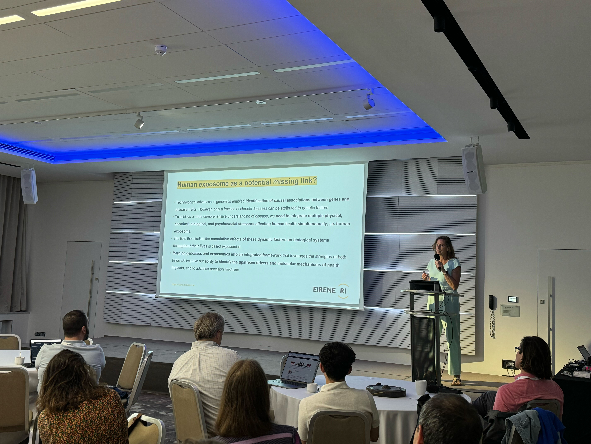

# **2024 Galaxy Community Conference: Meeting Report**

**Galaxy Coordinator & Editor:** Natalie Whitaker-Allen

**Student Coordinator & Editor:** Marisa Loach1,4

**Student Contributors:** 

Morgan Howells1, Stuart Jackson2, Julia Jakiela3, Engy Nasr4, Natalia Padillo-Anthemides5, Shweta Pandey6, Polina Polunina4

1\. The Open University, UK 2\. UC Riverside, USA 3\. The University of Edinburgh, UK 4\. University of Freiburg, Germany 5\. University of Florida, USA 6\. CSIR-Institute of Microbial Technology, India 

## GCC2024 Meeting Overview

The Galaxy Community Conference (GCC) is an annual event that brings together Galaxy users and developers from around the world. Galaxy, a free and open-source platform for data analysis, workflow building, training, and more, continues to foster a collaborative and innovative community. GCC2024, held in Brno, Czech Republic, attracted 151 participants from 28 countries, making it a truly international gathering.

This year’s conference featured a rich program, including 54 talks, 55 posters and demos, and 14 Birds of a Feather sessions. The community's collaborative spirit was highlighted by the participation of 80 Collaboration Fest (CoFest) attendees, who worked together on various projects to advance the Galaxy ecosystem. 

The conference was thrilled to include three distinguished keynote speakers: Jana Klánová, Ute Gunsenheimer, and Daria Onichtchouk, who shared their insights and expertise with the community. Presentation sessions were divided into two tracks: the Analysis Track, focusing on diverse data analyses performed on Galaxy, and the Enablement Track, showcasing the latest developments and tools to enhance the platform's usability and functionality. Tailored training sessions were designed to meet the needs of different users, ensuring a comprehensive and accessible learning experience. These sessions catered to new and experienced Galaxy users, offering pathways to enhance their skills and knowledge.

GCC2024 also emphasized community building and networking through various social events. Organized tours, coffee breaks, and a memorable conference dinner provided ample opportunities for attendees to connect, share insights, and foster collaborations within the vibrant Galaxy community. These activities enriched the conference experience, making it both productive and enjoyable for all participants.

To view a complete schedule of events, please visit the [GCC2024 website](https://galaxyproject.org/events/gcc2024/schedule/).

### Fellowship Recipients

The JXTX \+ GCC2024 Scholarship, sponsored by the JXTX Foundation and the Galaxy Project, supported six outstanding genomics and data sciences students to attend GCC2024. The recipients, selected for their exceptional contributions to their respective fields, presented their research through talks or posters at the conference.

**Shweta Pandey**  
CSIR-Institute of Microbial Technology (CSIR-IMTECH), Chandigarh, India  
Talk title: MitoLink2.0: A Generic Integrated Web-Based Workflow System to Evaluate Genotype-Phenotype Correlations in Human Mitochondrial Diseases

**Natalia E. Padillo-Anthemides**  
University of Florida, Gainesville, FL, USA  
Talk title: Reconstructing Cell Type Specification Trajectories in the Last Common Animal Ancestor

**Luca Degradi**  
Università degli Studi di Milano, Milano, Italy  
Talk and poster title: Genomics and Transcriptomics of Fusarium Musae from Human and Banana

**Morgan Howells**  
The Open University, Milton Keynes, England  
Talk title: Addressing User Needs in Single-Cell Analysis; Internship and Obstacles

**Drielli Canal**  
Federal University of Rio Grande do Sul, Porto Alegre, Brazil  
Talk title: Genomic and Evolutionary Analysis of the Cytochrome P450 Gene Family in a Ground-Herb of Amazonian Riparian Forests with a Waterflooding Gradient

**Ahmad Azani Othman**  
Universiti Teknologi MARA, Shah Alam, Malaysia  
Poster title: Bacterial Community Associated with Native Blowflies (Diptera: Calliphoridae) of Pahang National Park, Malaysia: A Metagenomic Approach

## Keynote Speakers

Three keynote speakers were invited to share their experiences and insights into the changing role of Galaxy in supporting innovation, collaboration, and FAIR principles.

### **Jana Klánová**

Masaryk University (Brno, Czech Republic)

Talk Title: Integrating Exposomics into Biomedical Sciences

Professor Jana Klánová kicked off the conference with a talk on exposomics. This exciting multidisciplinary field draws on genomics, metabolomics, transcriptomics, and proteomics to explore the effects of environmental exposures on human health and disease. She introduced the Research Centre for Toxic Compounds in the Environment (RECETOX), which engages in research and education on managing these risks. Professor Klánová also provided insights into several large-scale projects relevant to the Galaxy Community.

### **Ute Gunsenheimer** 

Secretary General, EOSC Association (Brussels, Belgium)

Talk Title: Building the EOSC Federation and the Potential Role of Galaxy

Ute Gunsenheimer presented on the European Open Science Cloud (EOSC), which aims to create an open environment enabling European researchers to publish, find, and reuse data, tools, and services under FAIR principles (Findability, Accessibility, Interoperability, and Reusability). Her keynote highlighted EOSC's transformative potential and alignment with the Galaxy community's commitment to accessible and reproducible science.

### **Daria Onichtchouk**

Independent Group Leader, University of Freiburg (Freiburg, Germany)

Talk Title: Zebrafish Swims into the Galaxy

Dr. Daria Onichtchouk, a distinguished developmental biologist and avid Galaxy user, shared insights into her extensive use of the Galaxy platform over nearly a decade. Her research unravels the genetic mechanisms that govern pluripotency, particularly during the maternal to zygotic transition (MZT) in zebrafish. Using Galaxy, Dr. Onichtchouk has streamlined her experimental workflows and enhanced the reproducibility and transparency of her analyses. Her keynote underscored Galaxy's pivotal role in advancing our understanding of pluripotency control and developmental biology.

## Talks Sessions

GCC2024 featured three days of talks covering the latest developments and analyses on the platform. ‘Community’ was a key theme throughout the conference, with the first session highlighting the diverse communities that make up Galaxy. Participants heard from regional groups, such as our hosts in the Czech Republic, as well as Special Interest Groups (SIGs) and Galaxy instances focusing on topics like antibiotic resistance, neutron science, and microbiology. This session introduced Galaxy as both a platform and a community, giving newcomers an idea of who to connect with during the conference.

The conference split into parallel analysis and enablement tracks following the initial session.

### Analysis Track

The analysis track sessions showcased Galaxy’s versatility, with talks highlighting the diverse datasets and tools used on the platform to facilitate cutting-edge research across disciplines. Topics included the genomic adaptability of a fungal banana pathogen, the integration of tardigrade genomes into Galaxy, and the development of Galaxy tools for catalysis workflows in physical sciences. Researchers shared the latest analyses and workflows run on the platform, demonstrating Galaxy’s power in addressing complex challenges in bioinformatics and beyond. The analysis track underscored the importance of collaboration and using open, FAIR workflows to enhance reproducibility and accessibility.

### Enablement Track

The first enablement track session on workflows and administration included talks on recent upgrades to the Galaxy user interface, new ways to visualize and manage workflows, and features and techniques to help developers create and integrate more tools into Galaxy. These presentations highlighted the continuous efforts to enhance the Galaxy platform, focusing on user experience, workflow management, and integration with external services.

The second enablement track session on outreach and automation covered recent community-focused developments. Topics included updates to the Galaxy Training Network (GTN), a new training suite bridging the gap between biologists and programmers, tools for standardizing Galaxy’s outreach across social media, the incorporation of interactive tools directly within the Galaxy UI, and efforts to consolidate several France-based Galaxy servers into a single regional server. These talks represented the thriving community that is continually improving the Galaxy experience for all types of users around the globe.

The parallel tracks and the final combined talk session at the end of the conference emphasized the event's role in bringing users and developers together. The main takeaways from these sessions were the importance of listening to user feedback and valuing inclusivity and multilingualism in our diverse, global community.

## Panel Discussion

In addition to the talks sessions, GCC2024 featured a panel discussion between key members of the Galaxy community:  
**Moderator:** Enis Afgan \- Associate Research Scientist (Johns Hopkins University, USA) and Galaxy Project Administrator

**Panelists:** 

* **Brad Langhorst** \- Group Leader, Biotechnology Industry (New England Biolabs, USA)  
* **Shurjo K. Sen** \- Program Director, Medical Federal Funding Agency (National Institutes of Health, USA)  
* **Wendi Bacon** \- Senior Lecturer, Galaxy Admin with expertise in Single-cell Analysis (The Open University, UK) and Galaxy Project Administrator  
* **Jeremy Goecks** \-  Healthcare and Medical Research Industry, Assistant Center Director, Research Informatics, Moffitt Cancer Center  
* **Tim Griffin** \- Professor, Director, Center for Mass Spectrometry and Proteomics (University of Minnesota, USA)

The discussion was shaped by many insightful questions and comments from the audience and focused on three main topics:

1\. **Empowering Users**: Discussions centered on enabling high-quality research by aligning biological needs with technological solutions. The panel emphasized the strengths of the GTN and the ongoing efforts to maintain its accessibility.  
2\. **Promoting Re-use of Galaxy Workflows:** Panelists addressed challenges in promoting workflow re-use, with users sharing opinions on balancing the ease of automated processes with the flexibility to customize analyses. Suggestions included creating parent workflows with varying levels of adaptability to cater to different user needs. Additionally, there was a call for showcasing more scientific success stories to inspire Galaxy users.  
3\. **Making Galaxy More Accessible**: Strategies discussed included organizing bi-yearly regional meetings alongside regular meetings to engage a broader user base and creating a user-friendly 'landing page' to guide first-time and existing users through Galaxy functionalities and resources, with step-by-step selections tailored to users' fields of research and analytical needs.

The panel concluded by recognizing that while developers play crucial roles in building and maintaining a usable Galaxy, it is ultimately the users who bring the platform alive.

## Posters

Poster sessions at GCC2024 took place on the first two days of the conference. Of the 55 posters displayed, 22 were associated with conference talks, offering attendees the perfect opportunity to meet presenters and delve deeper into the details of their work over a cup of coffee.

The posters covered various topics, from technical advances for Galaxy developers to cutting-edge analyses in metagenomics, drug discovery, and astrobiology. Many posters highlighted new Galaxy features and resources, providing both users and developers with ample inspiration for future projects.

Additionally, posters showcased various teaching activities, workshops, and exchange programs within the Galaxy community. These contributions underscored the community's commitment to education and collaboration, enhancing the overall conference experience for participants.

## Training Sessions

GCC2024 offered an exciting array of 31 educational sessions designed to help attendees learn new concepts, gain practical, hands-on training, and interact with others in similar fields. These sessions provided opportunities to get answers to questions from top experts on various topics.

The training sessions were organized into "Learning Pathways," catering to diverse interests and expertise levels. By organizing the training sessions into these distinct pathways, GCC2024 ensured that all participants could find sessions that matched their interests and expertise, making the learning experience more tailored and effective. These pathways included:

1. Trainings for Newcomers  
2. Trainings for Domain Scientists  
3. Trainings for Educators  
4. Trainings for Tool Developers  
5. Trainings for System Administrators and Software Engineers

Trainers from diverse backgrounds, each with unique expertise and perspectives, came together to create this comprehensive training schedule. This collaboration ensured a rich and varied learning experience for all attendees, reflecting the multifaceted nature of the Galaxy community.

A huge “thank you” to all the trainers for contributing valuable training sessions to GCC2024. Their dedication and expertise were instrumental in making the training program a success, enriching the knowledge and skills of participants across the Galaxy community.

## Birds of a Feather 

Birds of a Feather (BoF) sessions provided yet another opportunity for diverse Birds of a Feather (BoF) sessions, brought to GCC by community members, are valuable parts of the conference, providing opportunities for diverse communities within the Galaxy ecosystem to gather and exchange ideas. This year, 13 BoFs were offered, covering various topics.

These sessions offered a pleasantly unpredictable environment, allowing attendees to connect with others who share similar interests across the diverse fields represented at the conference.

The final BoF session included a collaborative writing group inviting students to contribute to this meeting report. This student-led initiative provided an opportunity to reflect on the experiences of GCC2024 and determine how best to share these insights with the broader Galaxy community through this report.

## CoFest 

The Collaboration Fest (CoFest), held at Open Gardens, brought together new and experienced Galaxy contributors for two days of collaboration, learning, and cooperation at the conclusion of the conference. Participants enjoyed breaks amidst garden strolls and visits with the resident chickens and rabbits.

Newer community members took their initial steps as Galaxy contributors during CoFest. Saskia and Helena provided valuable guidance on contributing to the GTN. Among them was Shweta, a fellowship recipient, who was thrilled to join the ranks of Galaxy contributors. She also participated in a group led by Bjorn to learn about tool wrapping for Galaxy, with students expressing their gratitude for his teaching and enthusiasm for future sessions. First-time users and budding tool developers expressed interest in more such sessions during future CoFests to further engage with the community.

For experienced Galaxy contributors, CoFest provided a space to collaborate on new projects or tackle pending tasks. Inspired by discussions from the panel, participants laid out a Galaxy Roadmap and initiated work on a simplified workflow-centric landing page. The event also fostered new communities, including efforts to unify subdomains across US, UK, and AU Galaxy servers using a newly created template. Other projects included initiatives to streamline data citation processes, reorganize ecology tools, and enable users to convert any Shiny App into an Interactive Tool on Galaxy.

## Social Events 

GCC2024 offered ample opportunities for networking and relaxation through coffee breaks and various social events. Wednesday afternoon's tours were a highlight, providing participants with the chance to explore more of Brno. Two groups embarked on city walking tours, while others visited the UNESCO-listed Villa Tugendhat.  
A significant addition to this year's social program was the first VENUS (Women & Nonbinary Empowerment, Unity, and Support) lunch, providing a welcoming space for women and non-binary participants to share their experiences within the Galaxy community.

One of the leading social highlights was the conference dinner hosted at the Augustinian Abbey. Attendees enjoyed exploring the abbey's library in search of its secret passage, visiting Mendel's room, and engaging in activities such as making their own GCC2024 buttons and enjoying ice cream.

## Recognition 

We sincerely thank all sponsors, hosts, organizing and scientific committees, training coordinators, online support team, scientific program members, and CoFest organizers for their invaluable contributions to GCC2024. Your collective efforts have made GCC2024 a resounding success, fostering community, innovation, and collaboration within the Galaxy ecosystem. We look forward to continuing this journey together at future events.

### Sponsors 

Gold sponsor:

* [JXTX Foundation](https://jxtxfoundation.org/)
* [GigaScience](https://academic.oup.com/gigascience/)
* [KWS](https://www.kws.com/corp/en/)
* [Limagrain](https://www.limagrain.com/en/)
* [deNBI](https://www.denbi.de/)

Silver sponsors:

* [Worfklow4Metabelomics](https://workflow4metabolomics.org/)
* [GalaxyWorks](https://galaxyworks.io/)

Bronze sponsors:

* [GigaScience](https://academic.oup.com/gigascience/)
* [KWS](https://www.kws.com/corp/en/)
* [Limagrain](https://www.limagrain.com/en/)
* [deNBI](https://www.denbi.de/)

### Hosts

* The City of Brno
* MUNI
* Elixir Czech Republic

### Organizing Committee 

Björn Grüning, University of Freiburg, Germany  
Enis Afgan, Johns Hopkins University, United States  
Helge Hecht, Masaryk University, Czech Republic  
Jenn Vessio, Johns Hopkins University, United States  
Natalie Whitaker-Allen, Johns Hopkins University, United States

### Training Coordinator 

Tyler Collins, Johns Hopkins University, United States

### Scientific Program Members 

**Committee Chair:** Enis Afgan, Johns Hopkins University, United States  
	  
Alex Ostrovsky, Johns Hopkins University, United States  
Beatriz Serrano-Solano, Euro-BioImaging ERIC, Germany  
Elliott Price, Masaryk University, Czech Republic  
Enis Afgan, Johns Hopkins University, United States  
Hans-Rudolf Hotz, Friedrich Miescher Institute for Biomedical Research, Switzerland  
Lucille Delisle, Swiss Federal Institute of Technology, Switzerland  
Wendi Bacon, The Open University, England

### CoFest Organizers 

Ahmed Awan, Johns Hopkins University, United States  
Björn Grüning, University of Freiburg, Germany
