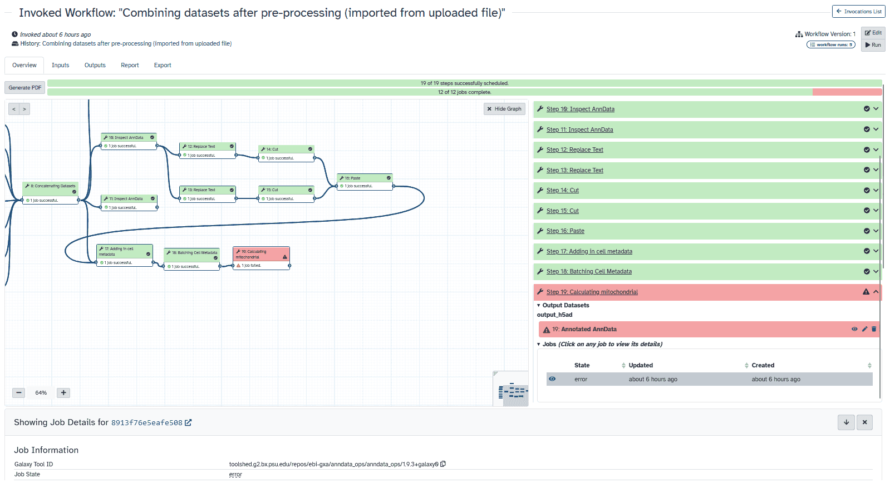

Hello, Galaxy Community!

Welcome to the latest edition of the Galaxy Project Newsletter! We’re excited to bring you a fresh update packed with the newest developments from the Galaxy community. This month, we’ll dive into the highlights from GCC2024, where innovation and collaboration were at the forefront. We’ll also introduce the 2024 Galaxy Community Update Paper, offering a comprehensive look at our progress and future directions.

Don’t miss the scoop on Galaxy Release 24.1, featuring key updates that enhance your Galaxy experience. And we’re thrilled to announce the Galaxy Training Academy 2024—a week-long, global online event offering tailored training tracks and expert guidance. We’re also calling for trainers to join us in making this event successful!

Thank you for tuning in and for being a part of Galaxy!

# GCC2024

## Overview

The Galaxy Community Conference 2024 (GCC2024) was a remarkable success, bringing together researchers, developers, and Galaxy enthusiasts from around the globe. Held in Brno, Czech Republic, the conference featured insightful keynotes, engaging presentation tracks, hands-on training sessions, and vibrant social events. Participants had the opportunity to share their latest work, learn from others, and collaborate on projects that push the boundaries of bioinformatics and data analysis.

## GCC2024 Meeting Report

We are excited to announce that the GCC2024 meeting report is now available! This comprehensive report was crafted in collaboration with several students who attended the conference, providing a unique perspective on the event's highlights. The report includes detailed summaries of the keynote speeches, presentation tracks, training sessions, and social events. You can access the full report here.

## GCC2025

Mark your calendars! GCC2025 will be held in New York. We look forward to another fantastic gathering of the Galaxy community filled with learning, networking, and fun. Stay tuned for more details as the event approaches.

# 2024 Galaxy Community Update Paper

The latest Galaxy Community Update Paper provides a comprehensive overview of the Galaxy Project's progress and future directions. Galaxy continues to support user-driven research, expanding its scope each year. Users are drawn to Galaxy for its stability, diverse toolset, extensive reference datasets, training resources, and integration capabilities, all enabling complex, reproducible, and shareable data analysis.

The 2024 update highlights several key advancements:

- __User Experience Design (UXD) Improvements:__ Enhancements in accessibility and tool discoverability through Galaxy Labs/subdomains, as well as a redesigned Galaxy ToolShed.

- __Tool Capabilities:__ Integration of general-purpose graphical processing units (GPGPU) for cutting-edge methods and support for licensed tools.

- __Global Research Engagement:__ Developing more workflows and resourcing public Galaxy services to support global research consortia.

- __Galaxy Training Network (GTN):__ Expansion of the GTN portfolio with new learning paths and direct integration with Galaxy tools used in training courses.

- __Code Development:__ Improvements in job scheduling, user interface, and environmental impact assessment, including displaying estimated CO2 emissions generated by each Galaxy job.

A heartfelt thank you to the entire Galaxy community for your contributions and dedication. Your efforts make Galaxy a success. 

[*Read the full update paper here.*](https://academic.oup.com/nar/article/52/W1/W83/7676834)

# Galaxy Release 24.1

The latest Galaxy release, 24.1, has exciting new features and improvements designed to enhance user experience and streamline workflows. See a sneak-peak at just a few of the exciting new updates and features Galaxy 24.1 includes:

- __Activity Bar Enabled by Default:__ The activity bar is now enabled by default, providing quick access to essential features and improving workflow navigation.

- __Workflow Invocation Graph View:__ A new graph view in the workflow invocation summary displays job states for each step on the workflow editor canvas. Users can click on a step to see detailed information about that invocation step.

- __Zenodo Integration:__ The new Zenodo file source plugin based on Invenio simplifies integration. This update introduces new schemes (invenio:// and zenodo://) for Invenio and Zenodo file sources, aligning them with their intended conventions. Existing exports using the gxfiles:// scheme will continue to work as expected.

For a complete list of updates and detailed release notes, please view the full [User Release Notes](https://docs.galaxyproject.org/en/master/releases/24.1_announce_user.html).

# Galaxy Training Academy 2024

Join Us for the Galaxy Training Academy 2024!

We are thrilled to announce the Galaxy Training Academy 2024, a week-long global online training event designed for all experience levels. Taking place from October 7th to October 11th, 2024, this event offers a unique opportunity to dive deep into various aspects of Galaxy and data analysis from the comfort of your home.

Event Highlights:

- __Flexible Learning Tracks:__ Choose from a diverse range of tracks, including Introduction to Galaxy, Proteomics, BY-COVID, Transcriptomics, Microbiome, Bacterial Genomics and AMR Detection, Single-Cell, Machine Learning, and Genome Assembly. Tailor your learning experience to match your interests and research needs.
  
- __Self-Paced Learning:__ Participants can move at their own pace, accessing high-quality training materials and resources while receiving support from experts throughout the week.
  
- __Expert Access:__ Direct interaction with field experts ensures that all your questions are answered and you receive the guidance you need to succeed.
  
- __Free of Charge:__ This event is entirely free, making it accessible to everyone interested in expanding their knowledge and skills in bioinformatics.

Don't miss this chance to enhance your skills and connect with the global Galaxy community. Stay tuned for more details and registration information!

## Call for Trainers

We are currently seeking enthusiastic trainers to help make this event a success. If you have expertise in any of the topics covered or wish to introduce new topics to the event, we invite you to contribute to this exciting training opportunity. Your involvement will play a crucial role in shaping the learning experience for the Galaxy community worldwide. For more information on being a Galaxy Training Academy trainer, [please see the Hub](https://galaxyproject.org/news/2024-05-29-galaxy-training-academy-call-contribution/).

# Galaxy in Research

Exploring the Latest in Galaxy-Driven Research

We are excited to spotlight the new "Galaxy in Research" series, which delves into scientific papers showcasing Galaxy's impact on various research fields. Our News posts provide easy-to-read analyses of recent studies, demonstrating how Galaxy tools and workflows are advancing scientific discovery. Additionally, our social media posts aim to keep you informed about these exciting developments and community contributions.

Discover how researchers are leveraging Galaxy for cutting-edge studies, and stay connected with our updates to see how the Galaxy platform continues to support and drive innovation across disciplines.

See below for some of our most recent Galaxy in Research highlights!

- [__Galaxy in Research: Unlocking genetic secrets of Lake Baikal’s endemic sponges__](https://galaxyproject.org/news/2024-07-17-galaxy-in-research/)

*Explore the depths of Lake Baikal and discover how cutting-edge genetic research in Galaxy is unraveling the complex relationships between its unique sponge species.*

- [__Galaxy in Research: Molecular secrets of minnow adaptation to salinity stress__](https://galaxyproject.org/news/2024-07-03-galaxy-in-research/)

*Discover how advanced transcriptomic analyses in Galaxy reveal the intricate molecular adaptations of minnows to freshwater salinization.*

- [__Galaxy in Research: Decoding chromatin interactions with asteRIa__](https://galaxyproject.org/news/2024-06-05-galaxy-in-research/)

*Find out how Galaxy helps researchers unlock the mysteries of gene expression regulation through chromatin studies.*

- [__Galaxy in Research: Investigating Food Safety Threats__](https://galaxyproject.org/news/2024-06-03-galaxy-in-research/)

*Learn how Galaxy can be used to detect and analyze drug-resistant bacteria threatening food safety in Egypt.*

- [__Galaxy in Research: Exploring the Hidden World of Antarctic Toxins with Galaxy__](https://galaxyproject.org/news/2024-05-14-galaxy-in-research/)

*Discover how Galaxy is helping to unravel the hidden world of peptide toxins in an Antarctic marine invertebrate.*

# Upcoming Events

| DATE  | EVENT |  VENUE or LOCATION |
| ------------- | ------------- | ------------- |
| 07 August 2024| [Get Started with Galaxy: A Beginner's Workshop](https://galaxyproject.org/events/2024-08-07-workshop/) | Online  |
| 10–13 September 2024 | [A practical introduction to bioinformatics and RNA-seq using Galaxy](https://www.cecam.org/workshop-details/a-practical-introduction-to-bioinformatics-and-rna-seq-using-galaxy-1359) | Online|
| 08–10 October 2024 | [Gateways 2024](https://sciencegateways.org/gateways2024) | Bozeman, MT, USA  |
| 21–23 October 2024| [EOSC Symposium 2024](https://eosc.eu/symposium2024)  | Berlin, Germany |
| 13–16 November 2024 | [CSHL Biological Data Science](https://meetings.cshl.edu/meetings.aspx?meet=data&year=24) | Cold Spring Harbor, NY |

*Thank you for being a part of Galaxy!*

__Get more timely info by following us on [Mastodon](https://mastodon.social/@galaxyproject@mstdn.science), [Bluesky](https://bsky.app/profile/galaxyproject.bsky.social), and [LinkedIn](https://www.linkedin.com/company/galaxy-project)!__ 
