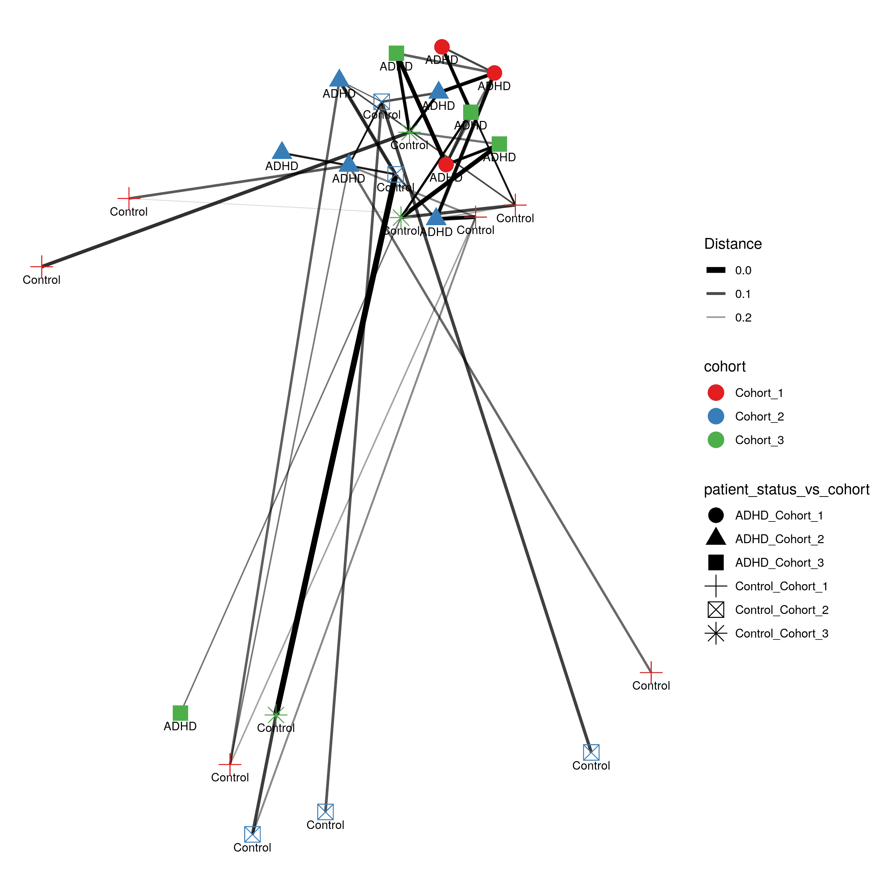

# Shiny phyloseq interactive tool (IT)

[Shiny apps](https://shiny.posit.co/) are web apps using R functionality, that give easy responsive access to R packages. 
Interactive tools are a great way to work with data interactively and responsive using Galaxy. In theory all shiny apps could become ITs, but so far the 
wrapping and deployment of shiny apps as ITs was technically challenging. Thanks to a Hackathon together with members from the Bioconductor 
communities best-practices for the development of ITs using Shiny apps were developed, focusing mainly on the development of a docker image, that can be used
as a starting point to add any any shiny app. 
As a proof-of-concept the [shiny-phyloseq app](https://github.com/joey711/shiny-phyloseq) has been wrapped as IT. 
A fork of this docker image tailored for the shiny app is available here: https://github.com/paulzierep/docker-phyloseq.
The image can be run locally to test the app and then must be deployed to quay.io. 
This app allows to perform dynamic analysis of
metabarcoding/amplicon data such as:

* filter data based on metdadata and taxonomy
* plot alpa diversity
* plot distance networks 

* ordination plots

* heatmaps

* trees

* scatter plots
* bar charts

The tools is available on usegalaxy.eu (https://usegalaxy.eu/?tool_id=interactive_tool_phyloseq&version=latest) and was integrated into a [dada2 based GTN tutorial](https://training.galaxyproject.org/training-material/topics/microbiome/tutorials/dada-16S/tutorial.html) by Bérénice Batut.

## Data upload from Galaxy

Although the IT worked with the original shiny app. The shiny-phyloseq app did not allow to upload amplicon data using command line arguments, which makes it difficult to allow for data input from Galaxy directly (downloading data from the Galaxy History and uploading to the IT via the web frontend would work though). Therefore, the tool was forked and modified to allow for additional data input. This functional adaptation of shiny-apps to allow for non-web based data upload is the only requirement to make any shiny app compatible with Galaxy based data upload.  

The changes made to the original app can be found in this [git diff](https://github.com/joey711/shiny-phyloseq/compare/master...paulzierep:shiny-phyloseq:master).

# Demo of the IT

