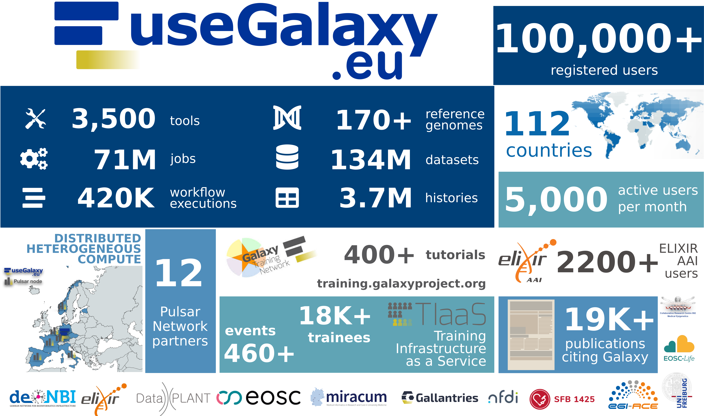

🚀 **100,000 users for Galaxy-EU**

We have amazing news and we can't believe it: UseGalaxy.EU has now 100,000 users! 
The journey of the European Galaxy server began in 2010 when Björn offered a tiny set of BLAST tools to the faculty of Pharmacy of the University of Freiburg for similarity searches of Streptomyces strains. We were so proud of having 800 Galaxy users - mostly local ones - using the Freiburg Galaxy server. In the year 2018 we were partners of the de.NBI cloud and the [Freiburg Galaxy server became the European Galaxy server](https://usegalaxy-eu.github.io/posts/2018/03/15/usegalaxy-eu) being able to serve more researchers. In 2022 we celebrated [50,000 users](https://galaxyproject.org/news/2022-06-23-reached-50000-users) and now, this number has doubled within two years.

🌟 **Democratizing Data Analysis**

Giving researchers free access to a huge computational infrastructure and training to let them take part in their own data analysis has revolutionized the daily work of many scientists. 

🌟 **Thank you!**

Without the help of many people this success would have been impossible. We want to thank from the bottom of our hearts all our funders, our supporters at the University of Freiburg and everywhere in the world, and we want to thank our users who chose Galaxy for their data analysis.

