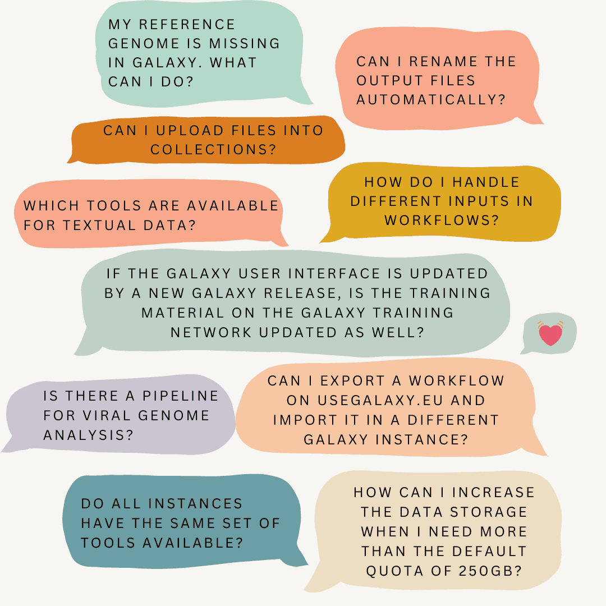

🚀 **First “Ask Us Anything about Galaxy” live Q&A session was successful**

Serving and engaging with the Galaxy user community is one of the key pillars of the Galaxy project. Galaxy beginners and advanced users have many questions around Galaxy concerning data analysis, tools, workflows or the training material. For the very first time, the Galaxy-EU team offered a live webinar to Galaxy users and gave them the chance to ask questions there and meet the people behind Galaxy-EU.

🌟 **Questions from beginners and advanced users**

More than 30 scientists followed our invitation and filled this one hour with interesting questions which were answered by experts of our team. For all of us it was a well received and great experience and we plan to offer online live Q&A sessions every 2-3 months. The next one will be offered in September 2024. We will announce them on the [Events page](https://galaxyproject.org/events).

