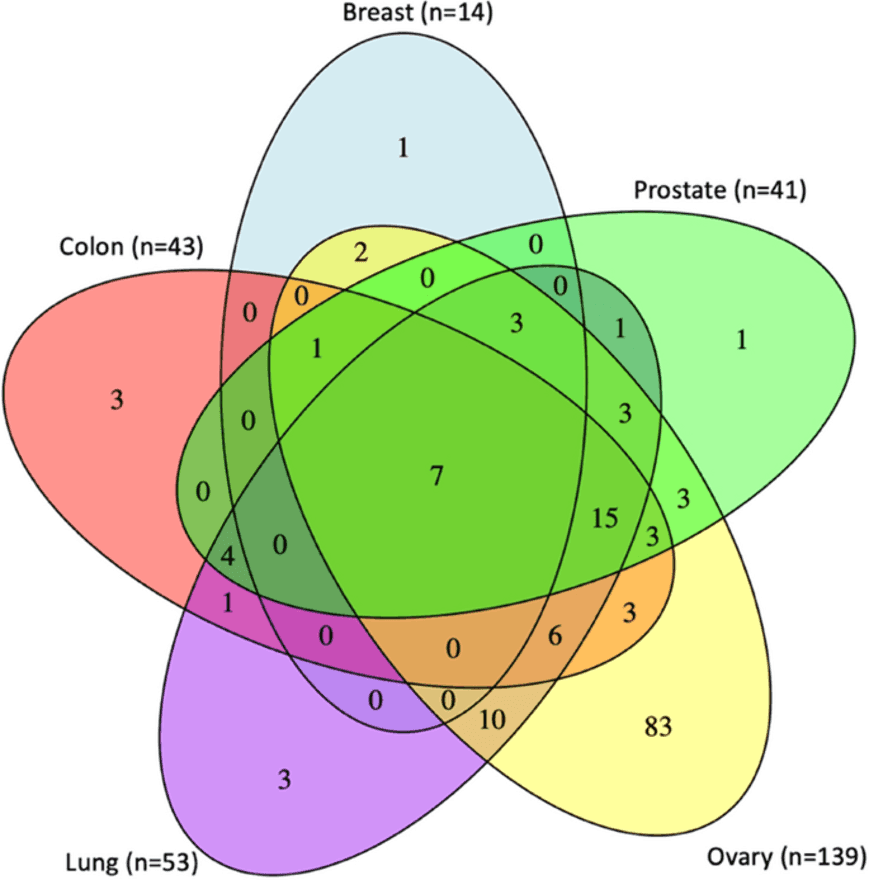

# **Galaxy in Research: Exploring DNA Methylation and Aging Across Diverse Human Tissues**  
   
*How does DNA methylation correlate with aging across different human tissues? A new study provides insights into this question, revealing tissue-specific and shared epigenetic patterns.*  

The relationship between DNA methylation (DNAm) and chronological age has been extensively studied, particularly in whole blood. However, the tissue-specific nature of age-related DNAm changes remains a critical area of exploration. Understanding these changes across various human tissues can help elucidate the mechanisms of aging and potentially lead to the development of biomarkers. In their latest study, Niyati Jain and colleagues conducted an epigenome-wide association study (EWAS) to investigate the DNAm patterns associated with aging across nine different tissue types, leveraging data from the Genotype-Tissue Expression (GTEx) project. Their findings provide significant insights into the complex interplay between aging and epigenetics in human tissues.  
   
## **Research Overview**  
   
In the study "DNA methylation correlates of chronological age in diverse human tissue types," the research team analyzed DNAm data from 961 tissue samples representing nine tissue types: breast, lung, colon, ovary, prostate, skeletal muscle, testis, whole blood, and kidney. Using the Illumina EPIC array, they identified age-associated CpG sites across these tissues, revealing tissue-specific and shared epigenetic patterns.  
   
## **Key Findings**  
   
·  	**Identification of Age-Associated CpG Sites:** The study identified 162,002 hypermethylated and 90,626 hypomethylated CpG sites across eight tissue types, with 130,137 (80%) hypermethylated and 74,703 (82%) hypomethylated CpGs observed in a single tissue type.

·  	**Tissue-Specific and Common Patterns:** While most age-associated CpG sites were tissue-specific, enrichment patterns among genomic features like chromatin states and CpG islands were consistent across most tissues.

·  	**Functional Insights:** The study identified several age-related expression  
quantitative trait methylation (age-eQTMs) correlations across multiple tissues, particularly in regions such as CDKN2A, HENMT1, and VCWE.

·  	**Epigenetic Signatures of Aging**: Consistent with previous findings, hypermethylated CpG sites were enriched in repressed polycomb regions and CpG islands. At the same time, hypomethylated CpGs were more common in non-CpG islands and enhancers.  
   

*Venn diagram showing the overlap of pathways linked to age-associated CpG sites in breast, prostate, ovary, lung, and colon tissues. The number (n) represents pathways identified with a false discovery rate (FDR) of less than 0.05 (Jain et al., 2024).*
   
## **Galaxy's Role**

The research used Galaxy.org’s "get flanks" tool to assign 10 Kb flanking regions of genes, facilitating the analysis of age-related DNAm changes across diverse tissues.  
   
## **Significance of Study**  
   
This study provides important insights into how aging impacts DNA methylation across various human tissues, uncovering tissue-specific and shared epigenetic patterns. The research advances our understanding of the molecular mechanisms driving aging by identifying over 250,000 age-associated CpG sites and age-related expression quantitative trait methylation (age-eQTMs) across multiple tissues. These findings could lead to the development of new biomarkers for aging, with potential applications in early disease detection and personalized medicine. Galaxy’s role in facilitating this analysis highlights the importance of accessible bioinformatics tools in advancing genomic research.
   
## **Acknowledgments**  
   
We thank Niyati Jain and the team for using Galaxy in their \= study. Their work highlights the platform's capability to support complex genomic analyses across multiple tissue types.  
   
*Stay tuned for more updates on Galaxy-enabled research and scientific discovery\!*  

--- <be> 
   
Jain, N., Li, J.L., Tong, L. et al. DNA methylation correlates of chronological age in diverse human tissue types. Epigenetics & Chromatin 17, 25 (2024). [https://doi.org/10.1186/s13072-024-00546-6](https://doi.org/10.1186/s13072-024-00546-6)  
