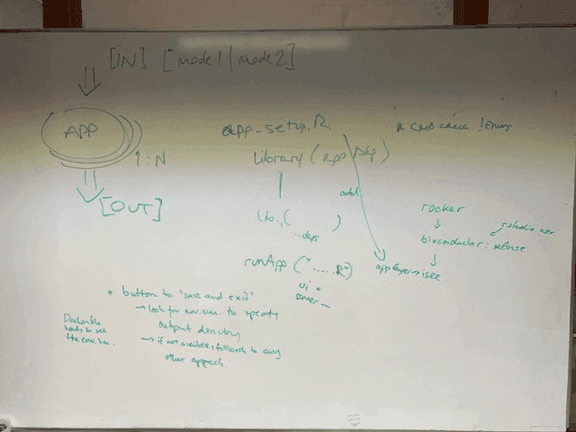

During the EuroBioC2022 conference in Heidelberg, Germany, a group of participants gathered to discuss [R/Shiny applications](https://shiny.posit.co/), with particular focus on those included in Bioconductor packages. During the discussion, it was suggested that Galaxy may be a good venue for hosting such apps, as a complement to, e.g., shinyapps.io, where the free tier may not provide enough computational and storage capacity for practical usage of all apps. Although, some R/Shiny apps already existed as Galaxy interactive tools, e.g. [iSEE](https://usegalaxy.eu/root?tool_id=interactive_tool_isee), it became evident during a later discussion between Galaxy and Bioconductor representatives, that more work towards setting up (generally usable) templates would be necessary to simplify the inclusion of more apps. These templates should make it easy to make any Shiny app (not only coming from the Bioconductor environment) available in Galaxy and other frameworks.

On February 29th/March 1st 2024, representatives from the Bioconductor and the Galaxy communities (Charlotte Soneson, Federico Marini, Björn Grüning, and Hans-Rudolf Hotz) met in Freiburg for a short hackathon to learn from the 'other side', to brainstorm (see picture), to start working on the templates and to implement the first tool.

Initial work concentrated around the [ideal package](https://bioconductor.org/packages/release/bioc/html/ideal.html). The corresponding Shiny app already offered the stopApp functionality (see: [close-window](https://deanattali.com/blog/advanced-shiny-tips/#close-window)) which deemed to be very useful to cleanly close the app and eventually stop the container. A [proof of concept](https://github.com/federicomarini/docker-ideal) was generated and the dockerized shiny application was made available at the European Galaxy server as an [interactive tool](https://usegalaxy.eu/?tool_id=interactive_tool_ideal&version=latest).  
In order to provide a general usable recipe, two repositories were set up with easy-to-expand (i.e. exchange with your favorite Shiny application) templates:

[templateDockerShinyPkg](https://github.com/csoneson/templateDockerShinyPkg) 
As a prerequisite, the shiny application needs to be available as a package. This repository contains a small package providing a template for a shiny application, suitable for running in a container environment.

[templateDockerShiny](https://github.com/hrhotz/templateDockerShiny)
Using this Dockerfile, the template shiny application can be dockerized   

Once the Shiny-App Docker container is created and publicly available to everyone, it can be integrated into Galaxy. The process is very similar to the integration of a normal Galaxy tool and [described in the GTN](https://training.galaxyproject.org/training-material/topics/dev/tutorials/interactive-tools/tutorial.html). Alternatively you can drop us a message in our [Galaxy Tool Chat](https://matrix.to/#/#galaxy-iuc_iuc:gitter.im) or create a [new issue](https://github.com/galaxyproject/tools-iuc/issues/new) to inform us about your new App. We will try to integrate it for you and deploy if on the European Galaxy server.

Ultimately, the goal will be to add such interactive tools to (existing) Galaxy workflows. More work for another Hackathon in the future. 

We thank de.KCD, the FMI and the University Medical Center in Mainz for their support.

