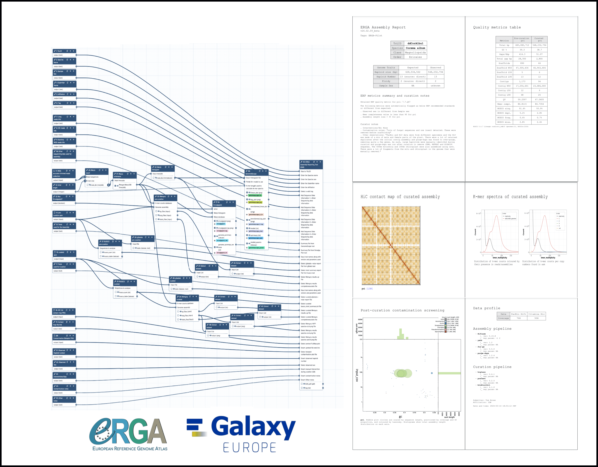

# **The ERGA Assembly Report - a community-developed Genome Assembly QC Document Using Galaxy**

Ensuring consistent high-quality genome assemblies from a distributed project with multiple partners, technologies, organisms, and infrastructures requires addressing several key challenges. Often a question arises - How can we ensure that consistent high-quality genomes are generated across such diverse conditions? This can be achieved by adopting FAIR (Findable, Accessible, Interoperable, and Reproducible) principles, standardizing data formats, and utilizing shared bioinformatics pipelines. Automated quality control, benchmarking, and adaptable workflows are crucial for maintaining consistency. Additionally, how can we report our outputs in a robust and reproducible fashion? This involves adhering to rigorous metadata standards, thoroughly documenting methodologies, and sharing data and tools through open-access platforms with version control, ensuring transparency, reproducibility, and interoperability across all outputs.

The ERGA Assembly Report (EAR) is a community-developed Genome Assembly QC document that leverages the Galaxy platform, a highly accessible and user-friendly environment to provide a comprehensive quality control assessment of genome assemblies. This document covers several critical aspects of assembly evaluation. First, Read QC ensures the raw sequencing data meets quality standards before assembly begins. Assembly contiguity & completeness metrics assess how well the genome has been reconstructed, focusing on factors like scaffold lengths and gaps. Gene completeness is evaluated using tools such as BUSCO to measure how many expected genes are present in the assembly. A contaminant screen helps identify and remove any non-target sequences that may have been introduced during the sequencing process. Finally, the ERGA Assembly Report includes detailed documentation of the software and pipeline versions used in the assembly process to ensure reproducibility and transparency, allowing others to verify or replicate the analysis. By using Galaxy's shared infrastructure, the report supports version control, history sharing, and workflow reuse, which enhances collaboration, transparency, and standardization across the genome assembly community, making it a powerful platform for the ERGA initiative.

<a href="https://usegalaxy.eu/root?tool_id=toolshed.g2.bx.psu.edu%2Frepos%2Fbgruening%2Ferga_ear%2Fmake_ear%2F24.08.26%20galaxy0"><button type="button" class="btn btn-primary btn-lg">Check ERGA Assembly Reporting Tool in Galaxy</button></a>

 

