# Introduction

The [EuroScienceGateway Project](../../projects/esg/) is streamlining the way that users *Bring their Own Storage (BYOS)* to Galaxy. This post covers a specific case in which a user has access to storage resources in the [EGI Federated Cloud](https://www.egi.eu/service/cloud-compute/) and wants to connect it to the [EU Galaxy instance](https://usegalaxy.eu/). However, similar steps can be followed to connect a different Galaxy instance with storage capacity using [Azure Blob Storage](https://azure.microsoft.com/en-us/products/storage/blobs), [Amazon Web Services S3 Storage](https://aws.amazon.com/s3/), and [Google Cloud Storage](https://cloud.google.com/storage).

In order to connect [Galaxy](https://usegalaxy.eu/) with external cloud storage, the user needs to click on the `User` drop-down menu, select `Preferences` and then `Manage Your Storage Locations`. This will display a list of the cloud storage services already connected to Galaxy. The first time it will be empty and the user can connect to a new cloud storage service clicking on `Create`. The following options are given to the user:

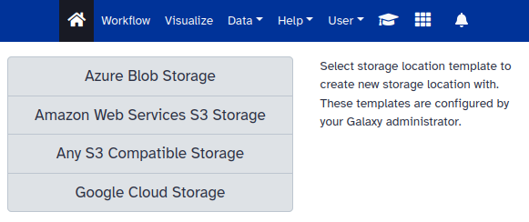

Generally speaking the user needs the following information to connect Galaxy with cloud storage:

1. Name of the bucket

1. Access key

1. Secret key

For `Any S3 Compatible Storage` the user also needs to provide the URL to the API endpoint.

Once filled out correctly the external cloud storage is connected to Galaxy:

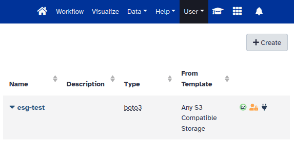

Now one interesting option for the user is to select the external cloud storage as the default storage location in Galaxy. For that, the user needs to click on the `User` drop-down menu, select `Preferences`, `Preferred Storage Location` and then select the newly added connection.

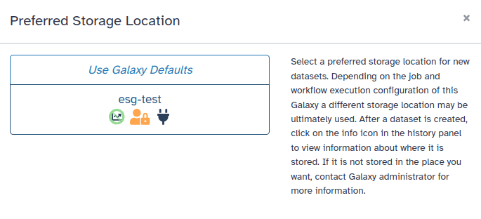

Instead of using a default storage location it is also possible to select it at different levels: per `History`, per `Tool`, and `Workflow`.

# Getting S3 storage from EGI

Users with access to cloud resources in the [EGI Federated Cloud](https://www.egi.eu/service/cloud-compute/) can benefit from the available [TOSCA template](https://github.com/grycap/tosca/blob/f8cf9f2b11ba1de4d8639ad04728de23d25d0299/templates/minio_compose.yaml) in [Infrastructure Manager (or IM)](https://im.egi.eu/) for the automated deployment of [MinIO](https://min.io/).

Below are the steps that a user needs to follow to make use of computing resources in the EGI Federated Cloud:

1. [Create an EGI Check-in account](https://docs.egi.eu/users/aai/check-in/signup/).

1. [Enroll in a Virtual Organization (VO)](https://docs.egi.eu/users/aai/check-in/joining-virtual-organisation/). You need to wait for approval before moving on.

1. Once you are a member of a VO, [configure credentials in Infrastructure Manager](https://docs.egi.eu/users/compute/orchestration/im/dashboard/#cloud-credentials).

1. In [Infrastructure Manager](https://im.egi.eu/) select `Deploy a VM` and click `Configure`.

1. Select `MinIO` and click `Add`.

1. Configure deployment details for MinIO and click `Submit`.

A prerequisite for the deployment of MinIO with IM is the use of some sort of Dynamic DNS service. EGI also offers a [Dynamic DNS service](https://docs.egi.eu/users/compute/cloud-compute/dynamic-dns/) for free for users with an EGI Check-in account (see a [tutorial](https://youtu.be/waylAJ4p-LA) for further help). Using a Dynamic DNS service the user needs to register two DNS hostnames: one DNS hostname for the `MinIO Console`, and another one for the `MinIO API endpoint`.

IM will deploy a Virtual Machine with Docker and MinIO as a containerised service. Therefore, the first step for the user is to select `Deploy a VM` in IM:

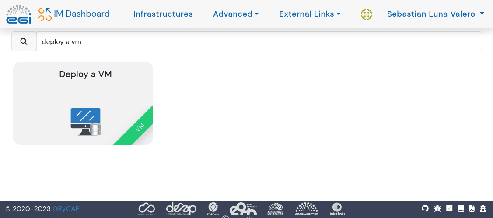

After selecting the option `Deploy a VM` in IM the user is presented with several options to deploy services on top of a Virtual Machine. The Figure below shows the filtered output when looking for MinIO. The user needs to click on `Add` and then `Configure`:

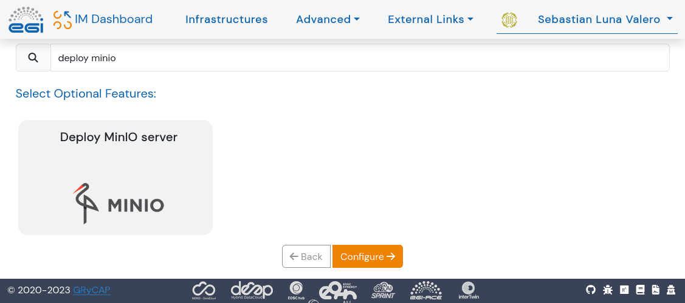

In the configuration page for the deployment in IM (see Figure below) the user needs to enter:

1. The release tag from https://github.com/minio/minio/tags for the deployment.

1. The desired access and secret key for MinIO.

1. Dynamic DNS configuration for both the Console and the API endpoint.

1. An email address used by [certbot](https://certbot.eff.org/) when registering the TLS certificates.

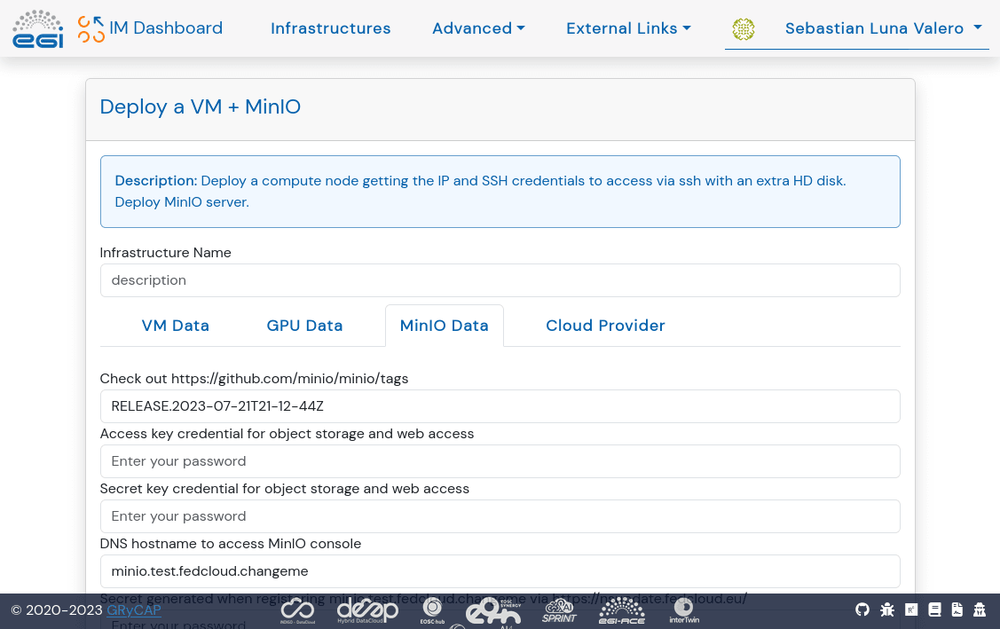

Once all the parameters are configured for MinIO and the VM, the user needs to choose a cloud provider for the deployment. This is done selecting the cloud credentials configured earlier and the Virtual Machine Image for the deployment as shown in the Figure below:

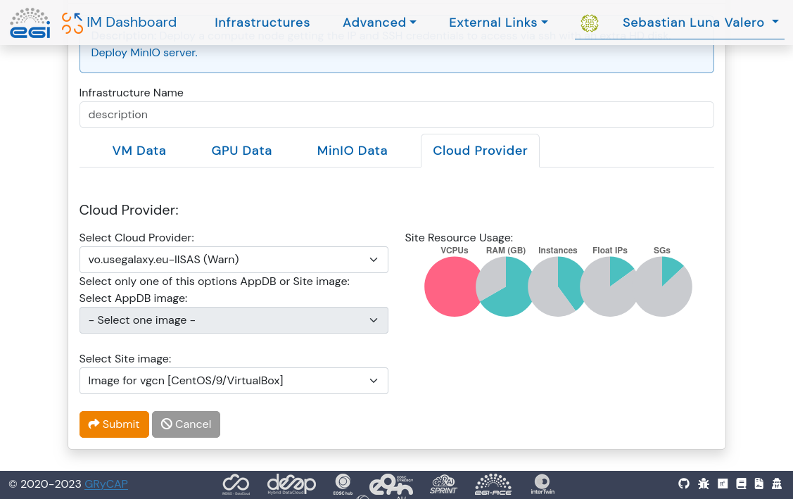

All going well IM will show the deployment as `Configured`:

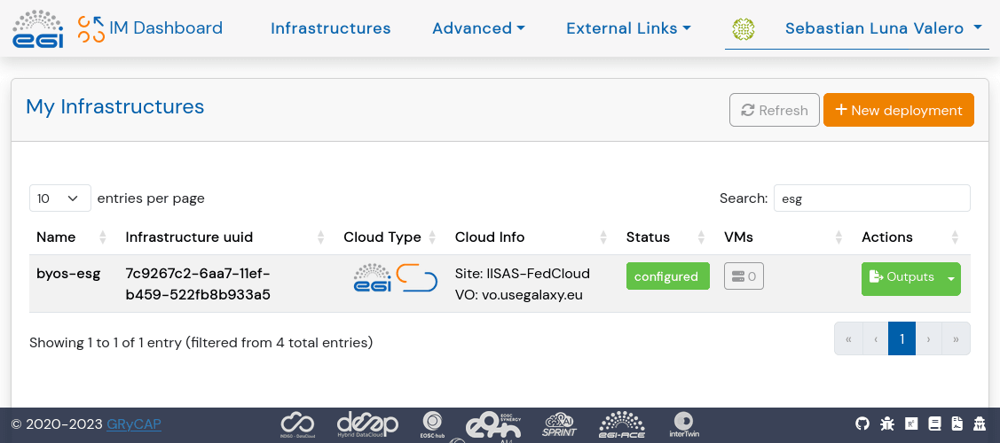

Now the user should click on the `Outputs` button under the `Actions` column to get the URL for both the MinIO Console and the API endpoint. The latter is the URL that needs to be added to Galaxy to connect with this S3 endpoint.

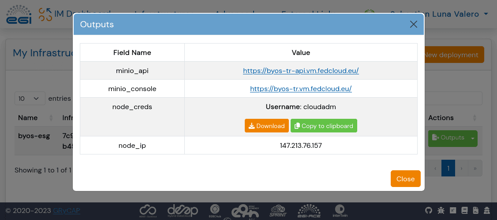

Along with the URL for the MinIO API endpoint, the user will also need to generate an access and secret key in MinIO that will then be used in Galaxy to connect to this cloud storage:

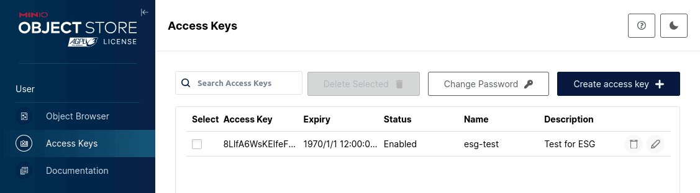

# Adding MinIO bucket to Galaxy

Once the MinIO service is up and running the user can create a bucket in MinIO. This is done by accessing the MinIO Console URL and logging in with the access and secret key generated earlier. The user can then create a bucket by clicking on the `Create Bucket` button in the top right corner of the screen and adding a name for the bucket:

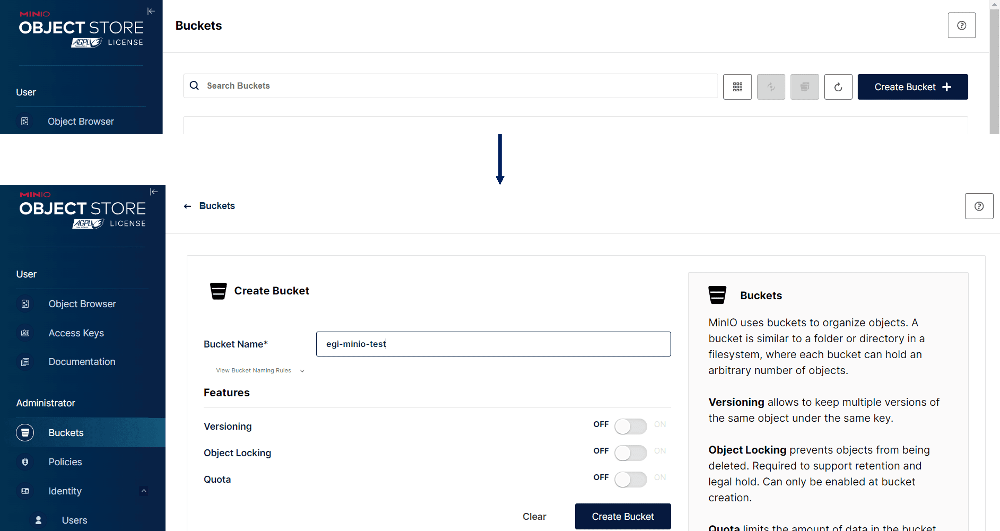

The user can then add this bucket to Galaxy by following the steps described at the beginning of this post (Select `Any S3 Compatible Storage` option from the available templates). The user needs to provide a `Name`, `Access Key ID`, `Bucket` (name of the bucket), the `S3-Compatible API Endpoint` (MinIO API endpoint), the `Secret Access Key` and submit the form.

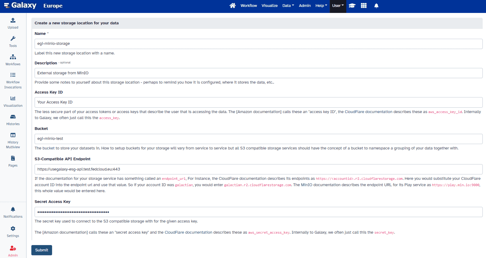

Once the bucket is added to Galaxy the user can start using it as the default storage location or select it at different levels: per `History`, per `Tool`, and `Workflow`.

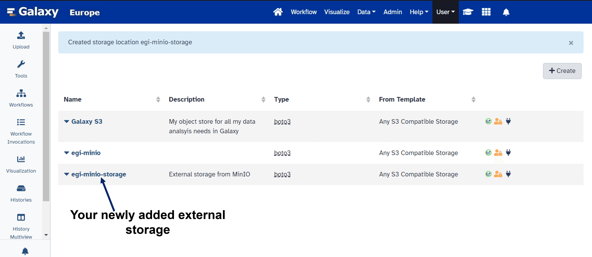

# Running workflows in Galaxy with Bring Your Own Storage

The user can now run tools and workflows in Galaxy using the newly configured external storage. Below is an example of a workflow that performs the assembly of bacterial genomes using [Shovill](https://usegalaxy.eu/?tool_id=shovill) a faster _de novo_ assembly pipeline for Illumina paired end reads.

<iframe title="Galaxy Workflow Embed" style="width: 100%; height: 700px; border: none;" src="https://usegalaxy.eu/published/workflow?id=b17603457e1d4262&embed=true&buttons=true&about=true&heading=true&minimap=true&zoom_controls=true&initialX=-20&initialY=-20&zoom=1"></iframe>

## Steps to run the workflow:

1. Create a new history in Galaxy.

2. Select the newly added external storage as the preferred storage location for the `History`.

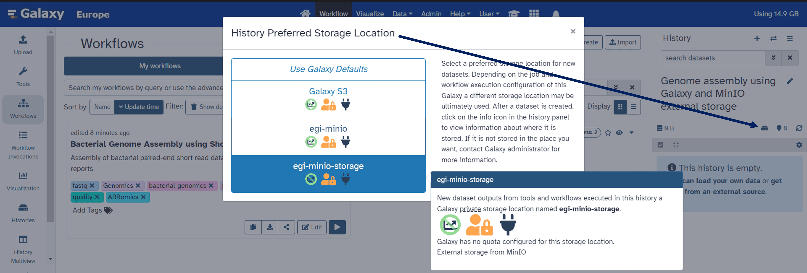

3. Upload / Import the [input data](https://usegalaxy.eu/published/history?id=8ac959df218c9188).

4. Go to the `Workflow` tab and select the workflow and run it.

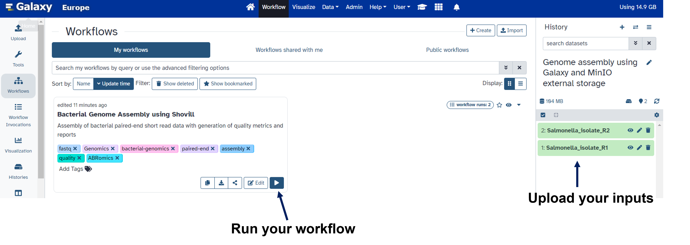

5. Once the workflow is completed, the user can find all the output files in the external storage.

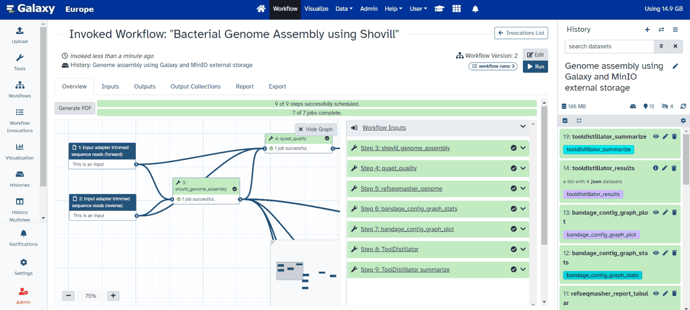

See below the output files in the external storage.

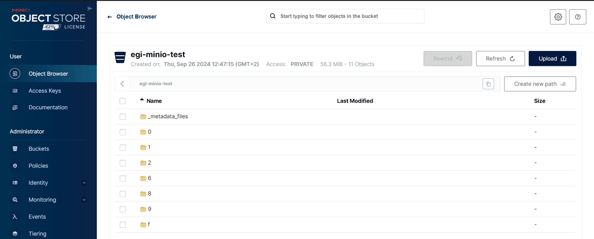

6. The user can also evaluate it by clicking the `Dataset details` of a job and observe that the user's external storage is used as the `Dataset Storage`.

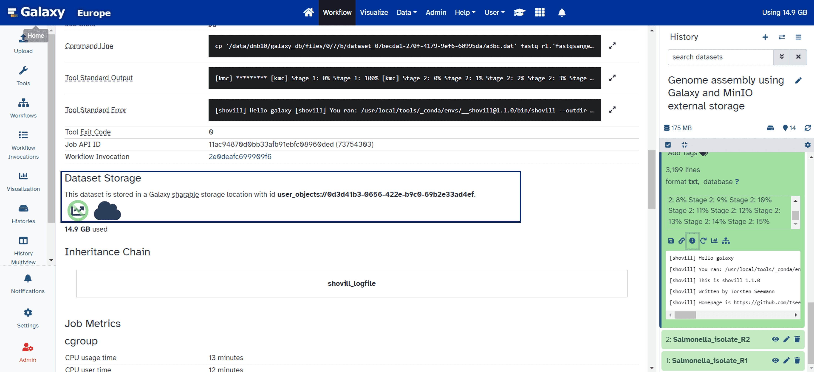

# Conclusions

Having the possibility to connect Galaxy with external storage capacity enables great flexibility for both the end user and the Galaxy administrator. The end user can benefit from extra storage capacity easily. The Galaxy administrator does not have to look after additional storage systems. All in all, this *Bring your Own Storage (BYOS)* approach allows Galaxy to scale up the number of users in a more sustainable way, thanks to the work of John Chilton and colleagues [upstream](https://github.com/galaxyproject/galaxy/pull/18127).
