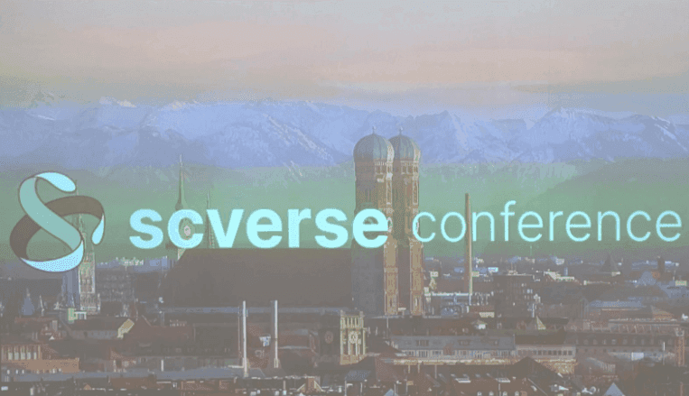
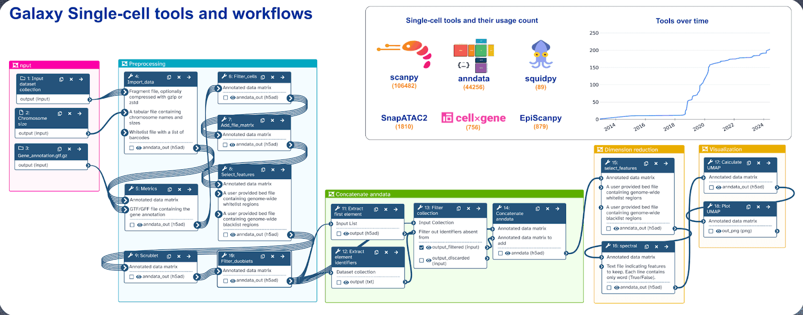

# **European Galaxy Team Presents at scverse Conference 2024**

  

The European Galaxy team recently participated in 3 days long scverse conference 2024, held at Technical University of Munich. This conference brought together researchers, developers, and scientists to explore advancements in single-cell analysis and spatial biology. The first day of the scverse conference 2024 commenced with the scverse core team presenting the latest developments in the scverse ecosystem. The morning keynote by Rob Patro focused on the critical role of efficient and accurate preprocessing methods for managing the increasing volumes of single-cell data, introducing the alevin-fry tool to the audience. Following this, keynote speaker Angela Oliveira Pisco delivered an insightful presentation on the development of a multimodal atlas for biological data analysis, The Tabula Sapiens. This is a benchmark, first-draft human cell atlas of nearly 500,000 cells from 24 organs of 15 normal human subjects.

In addition to these keynotes, the conference featured several poster flash talks that showcased the most recent developments in single-cell analysis and spatial data domains. Researchers from diverse institutions discussed novel methods, tools, and approaches to solving challenges in this evolving field. These short but impactful presentations were followed by an engaging poster session, offering attendees the opportunity to dive deeper into the ideas shared during the talks and exchange feedback. During this poster session, the European Galaxy team presented a poster highlighting Galaxy's offerings in the single-cell domain based on tool suites from scverse ecosystem. The poster showcased tools, workflows, training, and the platform’s flexibility, designed to support various stages of single-cell data processing—from data preprocessing to advanced analysis and visualization within Galaxy. Attendees were particularly curious about the platform's user-friendly interface, learning how it could streamline their own research. Most attendees were inquisitive to learn how effortlessly they can create a workflow and make their analysis process easy and reproducible. 

  

The second day of the scverse conference 2024 focused on cutting-edge advancements in single-cell analysis and spatial biology using advanced machine learning and deep learning methods. John Hawkins led the morning with a talk on “higher throughput and fidelity screens, emphasizing improved accuracy in barcode decoding”. He presented the SDR-seq method (Single-cell DNA and RNA sequencing) that claims to improve CRISPR screenings. Idris Kouadri Boudjelthia introduced NeuroVelo, a novel method for interpreting temporal cellular dynamics from single-cell data. Keynote talks were delivered by Christina Leslie, who explored the use of machine learning in regulatory genomics at single-cell resolution, and Alex Wolf, who discussed the concept of study-centered analysis and training models during his talk. Several additional talks highlighted emerging tools such as DeepSpaCE, a deep learning framework for detecting spatial single-cell domains, and scPortrait, a tool for building single-cell representations from microscopy images. Attendees also had the opportunity to participate in various workshops, including hands-on sessions on common pitfalls in single-cell analysis, scRNA project visualization, and interactive analysis using AnnData & SpatialData. Parallel workshops were offered on advanced topics like trajectory inference in single-cell analysis and benchmarking open problems in the field. The second day concluded with a conference dinner at Alte Utting, offering participants a chance to network and foster collaborations.

  

The final day of the scverse conference 2024 wrapped up with interactive workshops on essential topics like training models on atlas-scale single-cell datasets, making first contributions to sc-verse, and using Data Version Control in collaborative science. The workshops were followed by keynote speaker, Maria Brbic who showcased cutting-edge AI tools for single-cell domains, addressing the challenges of heterogeneous data. A key highlight was a talk by Fabian Theis discussing the evolution of single-cell analysis from Scanpy to virtual cells. Other talks explored advanced methods like Segger’s use of graph neural networks for cell segmentation and Novae’s graph-based model for domain assignments. Afternoon workshops included GPU-accelerated single-cell analysis, the Bento platform for subcellular spatial transcriptomics, and a deep dive into Big Data with AnnData. The day concluded with closing remarks, bringing an end to three days of intense collaboration, innovation, and exploration of the future of single-cell genomics.

We extend our gratitude to the organizers of the scverse conference for hosting such an insightful event and creating a platform that promotes deeper exploration and fosters open-source collaborations in the evolving field of single-cell omics. 

To learn more about Galaxy's offering in Single-cell and Spatial Omics domain, click [here.](https://singlecell.usegalaxy.eu/)
