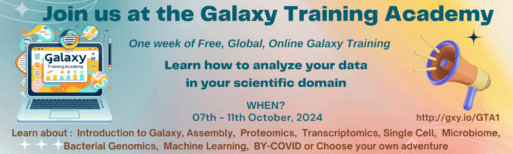
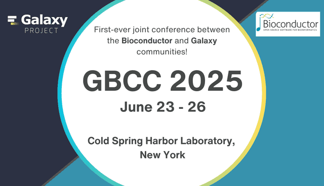

# Galaxy Newsletter: September 2024  

Hello, Galaxy Community!

We’re excited to bring you another packed edition of the Galaxy Newsletter! In this issue, we’re sharing updates on the Galaxy Training Academy 2024, the first-ever Galaxy and Bioconductor Community Conference (GBCC 2025), and the exciting arrival of ColabFold on Galaxy. We’re also celebrating some incredible Galaxy milestones, including surpassing 500k registered users and closing in on 20k citations on Google Scholar. Don’t miss our latest Galaxy in Research highlights, and be sure to check out our list of upcoming events where you can connect with the community.

Thank you for tuning in and for being a part of Galaxy!

---

## **Galaxy Training Academy 2024**  

**Overview**

The Galaxy Training Academy 2024 is a 5-day global online event happening from October 7–11, 2024. This event is designed for anyone eager to learn or improve their skills in bioinformatics using the Galaxy platform, whether you're a beginner or looking to level up. Best of all, it's completely free! The Academy will offer flexible, self-paced learning sessions to suit your schedule and skill level.

**What to expect!**

**Self-paced Learning:** Participants will have access to a variety of tracks covering topics such as genomics, machine learning, and more. Each day features a new topic, allowing you to focus on your specific interests.

**Expert Support:** You'll be connected with a global community of trainers and fellow learners through Slack channels, ensuring you receive real-time support and collaboration opportunities.

**Hands-on Training:** Get practical experience working with real-world datasets and bioinformatics tools on the Galaxy platform, gaining valuable skills to apply in your research or career.

**How to join**

Registration is open until September 30th, 2024. To participate, simply register online, and you'll be given access to all necessary materials and guidance for the event. No prior experience with Galaxy is needed—just a browser and an account on a Galaxy instance.

[Learn more and register!](https://training.galaxyproject.org/training-material/events/galaxy-academy-2024.html)

---

## **Galaxy and Bioconductor Community Conference 2025 (GBCC2025)**

Mark your calendars for June 23-26, 2025! We are excited to announce the first-ever Galaxy and Bioconductor Community Conference (GBCC 2025), taking place at the iconic Cold Spring Harbor Laboratory in New York. This event will unite the Galaxy and Bioconductor communities for an unprecedented collaboration aimed at advancing bioinformatics and data science tools across both platforms. 

**What to expect:**

* **Cutting-Edge Keynotes:** Hear from leaders in both the Galaxy and Bioconductor communities about the latest innovations in genomics and data science.  
* **Hands-On Tutorials:** Gain practical experience integrating Bioconductor tools with Galaxy during interactive workshops and tutorials.  
* **Networking and Collaboration:** Connect with peers during poster sessions, social events, and group activities. GBCC 2025 is designed to spark long-term collaborations between both communities.  
* **Diversity and Inclusion:** Scholarships, support for underrepresented groups, and resources for those with childcare needs will ensure an inclusive and welcoming environment for all attendees.

**Why plan to join?**

By attending GBCC 2025, you’ll be joining the forefront of bioinformatics and data science innovation. This is your chance to collaborate with global experts, contribute to discussions on reproducibility and open science, and learn how to leverage the combined power of Galaxy and Bioconductor to advance your research. 

**Logo design contest**

Get creative! We’re kicking off a GBCC 2025 logo design contest, and we want you to design the official logo. The winning design will be featured on all conference materials—think t-shirts, stickers, and more! Stay tuned for contest details.

---

## **Welcoming ColabFold to Galaxy!**

We are thrilled to announce that ColabFold, the powerful tool combining MMseqs2 with AlphaFold2 or RoseTTAFold for ultra-fast protein structure prediction, is now fully available on UseGalaxy.org! This exciting addition allows users to effortlessly predict protein structures and complexes in a fraction of the time, harnessing the speed of MMseqs2 and the accuracy of AlphaFold2—all within the familiar Galaxy environment. 

What makes this even better? The Galaxy version of ColabFold has streamlined the process by splitting it into two steps: the MSA (Multiple Sequence Alignment) step and the AlphaFold2 step. Each step runs quickly, with individual sequences completing in seconds or minutes. This unique two-part design also lets you take an iterative approach, refining your results at each step—a feature we know you’ll love!

Plus, with ColabFold running entirely on Galaxy servers, users worldwide now have more capacity than ever to analyze protein structures—no more waiting on limited resources! This is a game-changer for researchers who have been eagerly awaiting this tool.

Interested? Please keep in mind a few key details:

* Galaxy users can run up to two MSA jobs and four AlphaFold2 jobs concurrently.  
* The MSA tool accepts up to 20 sequences per FASTA/a3m file.  
* AlphaFold2 jobs are shared across users, so some wait time may occur. Be sure to leave your jobs queued until completion. In the meantime, other Galaxy jobs can still run!

We’d like to give a huge shout-out to the Advanced Research Computing team at Johns Hopkins for supporting the MSA step and to the Frontera project at the Texas Advanced Computing Center for providing the GPU power behind AlphaFold2. Special thanks to Milot Mirdita, developer of ColabFold, and our supporters at NHGRI and NSF for making this possible.

For more information on ColabFold, check out the [GitHub repository](https://github.com/sokrypton/ColabFold) and read the [original publication](https://www.nature.com/articles/s41592-022-01488-1), which explains how it all works.

Get started today on UseGalaxy.org, and happy folding!

---

## **Galaxy Milestones**

We’re thrilled to share some incredible milestones that highlight the growth and impact of the Galaxy Project!

**500,000 Registered Users**

Across all Galaxy instances, we have officially surpassed **half a million registered users**! This achievement speaks to the power of the Galaxy community and the vital role the platform plays in democratizing bioinformatics and data science for researchers worldwide. Every new user is a testament to the accessibility, versatility, and collaborative spirit that Galaxy fosters. We’re proud of this incredible milestone and can’t wait to welcome even more users into the Galaxy community as we continue to expand and evolve.

**Approaching 20,000 Citations**

On top of our expanding user base, Galaxy is also on the verge of reaching another major milestone—**20,000 citations on Google Scholar**! We anticipate crossing this mark before the end of the year, solidifying Galaxy’s place as a key player in advancing reproducible science.

Thank you to every single user, developer, and contributor who has been part of this journey. We couldn’t have done it without your passion and commitment to open science! Let’s keep growing and innovating together!

---

## **Galaxy in Research**

_Exploring the Latest in Galaxy-Driven Research_

In the recent editions of Galaxy in Research, we’ve highlighted some of the most exciting scientific breakthroughs made possible by Galaxy. From cutting-edge data analysis to novel insights in genomics and beyond, these studies showcase the power and versatility of the platform. See below for some of our most recent Galaxy in Research highlights!

[**Galaxy in Research: Uncovering the evolutionary secrets of wild loquats using comparative chloroplast genomics**](https://galaxyproject.org/news/2024-09-05-galaxy-in-research-lin2024/)  
*A new study has sequenced and analyzed two wild loquat chloroplast genomes, revealing key insights into their evolutionary history and the genetic diversity of loquat species.*

[**Galaxy in Research: Advancing quantum materials research with Galaxy**](https://galaxyproject.org/news/2024-19-08-galaxy-in-research/)  
*At Oak Ridge National Laboratory, scientists have harnessed the power of Galaxy to bring together cutting-edge computing resources, paving the way for new discoveries in quantum materials through advanced neutron scattering data analysis.*

[**Galaxy in Research: Exploring DNA methylation and aging across diverse human tissues**](https://galaxyproject.org/news/2024-08-14-galaxy-in-research/)  
*How does DNA methylation correlate with aging across different human tissues? A new study provides insights into this question, revealing tissue-specific and shared epigenetic patterns.*

[**Galaxy in Research: Exploring Genetic Variability in Almond Blooming**](https://galaxyproject.org/news/2024-07-30-galaxy-in-research-mir/)  
*Learn how genetic variations influence the blooming periods of almond cultivars, revealing key insights into their molecular regulation.*

---

## **Upcoming Events**

| DATE | EVENT | VENUE/LOCATION |
| :---- | :---- | :---- |
| 07–11 October 2024 | [Galaxy Training Academy 2024](https://training.galaxyproject.org/training-material/events/galaxy-academy-2024.html) | Online |
| 08–10 October 2024 | [Gateways 2024](https://sciencegateways.org/gateways2024) | Bozeman, MT, USA |
| 21–23 October 2024 | [EOSC Symposium 2024](https://eosc.eu/symposium2024) | Berlin, Germany |
| 13–16 November 2024 | [CSHL Biological Data Science](https://meetings.cshl.edu/meetings.aspx?meet=data&year=24) | Cold Spring Harbor, NY, USA |
| 21 November 2024 | [Small Scale Galaxy Meeting](https://galaxyproject.org/events/2024-11-small-scale/) | Online |
| 10–15 January 2025 | [Plant and Animal Genome Conference (PAG32)](https://www.intlpag.org/2025/) | San Diego, CA, USA |
| 23–26 June 2025 | [Galaxy and Bioconductor Community Conference (GBCC2025)](https://galaxyproject.org/news/2024-09-03-gbc-c2025/) | Cold Spring Harbor, NY, USA |

---

*Thank you for being a part of Galaxy!*

**Get more timely info by following us on [Mastodon](https://mastodon.social/@galaxyproject@mstdn.science), [Bluesky](https://bsky.app/profile/galaxyproject.bsky.social), and [LinkedIn](https://www.linkedin.com/company/galaxy-project)!**   
