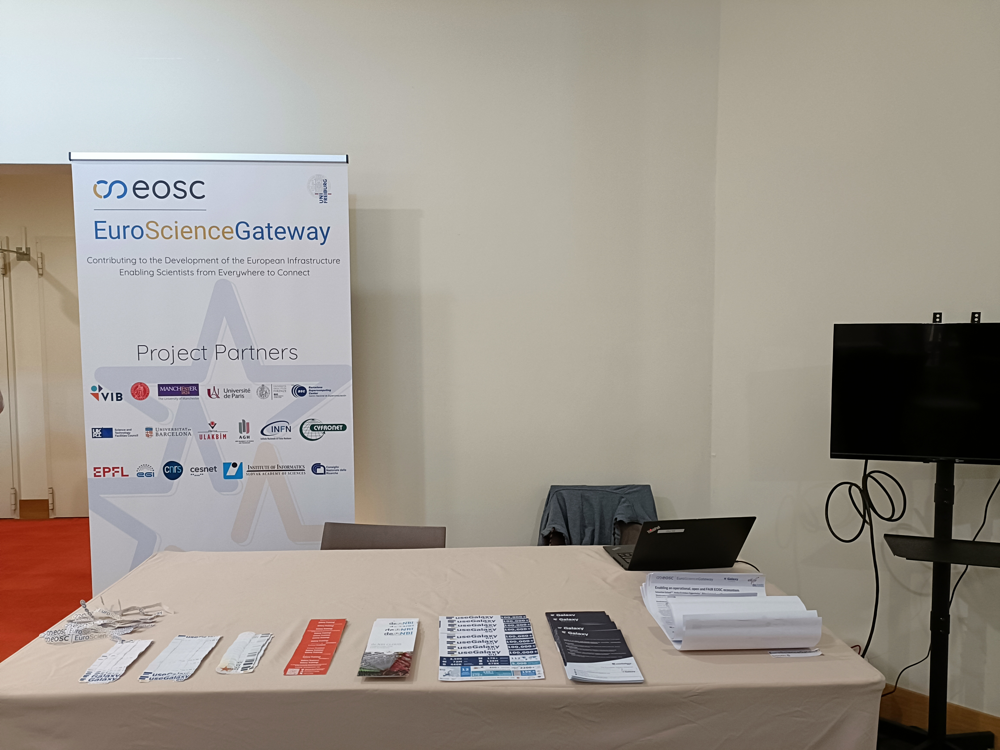
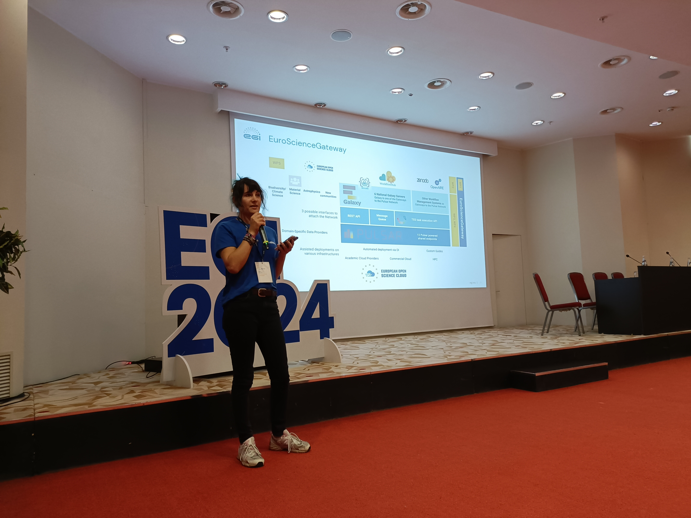

During 1st-3rd of October, Björn Grüning, Mira Kuntz, and Sanjay Kumar Srikakulam from the European Galaxy Team traveled to Lecce to join the [EGI2024 conference](https://www.egi.eu/event/egi2024/) and presented the [EuroScienceGateway project](https://galaxyproject.org/projects/esg/) along with collaborators. With Sebastián Luna-Valero and Enol Fernández (EGI), Hakan Bayındır (ULAKBIM/TR), Łukasz Dutka (Cyfronet/PL), work packages 1, 3 and 4 of ESG were represented.

At EGI2024, we held a booth on Galaxy and usegalaxy.eu, presenting the European Galaxy Server to a broader audience from various scientific fields. We also introduced Galaxy through presentations and presented its opportunities, the ESG project, and its updates. The team also participated in several open meetings and discussions, including the **EGI Federated Cloud community** and the **EGI Trusted Research Environments (TRE) Working Group** sessions.

# Events

## Day 1 - October 1st

On the first day, we set up the ESG booth. After the conference opening session in the afternoon, Mira pitched the booth and advertised Galaxy and the ESG project during the **Pitches: Exhibition** session.

## Day 2 - October 2nd

Sebastian presented a talk titled **EuroScienceGateway: Leveraging the European compute infrastructures for data-intensive research guided by FAIR principles** during the **Simplifying Data-Driven Science with User-Friendly Platforms and Gateways** session. A Q&A session followed the presentation.

| Presenters | Title | Links |
|---|---|---|
| Sebastian | EuroScienceGateway: Leveraging the European compute infrastructures for data-intensive research guided by FAIR principles | [Slides](https://indico.egi.eu/event/6441/contributions/19369/) |

During the session, Sebastian introduced Galaxy and the ESG project. He presented the ESG architecture, the design, setup, and architecture of Galaxy's EU instance, recent developments in the ESG project, such as Bring Your Own Storage and Bring Your Own Computer, integrations with WLCG IAM and EGI Check-in, optimized job scheduling and visualization and distributed computing using [PULSAR ](https://pulsar-network.readthedocs.io/en/latest/index.html) and [ARC](https://arc-user-guide.readthedocs.io/en/latest/index.html).

The initiative aims to create an open infrastructure for data-driven research, focusing on providing a user-friendly scientific workflow and data integration platform. This endeavor seeks robustness, scalability, and integration, enabling federated computational infrastructures and democratizing research data analysis.

# Thank You!

The European Galaxy team would like to **thank** the **Galaxy community**, **members of the ESG** for all their contributions that were presented, and **EGI** for the fantastic organization of this meeting.

