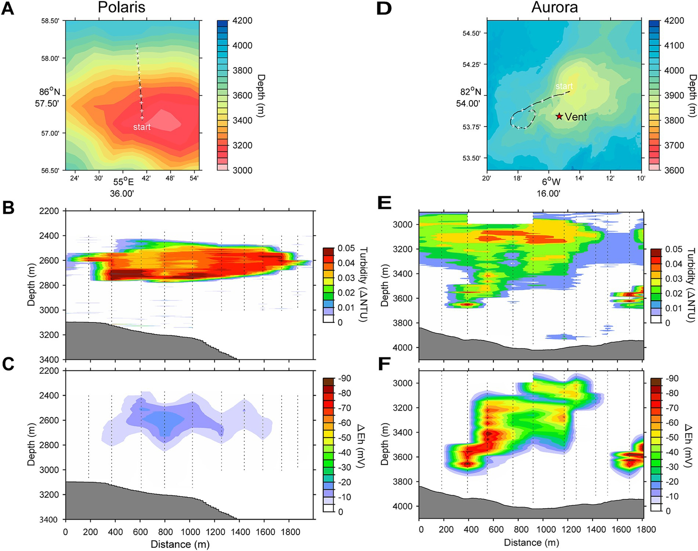

# **Galaxy in Research: Microbial life at Arctic hydrothermal vents**

*How do hydrothermal vents at the bottom of the Arctic Ocean fuel microbial life? A new study explores the microbial ecosystems thriving at the Aurora and Polaris seamounts, revealing key insights into how hydrogen and sulfur power deep-sea life.*

In this study, Gunter Wegener and colleagues explored the microbial and biogeochemical impacts of hydrothermal vents located along the Gakkel Ridge in the Arctic Ocean. At two recently discovered volcanic seamounts, Polaris and Aurora, researchers found hydrothermal plumes rising nearly 800 meters into the water column, carrying hydrogen and sulfur compounds that fuel unique microbial life. These plumes revealed elevated microbial carbon fixation rates, far exceeding background levels, driven by chemosynthetic bacteria.

This research uncovered how specific bacterial species thrive in these frigid environments, using hydrogen and sulfur as primary energy sources. The team’s transcriptomic analysis showed differences in gene expression between the two sites, reflecting variations in available energy sources. While sulfur-based bacteria dominated the Polaris plume, hydrogen-oxidizing microbes flourished at Aurora, demonstrating the critical influence of vent chemistry on microbial community structure.

## **Key Findings**

*	**Elevated Carbon Fixation:** Microbial carbon fixation at the vent plumes reached up to 46 μmol IC m⁻³ day⁻¹, significantly higher than background levels of 0.5–1 μmol IC m⁻³ day⁻¹.

*	**Microbial Diversity and Adaptation:** The bacterial communities at Polaris and Aurora differed, with SUP05 dominating at Polaris and Candidatus Sulfurimonas pluma thriving at Aurora, reflecting the available energy sources.

*	**Hydrogen and Sulfur as Key Energy Sources:** At Aurora, hydrogen was the primary driver of microbial growth, while sulfur oxidation played a more significant role at Polaris.

*	**Limited Role of Methane Oxidation:** Despite detectable pmo gene transcripts, methane oxidation was not observed, likely due to extremely low temperatures and rapid methane dilution in the Arctic waters.

    
*Figure showing the water column profiles and location of the study vents.* 

## **Galaxy’s Role**

Galaxy was integral to the construction of a detailed phylogenetic tree of the microbial communities identified in the hydrothermal plumes. Specifically:

* **16S rRNA Phylogenetic Analysis:** Researchers used Galaxy’s MAFFT tool with the L-INS-i method to align the 16S rRNA sequences. This alignment was critical for understanding the relationships between bacteria across different hydrothermal plumes.

* **Data Cleaning with BMGE:** The Galaxy platform provided access to BMGE, which helped refine and clean the sequence alignment, ensuring high-quality data for phylogenetic analysis.

## **Significance of Study**

This research sheds new light on the unique microbial ecosystems that thrive in the harsh environments of Arctic hydrothermal vents. The findings emphasize how hydrogen and sulfur fuel life in deep-sea ecosystems, with important implications for understanding biogeochemical cycles in extreme environments. The study also contributes to our knowledge of microbial community dynamics, showing how vent chemistry shapes microbial diversity and adaptation in the deep ocean.

## **Acknowledgment**

A special thank you to the entire research team for using Galaxy to power their phylogenetic analyses. Your work highlights the platform’s versatility and underscores the importance of open, accessible tools in advancing marine microbiology.

--- <be> 

Wegener G, Molari M, Purser A, Diehl A, Albers E, Walter M, Mertens C, German CR and Boetius A (2024) Hydrothermal vents supporting persistent plumes and microbial chemoautotrophy at Gakkel Ridge (Arctic Ocean). Front. Microbiol. 15:1473822. doi: 10.3389/fmicb.2024.1473822
