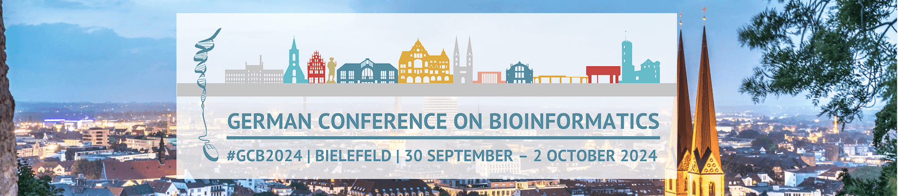
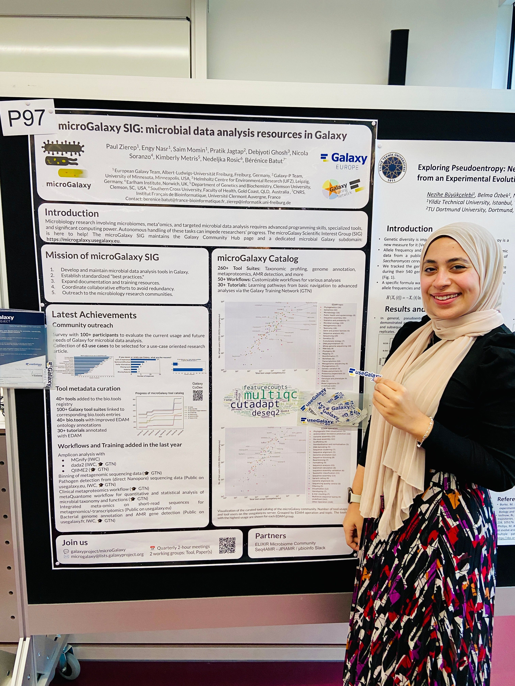

The [German Conference of Bioinformatics (GCB) 2024](https://gcb2024.de/) took place in Bielefeld from September 30 to October 2, bringing together leading minds in bioinformatics to discuss the latest advancements in computational biology, microbiome research, genomics, and more. Representing the Galaxy community, Engy Nasr and Saim Momin attended, contributing with two poster presentations and participating in workshops, poster sessions, and stimulating talks. Here’s a recap of our experience and the conference highlights.

### Day 1: Hands-on Workshops

Our GCB 2024 journey began with two in-depth workshops, where we gained valuable insights and skills in specialized areas of bioinformatics. With seven workshops running in parallel, we joined the following two sessions:

1. **Computational Pangenomics Workshop:** This workshop covered pangenomics fundamentals, with applications in analyzing genetic diversity across species. We explored advanced computational tools for building and analyzing pangenomic datasets, including *PanBench*, *PanGrowth*, *Plast*, *Bifrost*, and *SANS*. The hands-on exercises illuminated new ways we could use pangenomic analysis within the Galaxy framework.

2. **Bioinformatic Metagenome and Metaproteome Analysis for Microbiome Insights:** Led by leading microbiome researchers, this session provided tools and workflows for understanding metagenomic and metaproteomic data. We learned methods for assessing microbial communities, a crucial area in Galaxy’s microbial data analysis tools. 

### Keynotes, Conference Sessions, and Poster Interactions

Across the two main conference days, a mix of talks, poster sessions, and networking opportunities enriched our knowledge. Highlights included keynote talks from prominent researchers and experts in bioinformatics and genomic sciences, tackling issues in microbiome data integration, large-scale clinical data analysis, and applications in environmental science. We found sessions on data standardization, open-source workflows, and community-driven research especially pertinent.

The poster sessions, featuring 158 posters, were a lively exchange of ideas. Presenting our work and discussing it with colleagues across bioinformatics sparked new perspectives on data standards, reproducibility, and community collaboration.

### Galaxy Team Poster Presentations

Our Galaxy team contributed two posters, both well-received and served as excellent opportunities for discussion:

- **microGalaxy SIG: Microbial Data Analysis Resources in Galaxy**  
   This poster highlighted Galaxy's resources for microbial data analysis, outlining workflows and tools designed for complex microbial data sets. We connected with microbiome researchers, discussing ways Galaxy can continue to support and adapt to microbial data needs.

- **Community-Driven Standards Development for Reference Genome Generation**  
   This poster addressed the collaborative efforts of Galaxy EU and [ERGA](https://www.erga-biodiversity.eu/) community to establish community-driven standards for reference genome generation. The feedback underscored the importance of ongoing community involvement in developing adaptable, high-standard open-source tools and workflows.

  

### Social Program: Networking and Cultural Highlights

Beyond the enriching scientific exchange, GCB 2024’s social program added a unique flavor to the event. We attended a networking dinner at the [GLÜCKUNDSELIGKEIT restaurant](https://gcb2024.de/Social+Programme.html), complete with guided tours of the Bielefeld city, followed by a delightful dinner reception. Conversations flowed easily, sparking ideas for future collaborations within the bioinformatics community. These informal exchanges gave us the chance to connect with peers, gain insights into their work, and share our own experiences working within the Galaxy ecosystem.

### Reflections and Takeaways

Attending GCB 2024 was an inspiring experience for our team, marked by learning, collaboration, and cultural discovery. The breadth of topics—from pangenomics to community standards in genome generation—broadened our understanding of current bioinformatics challenges and innovations. We left with renewed enthusiasm for advancing Galaxy’s contributions in bioinformatics and are grateful to the organizers, speakers, and participants who made this event both insightful and memorable.

Looking forward to future collaborations with the dynamic GCB community!
