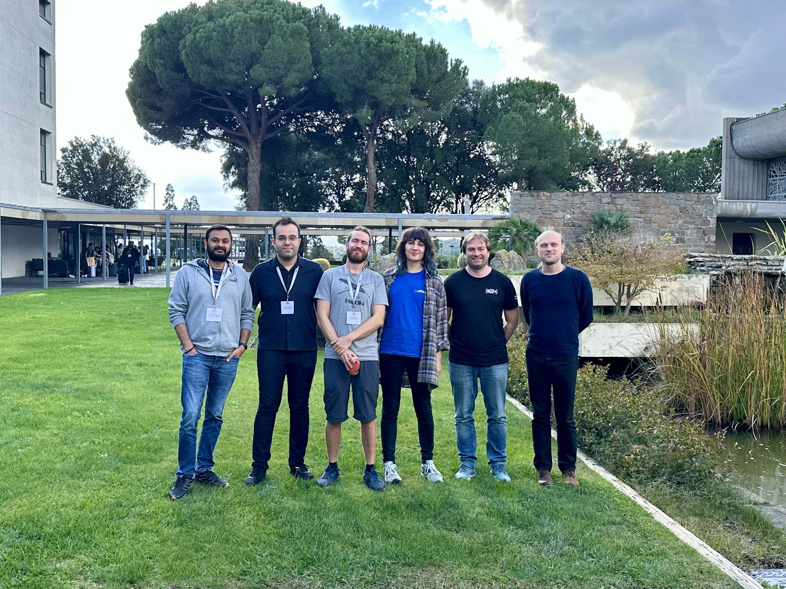

This year, [BioHackathon Europe](https://biohackathon-europe.org/index.html) in Barcelona took place between the 4th and 8th of November. Some members of the Galaxy Community went there and participated in various Galaxy-related projects. The event was a total blast: 5 days in a remote area to work, code, have fun, eat and discuss with the 150 other participants from all over Europe (even Australia)!

The main projects that interacted with Galaxy were:

# [Project 20](https://github.com/elixir-europe/biohackathon-projects-2024/blob/main/11.md)

Building on the achievements of BioHackathon Europe 2023, we successfully enhanced the Galaxy ecosystem by extending the capabilities of the existing Galaxy tool list table. A major milestone was the addition of workflows and training, leading to the creation of the Galaxy Communities Dock (Galaxy Codex).
This new resource also integrates the Galaxy Labs and allows the addition of community resources automatically.

This project was led by Bérénice Batut and Wendi Bacon. Paul Zierep helped with updates to the CI and minor code improvements.

The updates are available via the [Galaxy CoDex](https://github.com/galaxyproject/galaxy_codex) GitHub repository.

# [Project 21](https://github.com/elixir-europe/biohackathon-projects-2024/blob/main/21.md)

This project worked on a vision of a “federated microbiome analysis service”.
Paul Zierep participated in the discussion involving Galaxy and Alireza Heidari supported front-end related coding.

A preprint is available [Enhancing multi-omic analyses through a federated
microbiome analysis service](https://doi.org/10.37044/osf.io/3x274)

# [Project 22](https://github.com/elixir-europe/biohackathon-projects-2024/blob/main/22.md)

The objective of the project can be divided into two milestones:

* Development of a workflow that connects EGA, either central or any federated node, and Galaxy through Crypt4GH protocols.
* Galaxy's secure processing protocol: Sensitive datasets are kept encrypted throughout, with sensitive derivative results labelled as sensitive.

# [Project 26](https://github.com/elixir-europe/biohackathon-projects-2024/blob/main/26.md)
We focused on making computational data analysis more environmentally sustainable through improvements to Galaxy. By leveraging Galaxy's control over resource usage, we aimed to reduce the environmental impact of workflows via two key initiatives: job caching and environmentally friendly job scheduling.
### Smarter Resource Use with Job Caching

Galaxy already tracks the provenance of every tool execution, and we used this information to avoid redundant computations. Job caching enables Galaxy to reuse existing outputs when input parameters and conditions match, saving time and resources. During the Biohackathon, we worked to extend this feature to handle more scenarios. For example, we are refining how dataset metadata is matched to determine whether a job can be reused.

Additionally, we explored ways to enable shared caching among users who opt-in. This will be especially useful in collaborative settings, such as training sessions, where large-scale analyses can be performed without unnecessary computational overhead.
### Scheduling with Sustainability in Mind

Galaxy’s Total Perspective Vortex (TPV) plugin offers powerful scheduling capabilities by routing jobs to destinations based on custom rules. At the BioHackathon, we expanded TPV's functionality to prioritize sustainability. We gathered detailed job statistics from Galaxy's database and compute nodes, but also from the remote job execution endpoints called [Pulsar](https://github.com/galaxyproject/pulsar). Because Pulsar endpoints don't require any port to be open to the public, we needed to find a way where Pulsar could send this information actively. This was achieved by a script on the Pulsar endpoint that consumes the queue's status and other information and sends it to a message queue ([RabbitMQ](https://www.rabbitmq.com/)) from which another script picks it up and sends it to our InfluxDB server. We developed ranking algorithms that direct jobs to the most environmentally friendly destinations. These algorithms take into account factors such as energy efficiency and resource usage to ensure that Galaxy workflows have a smaller carbon footprint.
### Network Boot Skill Sharing
Galaxy Europe's workload fluctuates, with idling servers during holidays and heavy job queues in peak seasons.
We are currently using an OpenStack instance where we spin up our images, so-called 'Virtual Galaxy Compute Nodes' ([VGCN](https://github.com/usegalaxy-eu/vgcn)) which contain everything needed to pick up jobs from [HTCondor](https://htcondor.org/) and start crunching numbers.
Although the cloud is convenient for splitting large machines into smaller units, such as dedicated training infrastructure ([TiaaS](https://usegalaxy-eu.github.io/tiaas.html)), it is challenging to maintain, complex, and inflexible for power-saving. While we can stop cloud VMs, the underlying hypervisor hardware cannot be powered off.
Additionally, the hypervisor uses 5% of resources, and each VM uses another 5% for job management, leading to increased overhead, hardware wear, and energy use.
Paradoxically, simplifying and saving power requires some initial added complexity.
Moving away from the cloud should not require days in the data centre to install OSs on each node or address failed updates. So we need one OS image that is booted by all servers, just like in the cloud but on hardware.
You might know PC-pools from schools or universities. These usually don't store the OS on the local hard drive, but get it from centralized servers via LAN.
This process, known as network booting, uses a technology called [PXE](https://wiki.archlinux.org/title/Preboot_Execution_Environment) (Preboot Execution Environment). It can be implemented in various ways; we describe only our setup here. The BIOS/UEFI is not booting from a disk but is told to boot from the PXE supporting network interface card (NIC), which asks the DHCP server where to get a boot file. The NIC retrieves a boot file with the IP address of a [TFTP](https://wiki.archlinux.org/title/TFTP) (T=trivial) server. The server provides an [iPXE](https://ipxe.org/) boot file containing a URL to a web server (or S3 bucket) where it downloads an [initramfs](https://wiki.debian.org/initramfs) and kernel file. iPXE adds features to PXE, such as communication via HTTP. The initramfs contains the instructions to load the actual, final OS image via [DNBD3](https://www.bwlehrpool.de/wiki/doku.php/satellite/dnbd3) (Distributed Network Block Device 3) which is based on [NBD](https://github.com/NetworkBlockDevice/nbd/blob/master/doc/proto.md). This protocol allows to only pull files that are currently needed and accessed, which increases boot speed. If files need to be overwritten, they are stored on the local disk. During the BioHackathon, we learned about network booting and how Galaxy Europe can create custom initramfs using [dracut](https://dracut-ng.github.io/dracut-ng/) and [ansible](https://git.openslx.org/openslx-ng/ansible-dracut.git/) to implement DNBD3.

# Fun time

And we had an overall great time joining the sports events, wine tasting and amazing food!

