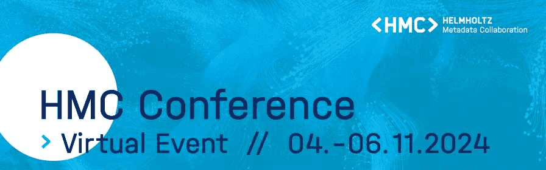
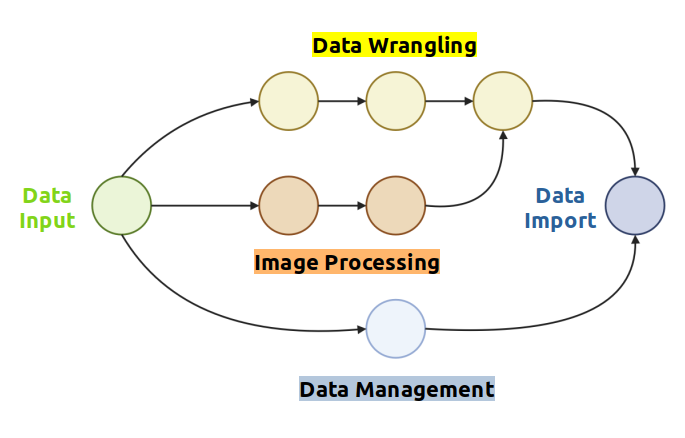

## The Helmholtz Metadata Conference (HMC) 2024

The Helmholtz Metadata Collaboration (HMC) focuses on enhancing research
data quality through metadata, implementing this approach throughout the 
entire organisation. Its primary goal is to make the extensive research 
data produced by Helmholtz Centres findable, accessible, interoperable, 
and reusable (FAIR) for the scientific community. This year’s Helmholtz 
Metadata Conference (HMC) was held virtually in Gather Town from November 
4th to 6th. The event targeted scientists, data professionals, software developers,
and anyone engaged with metadata. Sessions covered a range of topics, 
including metadata management, ontologies, metadata schemas and formats, 
semantics, standardisation, and workflows.

## Building FAIR Bioimage Pipelines with Galaxy
In the “workflow” session, I presented the application of Galaxy to develop 
FAIR analysis pipelines for metadata annotation and image management in 
high-content screening (HCS) bioimaging. In fact, Galaxy workflows enhance 
data FAIRness by allowing annotation, collaboration, and public sharing. 
Additionally, Galaxy tools are transparent, meaning they can be easily 
inspected within the Galaxy Tool Shed, providing a clear view of their 
structure.

## Integrating OMERO and Galaxy
During the conference, I discussed integrating OMERO’s upload and image 
annotation features with Galaxy’s image analysis workflows. 
This integration enables images to be automatically enriched with metadata 
(e.g., key-value pairs, tags, raw data, regions of interest) and uploaded 
to a user-defined OMERO server using a new OMERO tool suite developed in 
Galaxy. Currently, the suite offers tools for image and ROI uploads, 
metadata enrichment, and data filtering or retrieval, making it simple 
to transfer data and metadata to an OMERO instance.

## Combining Image Processing and Data Management in One Workflow
Image processing can be added to OMERO workflows. Users can retrieve
images from a local server and perform image analyses, such as annotation,
segmentation, or background subtraction. Galaxy is a powerful tool for 
image analysis, integrating popular software like CellProfiler and connecting 
with cloud services like OMERO and the IDR. This integration allows for 
efficient access to and management of image data, which is invaluable in 
bioimaging. Automated pipelines streamline the handling of complex metadata,
ensuring data integrity and fostering interdisciplinary collaboration. 
This approach not only boosts the efficiency of HCS bioimaging but 
also aligns with the scientific community’s FAIR principles, driving 
scientific discovery and innovation forward.

The presentation was shared on [Zenodo](https://zenodo.org/records/14044640)
