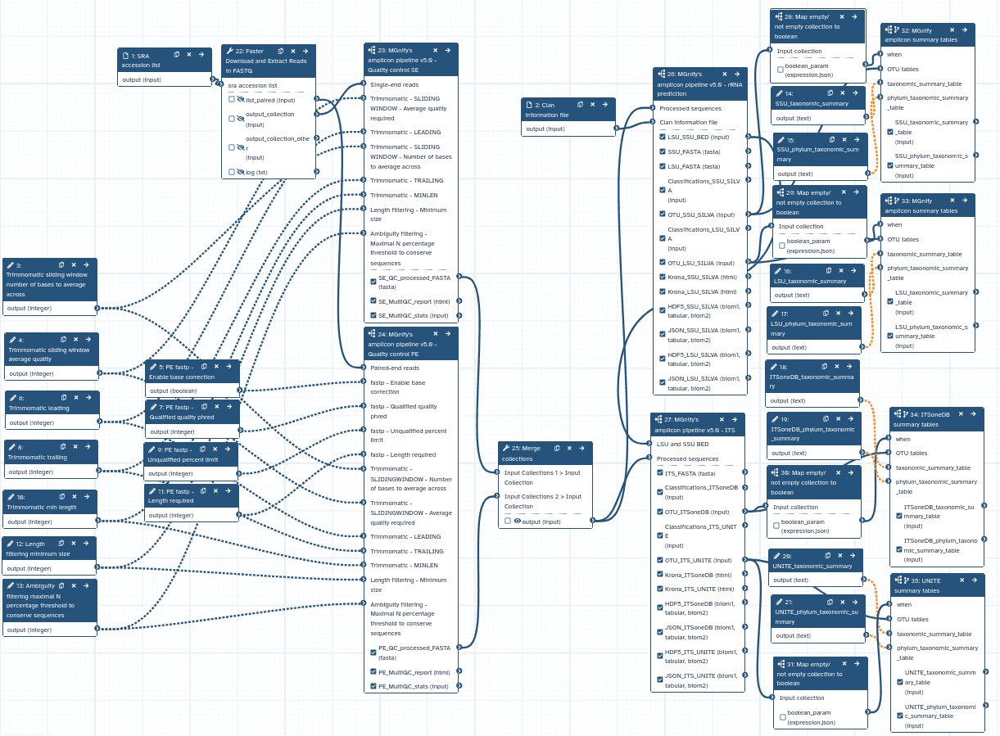

## MGnify amplicon pipeline v5.0

The microbial world is vast and complex, and the MGnify amplicon pipeline has long been a cornerstone for processing and analyzing 16S, 18S, and ITS rRNA gene amplicon sequences. Its version 5.0 brings advanced features and enhanced accuracy to microbiome research. But how can this pipeline be made even more accessible to researchers worldwide? The answer: porting it to Galaxy.

This diagram illustrates the MGnify amplicon pipeline v5.0 workflow for microbial amplicon analysis. It starts by processing paired-end or single-end reads, merging and trimming them with SeqPrep and Trimmomatic, followed by quality control checks and filtering.

The pipeline then splits into two paths: rRNA prediction and ITS sequence analysis. For rRNA-prediction, sequences are identified using the Rfam database and classified into SSU and LSU regions. ITS sequences are separated, masked with bedtools, and classified with databases like UNITE and SILVA.

Finally, all taxonomic results are visualized with Krona, providing an interactive view of microbial composition. This setup enables efficient, thorough microbial profiling of amplicon data.

## Availability on Galaxy

Version 5.0 of the MGnify amplicon pipeline is now fully available on the Galaxy EU server, bringing advanced microbial analysis workflows to researchers through an accessible, web-based interface.

The pipeline has been ported into five modular sub-workflows, allowing users flexibility in their analysis:
- Quality control for single-end reads
- Quality control for paired-end reads
- rRNA-prediction
- ITS analysis
- Summary tables

These sub-workflows can be run individually or combined to execute the entire pipeline, giving researchers the freedom to tailor the analysis to their specific needs. This modular design ensures accessibility and adaptability for diverse microbiome research projects. The pipeline is designed to take NCBI reads as input, but users can easily modify it to work with their own data uploaded directly to the Galaxy history. In addition to the main sub-workflows, two additional workflows have been created to simplify downstream analysis:

- A workflow that generates summary tables at a user-specified taxonomic rank
- A workflow that formats MAPseq results to produce ampvis2-compatible input

These workflows make it easier for users to customize and visualize their analysis results, enhancing the overall utility of the pipeline.

## Testing the pipeline
During the process, the ported pipeline was tested against its counterpart, yielding promising results.

The figure above compares the relative abundance of taxa between the MGnify and Galaxy pipelines. It shows the results from 10 randomly selected human gut samples. Taxa that were present in Galaxy but absent in MGnify were removed to emphasize the discrepancies. Overall, the results demonstrate highly similar patterns between the two pipelines, with minor discrepancies attributed to the non-deterministic nature of the MAPseq approach. 

## What's Next?

The successful port of MGnify pipeline v5.0 is just the beginning. Progress is being made in porting the new version, v6.0, to Galaxy. This version is more sophisticated, includes additional sub-workflows and tools, utilizes a broader range of databases, and features an updated version of MAPseq with a seed option.
