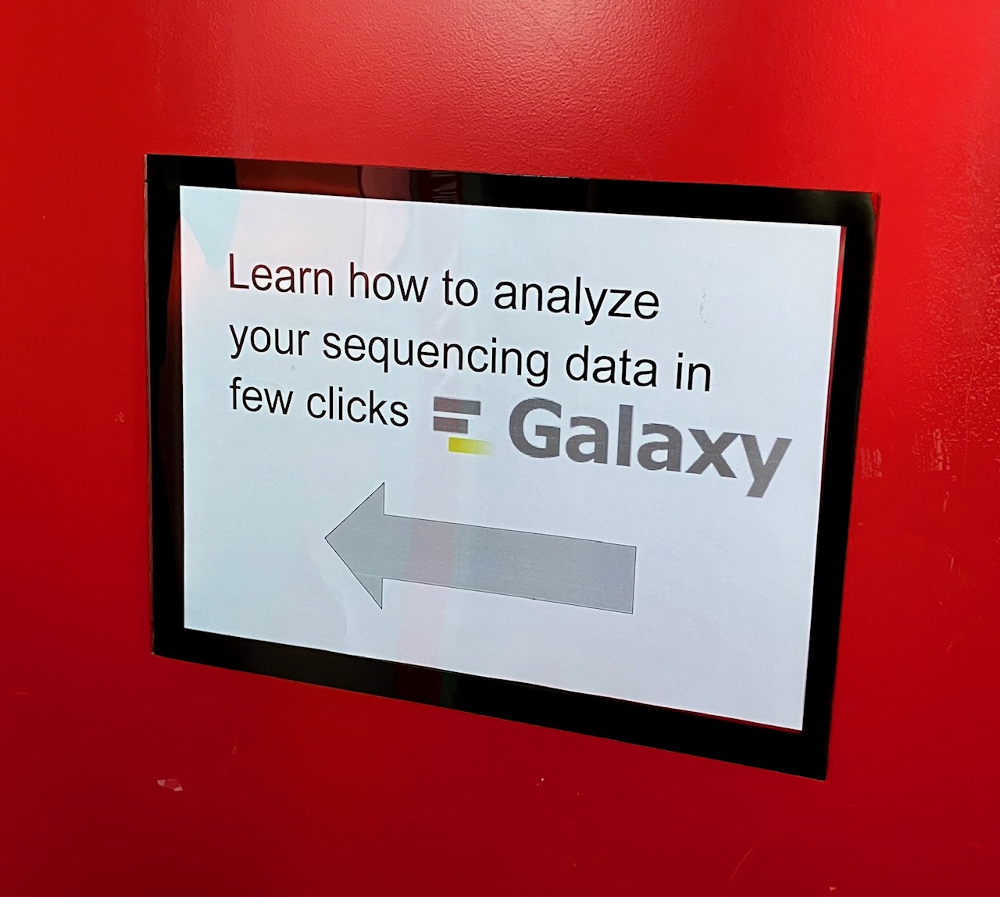

Since 2 years, we are offering to the scientists of the EPFL Life Science faculty a training called "Learn how to analyze your sequencing data in few clicks".

Thanks to TIaaS, we could offer the students an easy to set up working environment (i.e. just login and go to the provided TIaas URL).

We were working with the [Reference-based RNA-seq tutorial](https://training.galaxyproject.org/training-material/topics/transcriptomics/tutorials/ref-based/tutorial.html). It all went smoothly.

Our trainees were PhD student to PI and seemed happy to discover what they can do with galaxy. We could also show them the [new IWC webpage](https://iwc.galaxyproject.org) and how they can go fast with them.

Lucille and Hans-Rudolf
