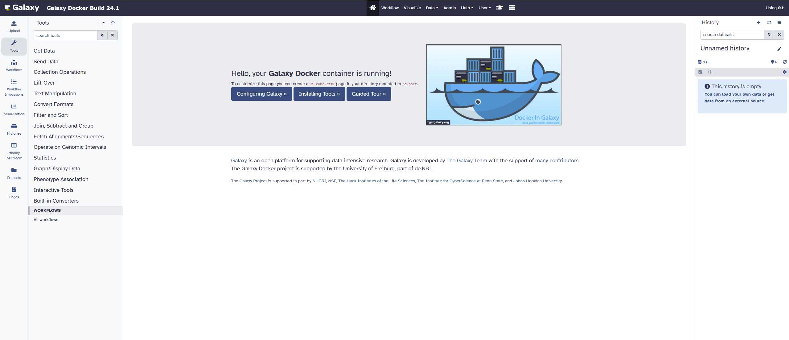
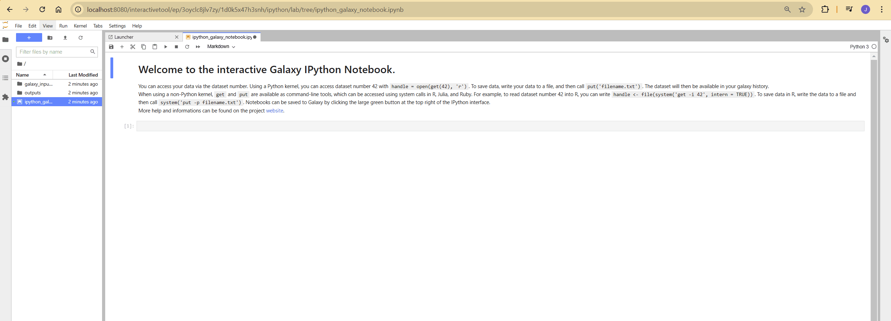

# Galaxy Docker 24.1

We are excited to announce the release of the Galaxy Docker Image version 24.1, now available as 
`quay.io/bgruening/galaxy:24.1`! This update incorporates major changes to the underlying Galaxy stack, 
offering performance enhancements, new features, and service improvements.

The [Galaxy Docker Image](https://github.com/bgruening/docker-galaxy) provides an easy-to-use, distributable, 
full-fledged Galaxy installation that can be utilized for testing, teaching, and presenting new tools and features. 
One of the primary goals is to simplify access to entire tool suites, which traditionally required setting up a 
public web service or having administrative access to a local Galaxy server. With Docker, tool developers can create custom images containing all necessary dependencies, allowing users to simply run the image within Docker.

Below is a detailed breakdown of what’s new and how to make the most of this updated version.

## Highlights of the Update

### Enhanced Dockerfile Architecture

The Dockerfile now employs a multi-stage build approach, resulting in a smaller, optimized image that includes 
only essential files. This change reduces resource consumption without sacrificing functionality.

### Base Upgrades

- Operating System: Upgraded from [Ubuntu 18.04](https://releases.ubuntu.com/18.04/) to [Ubuntu 22.04](https://releases.ubuntu.com/22.04/).
- Galaxy Version: Transitioned from version [20.09](https://docs.galaxyproject.org/en/master/releases/20.09_announce_user.html) to [24.1](https://docs.galaxyproject.org/en/master/releases/24.1_announce_user.html), bringing new features and optimizations.
- PostgreSQL Database: Upgraded from version [11](https://www.postgresql.org/docs/release/11.0/) to [15](https://www.postgresql.org/docs/release/15.0/), enhancing database performance.
- Python Interpreter: Upgraded from [Python 3.7](https://docs.python.org/3.7/whatsnew/3.7.html) to [Python 3.10](https://docs.python.org/3/whatsnew/3.10.html), now the default interpreter for Galaxy.
- Migration to Ansible Roles: [ansible-galaxy-extras](https://github.com/galaxyproject/ansible-galaxy-extras) role has been replaced by actively maintained individual [Ansible roles](https://github.com/bgruening/docker-galaxy/blob/main/galaxy/ansible/requirements.yml), making the setup more modular and maintainable.

These upgrades ensure compatibility with the latest dependencies and security standards.

### New and Updated Services

#### Web Server and Task Management
- [Gunicorn](https://gunicorn.org/): Replaces [uWSGI](https://uwsgi-docs.readthedocs.io/en/latest/) as the Galaxy web server, improving scalability and resource efficiency.
- [Celery & Celery Beat](https://docs.celeryq.dev/en/stable/): Introduced for distributed task management and periodic task execution, supported by:
    - [RabbitMQ](https://www.rabbitmq.com/): Acts as the broker for Celery.
    - [Redis](https://redis.io/): Functions as the backend for Celery.
    - [Flower](https://flower.readthedocs.io/en/latest/): Provides monitoring and debugging capabilities for Celery tasks.

#### Additional Services
- [TUSd](https://github.com/tus/tusd): Added to support fault-tolerant uploads for large files.
- [RabbitMQ Management Plugin](https://www.rabbitmq.com/docs/management): Enabled for easier monitoring and management of the RabbitMQ server.
- [Miniforge](https://github.com/conda-forge/miniforge) is now the default Conda installer in the Galaxy Docker image, focusing on the conda-forge and bioconda channels for package management.
- With the deprecation of [Galaxy Interactive Environments](https://docs.galaxyproject.org/en/release_21.09/admin/special_topics/interactive_environments.html) (GIEs), [Interactive Tools (ITs)](https://docs.galaxyproject.org/en/release_24.1/admin/special_topics/interactivetools.html#) are now the recommended approach for extending Galaxy with powerful services like Jupyter and RStudio.
- [GX-IT-Proxy](https://github.com/galaxyproject/gx-it-proxy): A dynamic configurable reverse proxy introduced to support Interactive Tools (ITs).
- [Gravity](https://github.com/galaxyproject/gravity): Manages core Galaxy services like Gunicorn, Celery, TUSd, GX-IT-Proxy, reports, and job handlers. This change simplifies configuration and improves service management.

### Existing Functionalities
The Galaxy Docker Image continues to support these functionalities:

- FTP or SFTP Data Upload: Easily upload data using passive mode FTP or SFTP for seamless integration with your workflows.
- [On-Demand Reference Data](https://galaxyproject.org/admin/reference-data-repo/): Access over 4TB of reference genomes and indexes directly via CVMFS.
- Cluster Integration: Leverage external high-performance clusters (e.g., Slurm, HTCondor, Grid Engine) for efficient job execution.
- [BioContainers Support](https://quay.io/organization/biocontainers): Automatically detect and execute tools with associated Docker images, ensuring smooth handling of tool dependencies using BioContainers.
- HTTPS Support: Secure your Galaxy instance with HTTPS via your own or self-signed certificates or by leveraging [Let's Encrypt](https://letsencrypt.org/) for automatic certificate generation.
- Lite Mode: Run a minimal version of Galaxy with only essential services for resource-constrained environments.
- Custom Docker Image Extensions: Extend the Galaxy Docker Image with your tools and configurations using a personalized Dockerfile.
- Non-Tool Shed Tools Integration: Add tools directly to your instance using custom configurations, even if they are not hosted in the Galaxy Tool Shed.

### Getting Started with Galaxy Docker
Setting up the Galaxy Docker container is simple. Here’s how to get started:

#### Basic Galaxy Docker Run
To launch the Galaxy container:

    docker run -d -p 8080:80 quay.io/bgruening/galaxy

Galaxy will be accessible at `http://localhost:8080`. To preserve your data between container restarts, use Docker volumes to mount a local folder to the container:

    docker run -d -p 8080:80 -v /home/user/galaxy_storage/:/export/ quay.io/bgruening/galaxy

This will mount `/home/user/galaxy_storage` from the host to `/export/` inside the container, allowing you to save and retrieve data.

:information_source: If you are upgrading from an earlier version of the Galaxy Docker image, we recommend starting with a fresh `/export` folder to avoid compatibility issues with the updated architecture.

#### Enabling Interactive Tools
Interactive tools allow for running services like Jupyter Notebooks within Galaxy. For this we need to be able to launch Docker containers inside the Galaxy Docker container. To enable this functionality:

    docker run -d -p 8080:80 -p 4002:4002 --privileged=true -v /home/user/galaxy_storage/:/export/ -e "GALAXY_DESTINATIONS_DEFAULT=slurm_cluster_docker" quay.io/bgruening/galaxy

Then launch the required Interactive tool from the tool panel. It might take some time to download the required docker image and start the tool.

### Deprecation Notice
The Compose setup for deploying Galaxy is no longer maintained. Users are encouraged to focus on the single-container version of 
the Galaxy Docker image. If you want a composable version, you can explore [Galaxy Helm](https://github.com/galaxyproject/galaxy-helm).

### Conclusion and Support
We hope you enjoy the new version of the Galaxy Docker Image. With better performance and new features, it’s the perfect 
tool for your data analysis needs. As always, feel free to reach out with questions, feedback, or issues. For detailed instructions, 
examples, and further information, please refer to the [README.md](https://github.com/bgruening/docker-galaxy/blob/main/README.md).
