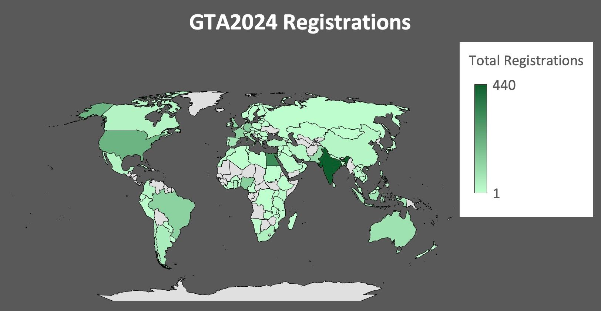

# The Galaxy Training Academy 2024 trained researchers in Galaxy data analysis world wide across a variety of scientific topics.

From October 7th to 11th, the [Galaxy Training Network (GTN)](https://training.galaxyproject.org/) hosted a global online Galaxy training course. This asynchronous, self-paced learning event was similar to last year’s GTN Smörgåsbord events, which have been successfully running since 2021.

These events federate trainers and trainees all over the globe. The trainings available are a mix of pre-recorded lectures and written guides, and the participants can follow the training paths at their own pace while benefitting from support from the trainers on Slack.

We would like to start this article by thanking everyone who participated in the event. These events are made possible by the hard work of the training teams and by the engagement of the trainees with us, and as the organizing team we were so happy to witness a lot of both! 

## The event 

The [Galaxy Training Academy](https://training.galaxyproject.org/training-material/events/galaxy-academy-2024.html) kicked off on Monday, October 7th, with an introductory day. The goal of the trainings that day was to allow participants to familiarize themselves with the Galaxy data analysis platform or to develop skill sets commonly used in data analyses, such as through the Data Manipulation Olympics.

The next three days were dedicated to in-depth exploration of specific domains: eight different scientific tracks were offered, each featuring individualized learning paths. The participants could choose to learn about proteomics, assembly, transcriptomics, single cell, microbiome, bacterial genomics, BY-COVID, and/or machine learning. While the almost over-the-clock online support was only guaranteed for the week, the material will stay online until a newer version is available, so if you missed the event, you can still take advantage of the curated material. 

On Friday, participants could "choose their own adventure" from the entire collection of GTN training materials or follow the FAIR(Findable, Accessible, Interoperable, and Reusable) training, to learn how to participate in making science open and accessible. 

The [full program](https://training.galaxyproject.org/training-material/events/galaxy-academy-2024.html#program) and detailed event [setup instrauction](https://training.galaxyproject.org/training-material/events/galaxy-academy-2024.html#setup) were provided to participants in advance.

## Participants

With over 2,829 registered participants, the GTA provided training to a wide range of learners from around the world. The majority of participants had little to no experience with Galaxy, with 42.5% being new users and 41.9% identifying as beginners. Nearly all participants came from an academic background, with 2.9% being industry professionals. 

Outside of the Introduction day, the registered participants were most interested in Transcriptomics, followed by Assembly and Machine Learning. 

The welcome video for the event has been watched by 673 people, and the most popular training video of the event was the excellent [*Introduction to Genome Assembly*](https://www.youtube.com/watch?v=9WZe7VGtr-k) by Michael Schatz.

## Community and support

Before the event, an individualized learning path was created for each scientific track. All offered tutorials were tested to ensure they ran smoothly on all Galaxy instances participating in the event. Additionally, recordings were prepared for many of the tutorials.

The entire event was supported by the incredible GTN community, providing assistance 24/7 through the Slack chat platform. Each track had its own dedicated channel where instructors promptly offered help and advice.

In total, 80 people contributed to the event, working on 53 updated tutorials, producing 27 new recorded videos from 24 speakers, and providing extensive support throughout the event.

## Feedback

If you participated in the event, it is not too late to let us know about your experience by filling out the [feedback form](https://forms.gle/QxJ611JYfm5Uqq998). This will allow us to make the next events even better!

## Next Galaxy Training Academy event

We plan on organizing the next Galaxy Training Academy in spring of 2025, so stay tuned on our social media if you want to participate: [LinkedIn](https://www.linkedin.com/groups/4907635/), [Bluesky](https://bsky.app/profile/galaxyproject.bsky.social), [Mastodon](https://mstdn.science/@galaxyproject).

