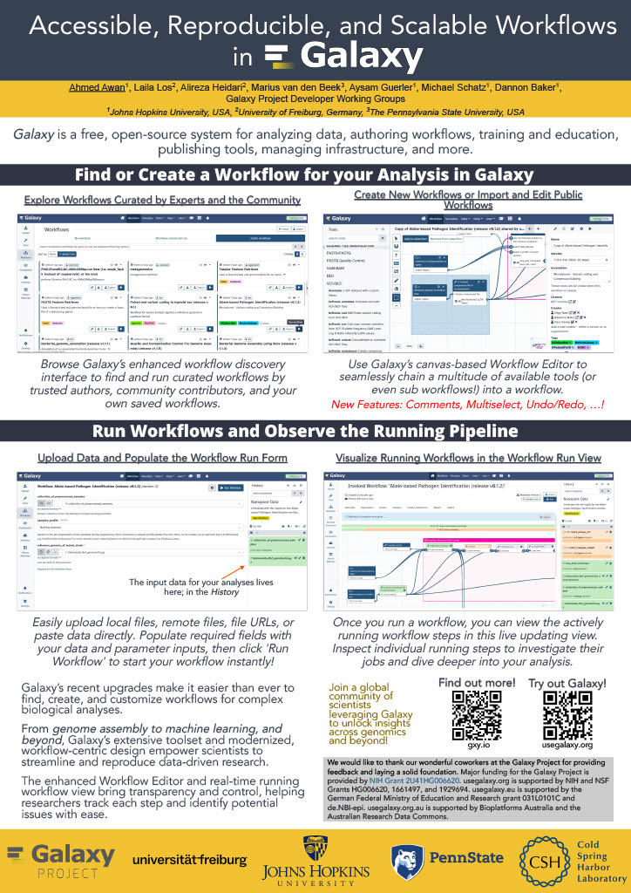
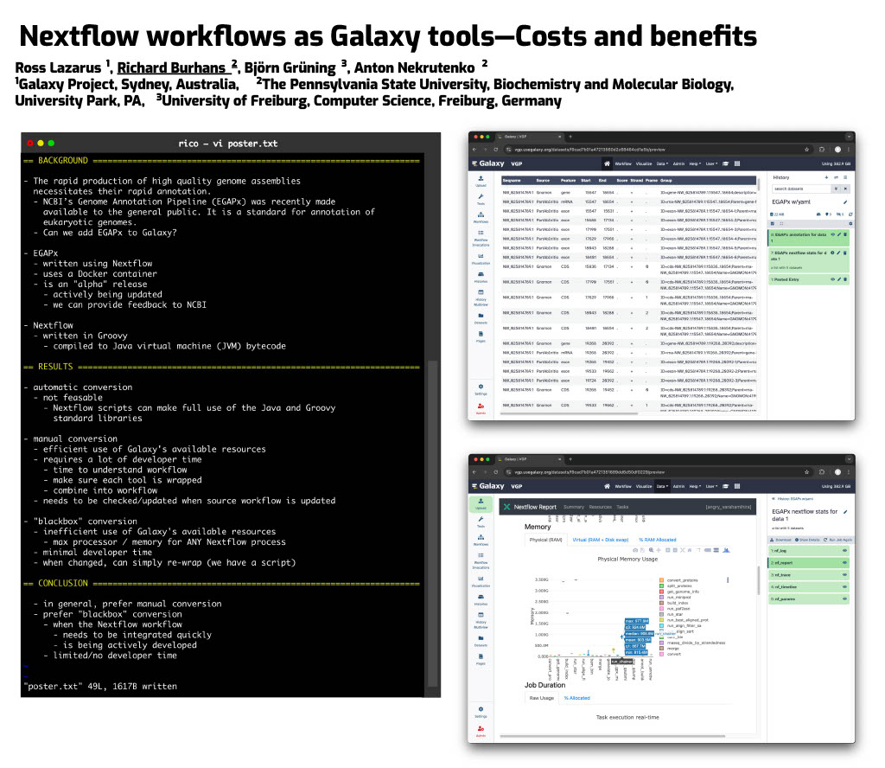
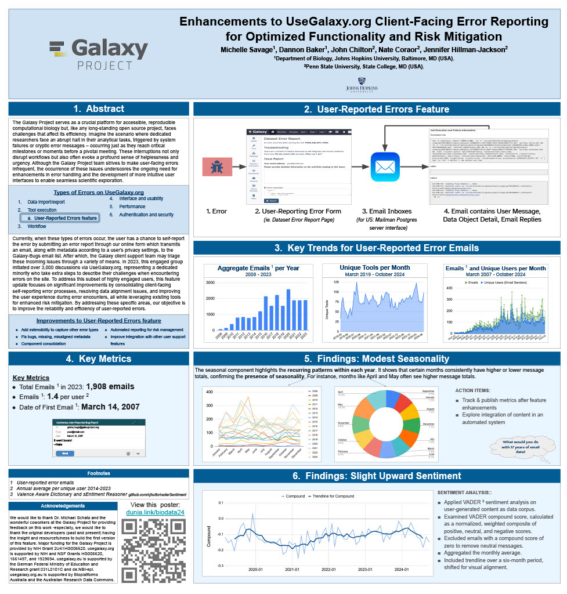
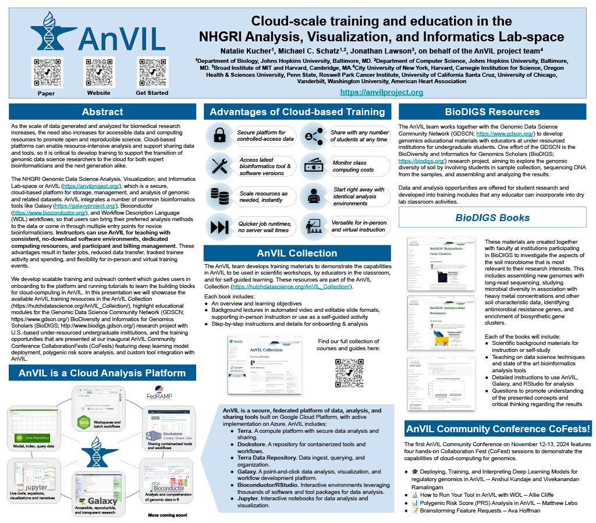
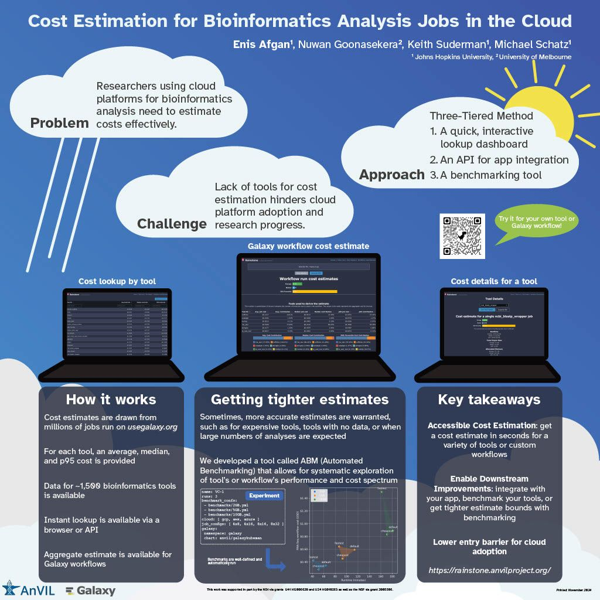
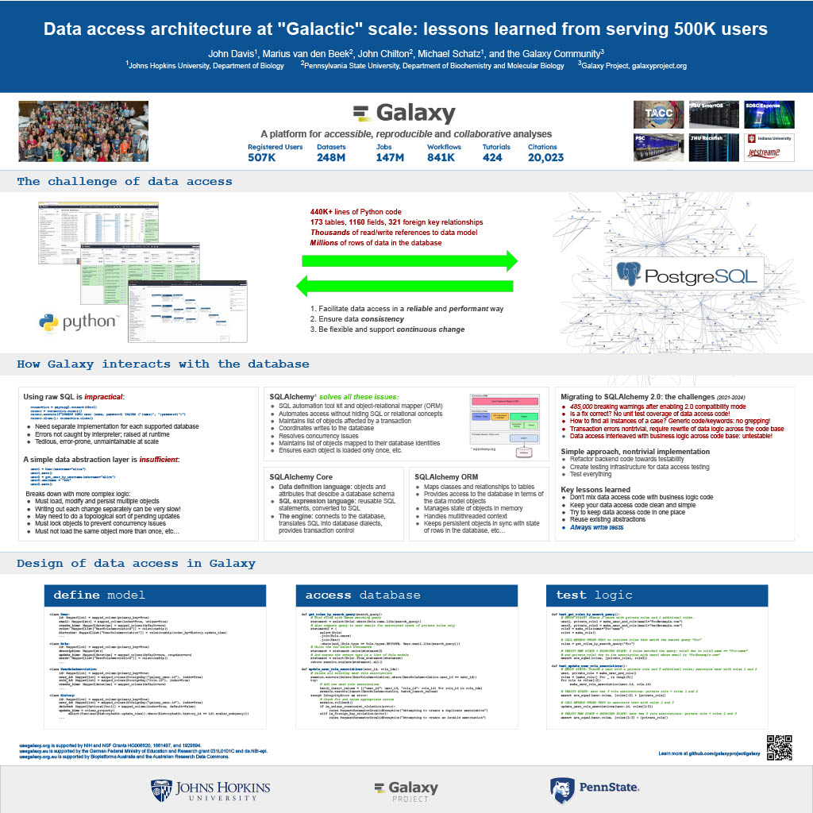
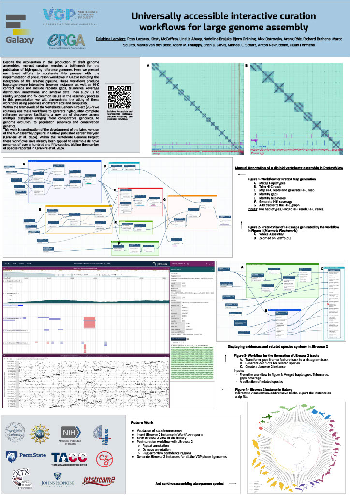

# **Biological Data Science 2024 Recap**  
Cold Spring Harbor Laboratory, NY  
November 13–16, 2024

Galaxy was thrilled to see such a strong presence at the Biological Data Science 2024 conference\! It was inspiring to witness Galaxy’s tools and resources featured in numerous talks and posters, showcasing the versatility and impact of Galaxy across a wide range of biological data science applications. We’re excited to highlight some of the standout presentations that demonstrated the power and adaptability of Galaxy in the field. Be sure to explore the abstracts for the talks and posters below\!

## **Talks**

### **Jeremy Goecks** 

*Transforming the Galaxy computational workbench with artificial intelligence*  

[The Galaxy platform](https://galaxyproject.org) is among the most popular biomedical analysis systems in the world. Thousands of scientists use Galaxy daily to run more than 9,000 available software tools, and there are \>500,000 registered users on Galaxy’s public servers located throughout the world. Galaxy provides a web interface that anyone can use to perform both simple and complex data analyses. Through this web interface, Galaxy makes biomedical data analysis accessible, reproducible, and scalable.   

Over the last several years, we have begun transforming Galaxy by integrating artificial intelligence (AI) and machine learning (ML) into Galaxy at many levels. This integration has had a tremendous impact on Galaxy users by providing them with cutting-edge analysis tools and framework features. With AI/ML, users can perform complex data analyses faster and improve the quality of those analyses substantially. A key area of AI/ML integration Galaxy is the development of a suite of machine learning tools that enable user-friendly and best practices approaches for applying machine learning to biomedical data. Promoting best practices in AI/ML is critical as it becomes easier to run AI/ML analyses. Galaxy ML tools use curated canonical ML models, pretrained neural networks developed by AI/ML experts, and comprehensive reports of accuracy and error analysis to help ensure that ML analyses in Galaxy are high quality. Galaxy ML tools enable traditional and deep learning for thirteen data types, including tabular, text, images, and multimodal datasets.   

We are integrating AI/ML into the Galaxy workbench itself. This line of work incorporates large language models (LLMs) and LLM-powered software agents to simplify and speed up data analyses. We have created a Galaxy interactive tool for analysis of datasets using natural language. This tool loads a tabular dataset into a software agent, and a Galaxy user can then use natural language to instruct the agent to perform analyses of the dataset. For instance, a user can instruct the agent to “perform a statistical summary of the data by column” or “plot a heatmap showing the correlation of the columns.” We are also building a Galaxy agent so that users can run Galaxy tools and workflows. Example commands to this agent include “train a logistic regression model using dataset 1 as input”, or “run the single-cell RNA-seq workflow on dataset collection 5.” This agent will then prompt the Galaxy user with suggested analysis steps and perform those steps when confirmed by a user. Using software agents advances Galaxy’s goal of promoting accessibility. To promote best practices using agents, we are training a Galaxy software agent on high-quality data analyses.   

In summary, Galaxy’s use of AI/ML enables simple best-practice data analyses and greatly improved accessibility.

### **Mentewab Ayalew**

*BioDIGS—Filling the gaps in soil biodiversity through an inclusive research and education community*

Soil represents the most biodiverse habit, especially for microorganisms. These microorganisms, especially bacteria, play important ecological functions and interact with host organisms such as the animals and plants found in that environment. They can have beneficial or harmful effects to host organisms and be a reservoir of functionally important genes such as antibiotic resistance genes. Thus, characterizing soil biodiversity and understanding the dynamics of microbial interactions is critical for addressing current health and environmental concerns.   
The BioDIGS Consortium ([BioDiversity and Informatics for Genomics Scholars](http://biodigs.gdscn.org)) was designed to address knowledge gaps in soil biodiversity while training the next generation of scientists in genomic data science. As part of the BioDIGS project, we leverage technological advances to gain unprecedented insights into the diversity and functional potential of the soil microbiome. Combining short and long read sequencing allowed the assembly of high quality genomes, most of which have never been isolated nor sequenced before. Likewise, an impressive number of antibiotic resistance genes were detected within the soil microbiome.   

An integral goal of the BioDIGS project is to train the next generation of Genomic Data Scientists and create an inclusive community of researchers. The project was initiated by the [GDSCN network](https://gdscn.org), which comprises faculty and staff from historically underserved institutions and research intensive institutions. Participating institutions select sites of interest and collect soil samples that are shipped for analysis. Soils are characterized (e.g. metal content, organics, pH) and DNA sequenced using short and long reads (Illumina, Nanopore, PacBio). Data are made available through NHGRI AnVIL and Galaxy for collaborative use. Equally important, BioDIGS data can be used in the classroom to train students in genomic data science techniques. Overall, it is expected that a number of new insights on soil biodiversity, functionality and microbial dynamics will be gained from this distributed project.

## **Posters**

### **Ahmed Awan**

*Accessible, reproducible, and scalable workflows in Galaxy*  

Galaxy (galaxyproject.org) is a widely used open-source platform for FAIR data analysis that enables users to use tools from many scientific domains. More than 10,000 tools are currently available in Galaxy spanning genomics, ecology, climate modeling, material science and many other data intensive fields. Tools can be chained together into workflows that can span dozens or hundreds of tools, which often makes them the best way to automate analysis in a reproducible and systematic manner. Over the last two years, Galaxy’s user interface has seen major improvements to enhance uniformity and provide increased context for users, along with special efforts towards making Galaxy’s user interface more workflow-centric.   
In this presentation, we will introduce these enhancements focusing on 1\) better workflow discovery and management through the new and improved workflow list, 2\) enhancements to Galaxy’s powerful Workflow Editor to graphically build and edit workflows, and 3\) improvements to the post workflow-run user experience. Our goal is to educate the community on how Galaxy’s empowering and easy to navigate workflow interface can improve the efficiency of their research analysis.   

The recent overhaul of Galaxy’s workflow list organizes workflows into an accessible interface with the user’s own workflows, workflows shared with the user, and published workflows categorized in dedicated tabs in the same view. Within the workflow list, users can find curated workflows authored by the community, and a modern card-style view for each workflow shows valuable information such as a quick overview of its graphical structure or the number of times it has been executed, without needing to launch the workflow or load the graph in a separate view.   
If the user wishes to edit a workflow, they can use the canvas-based Workflow Editor to place tools and inputs, and even entire sub-workflows, in a graphical structure. Several recent additions, such as workflow comments and annotation, undo/redo operations, an improved back-end and client infrastructure, and many more have made it a seamless user experience, allowing for better workflow curation.   

Finally, upon running a workflow in Galaxy, a workflow run is now visualized in real time, enabling users to observe each step in the workflow graph progress from one state to another. This allows users to identify any points of failure or interest by navigating around the Workflow Invocation Graph, and clicking on individual steps in the run.   

These improvements help make Galaxy’s workflow interface more intuitive, more transparent, and more accessible, thereby promoting scientific discovery and collaboration within the wider community.

### **Richard Burhans** 

*Nextflow workflows as Galaxy tools—Costs and benefits*  

Galaxy and Nextflow (NF) have different goals and share different audiences. Each has distinct strengths that, in some cases, may be complementary. For example, the Galaxy ecosystem may benefit from some widely used NF workflows, while NF relies heavily on singularity BioContainers generated and maintained by the Galaxy Project.   

Automated conversion between NF and Galaxy is not currently feasible, and manual conversion usually requires substantial time and effort. However, Galaxy allows any command line analysis package to be wrapped as a new tool, offering a simple solution. NF is available in Conda, and NF workflows are command line driven, so they can be wrapped as a monolithic “black box” Galaxy tool. This is technically inefficient because the entire NF workflow runs as a single job in Galaxy without the benefit of inbuilt data resources, workflow management, identical subtask reuse, or resource allocation. The maximum memory and processor allocation required by any step of the NF workflow must be dedicated to the “black box” Galaxy tool for the entire duration of the workflow execution. The only sustainable way to improve workflow logic is through pull requests to the NF repository, compared to editing a Galaxy workflow in a GUI. If all the required tools are available for a traditional Galaxy workflow, this is a poor solution, but if they are not, the savings in skilled effort and time may make the costs of technical inefficiency acceptable. So, when is it a good idea to use a NF workflow as a Galaxy tool? Recently, the Vertebrate Genome Project (VGP) needed to rapidly integrate NCBI’s genome annotation pipeline EGAPx, a NF workflow, into Galaxy. This was required for bridging the gap between genome assembly performed within the Galaxy Framework and annotation. The challenge was that many tools were not yet available in Galaxy for NCBI’s EGAPx NF workflow, so a monolithic proof-ofconcept tool was quickly created, tested, and deployed. Outputs include a GFF3 file with predictions, ready to add value to an existing Galaxy workflow by creating pre-configured JBrowse2 browsers.   

Compared to integrating all the new tools needed for a traditional Galaxy workflow, the new tool requires little developer time and is easily maintained when NCBI’s EGAPx repository is updated. Rapid integration and added scientific value outweigh the costs of technical inefficiency when running a limited number of times on the dedicated VGP Galaxy computational infrastructure. The job and outputs are available in Galaxy for sharing, replication, and downstream processing, in contrast to the usual alternative of running the NF workflow on a workstation command line. Testing confirmed that all outputs are identical to usual NF workflow command line execution because the tool constructs and calls exactly the same command line. This model is too inefficient for commercial cloud or scarce public computational infrastructure, but can be useful in some restricted situations, where the disadvantages are outweighed by the benefits.

### **Jayadev Joshi**

*GiN—Bridging Galaxy and JupyterLab for advanced omics data analysis workflows*  

Analyzing omics data is a complex challenge that requires the involvement and interaction of different tools at various levels. GiN (Galaxy in Notebooks) is an innovative open-source extension for JupyterLab that leverages the Galaxy API alongside JupyterLab’s graphical widget interface, effectively addressing these challenges. GiN introduces a userfriendly GUI that simplifies interactions with both local and public Galaxy servers directly from JupyterLab, enabling researchers to integrate programming languages such as Python and R. Galaxy, renowned as a webbased platform, supports accessible, reproducible, and transparent big data analysis within the biomedical research community. JupyterLab, on the other hand, is an indispensable tool for data scientists, researchers, and developers seeking an interactive and collaborative environment for coding and data manipulation.   

GiN enhances researchers’ ability to execute Galaxy tools via a graphical interface, manage job submissions, access historical datasets, perform large data uploads with resumable features, and review job outputs. By facilitating seamless execution and job submission to Galaxy instances from within JupyterLab, GiN provides a robust GUI-driven experience. Moreover, users can effortlessly switch between Galaxy servers using a dropdown menu, which enables the execution of tools from multiple servers within a single Notebook session. This cross-server tool integration empowers researchers to combine and analyze data across different Galaxy servers within one cohesive JupyterLab Notebook. Additionally, Notebooks can be shared with collaborators, preserving the tool parameters in Galaxy tool cells, thus fostering reproducibility in data analysis workflows. GiN also supports interaction with other JupyterLab plugins, such as g2nb, to further enhance data-sharing capabilities.  

GiN can be deployed using a Docker image for easy local installation, and it is also available as a Galaxy Interactive Tool. The GiN package, comprising Python, JavaScript, and Node.js modules, can be conveniently installed from GitHub using the pip package manager. 

### **Michelle Savage**

*Enhancements to UseGalaxy.org Client-Facing Error Reporting for Optimized Functionality and Risk Mitigation*  

[The Galaxy Project](galaxyproject.org) serves as a crucial platform for accessible, reproducible computational biology but, like any long-standing open source project, faces challenges that affect its efficiency. Imagine the scenario where dedicated researchers face an abrupt halt in their analytical tasks, triggered by system failures or cryptic error messages – occurring just as they reach critical milestones or moments before a pivotal meeting. These interruptions not only disrupt workflows but also often evoke a profound sense of helplessness. Although the Galaxy Project team strives to make user-facing errors infrequent, the occurrence of these issues underscores the ongoing need for error handling and the development of more intuitive user interfaces to enable seamless scientific exploration.   

Currently, when these types of errors occur, the user has a chance to selfreport the error by submitting an error report through our online form which transmits an email, along with metadata according to a user's privacy settings, to the Galaxy-Bugs email list. After which, the Galaxy client support team may triage and respond to these incoming issues through a variety of means. In 2023, this engaged group initiated over 3,000 discussions via UseGalaxy.org, representing a dedicated minority who take extra steps to describe their challenges when encountering errors on the site. In 2023, some of these most frequently referenced tools were used: to analyze gene expression among different conditions (DESeq), to clean highthroughput sequencing raw data (Trimmomatic), and to efficiently align DNA sequences with a larger reference genome (Bowtie).   

To address these highly engaged users, this feature update focuses on improvements by consolidating client-facing self-reporting error processes, resolving data alignment issues, and generally improving user experience, all while leveraging existing resources to mitigate risk. Additionally, capturing auxiliary operational lessons learned have already revealed themes for future improvements. For example in the area of user support improvements, the monthly frequency totals of user errors demonstrated seasonability for the months of April and May \- an issue which could be addressed by increasing the number of public workshops and training across that same time period. Thus by addressing these areas, our objective is to improve the reliability of user-reported errors and determine possible causative operational processes. 

### **Natalie Kucher**

*Training and education in the cloud with the NHGRI AnVIL*  

As the scale of data generated and analyzed for biomedical research increases, the need also increases for accessible data and computing resources to promote open and reproducible science. Cloud-based platforms can enable resource-intensive analysis and support sharing data and tools, so it is critical to develop training to support the transition of genomic data science researchers to the cloud for both expert bioinformaticians and the next generation alike.   

The NHGRI Genomic Data Science Analysis, Visualization, and Informatics Lab-space or [AnVIL](https://anvilproject.org/), which is a secure, cloud-based platform for storage, management, and analysis of genomic and related datasets. AnVIL integrates a number of common bioinformatics tools like [Galaxy](https://galaxyproject.org/), [Bioconductor](https://www.bioconductor.org/), and Workflow Description Language (WDL) workflows; so that users can bring their preferred analysis methods to the data or come in through multiple entry points for novice bioinformaticians. Instructors can use AnVIL for teaching with consistent, no-download software environments, dedicated computing resources, and participant and billing management. These advantages result in faster jobs, reduced data transfer, tracked trainee activity and spending, and flexibility for in-person and virtual training events.   

We develop scalable training and outreach content which guides users in onboarding to the platform and running tutorials to learn the building blocks for cloud-computing in AnVIL. In this presentation we will showcase the available AnVIL training resources in the [AnVIL Collection](https://hutchdatascience.org/AnVIL\_Collection/), highlight educational modules for the Genomic Data Science Community Network ([GDSCN](https://www.gdscn.org/)) BioDiversity and Informatics for Genomics Scholars ([BioDIGS](http://www.biodigs.gdscn.org/)) research project with U.S.-based under-resourced undergraduate institutions, and the training opportunities that were presented at our inaugural AnVIL Community Conference CollaborationFests (CoFests) featuring deep learning model deployment, polygenic risk score analysis, and custom tool integration with AnVIL.

### **Enis Afgan**

*Cost estimation for bioinformatics analysis jobs in the cloud*  

In this talk, we will present resources and a method for estimating the cloud computing costs for bioinformatics analysis jobs. The results are applicable to researchers and teams when budgeting analysis costs. They are also applicable to service providers when capacity planning. The goal of this work is to make cost estimation more accessible, and help encourage broad adoption of cloud platforms for bioinformatics analysis.   
With a growing number of NIH cloud platforms maturing, such as the All of Us Researcher Workbench, AnVIL, Biodata Catalyst, and GabriellaMiller Kids First, an increasing amount of data analysis will take place in the cloud. Within these platforms, researchers are directly responsible for the costs of cloud infrastructure, making cost estimation a key concern. Without adequate estimation tools, researchers are hard pressed to guess the cost of an analysis, hampering platform adoption, raising researchers’ anxiety, and slowing down the pace of research.

Benchmarking against one’s own data is the most precise method for obtaining an accurate estimate, but setting up these benchmarks is hard, making it difficult to generate initial cost estimates, or identify which tools to place the most benchmarking emphasis upon.   

The work presented herein offers a 3 tiered approach to cost estimation. The first tier provides an easy, approachable dashboard with estimates for average, median, and “high” costs of an analysis job, covering nearly 1,500 of the most widely used bioinformatics tools. The dashboard requires no input and is offered as a starting point for estimating job costs. The second tier provides an API that can automatically estimate the cost of an end-toend workflow, allowing researchers to chain individual tools together to estimate costs for an entire analysis. Currently, the API is compatible with workflows designed in the open source Galaxy system, making the service broadly accessible for any researcher. Finally, the third tier is a method and an automation tool for performing systematic benchmarking of tools as a way of obtaining more accurate cost estimates based on one’s own data. This is useful for more expensive tools or in case there are many samples to be analyzed leading to a need for more accurate estimates due to workload scale.   

Available cost estimates are based on historic runtime characteristics of hundreds of thousands of jobs from the usegalaxy.org service, capturing a broad spectrum of uses and offering representative estimates. The accuracy of the estimates were also validated via tool benchmarking on commercial clouds. The approach as a whole provides a graded means with which to estimate costs, depending on the nature of one’s data, the complexity and scale of the analysis, and the desired level of accuracy.

### **John Davis**

*Data access architecture at "Galactic" scale*  

[Galaxy](https://galaxyproject.org) is a globally-distributed open source software platform and ecosystem that connects analysis tools, datasets, compute resources, a graphical user interface, and a programmatic API. It enables accessible, reproducible, and collaborative data science and is used by hundreds of thousands of scientists. It has been in continuous development and operation for almost two decades and is among the most active open source projects in the world. This talk will focus on Galaxy's data access architecture and the many lessons we have learned through developing this software and administering Galaxy instances that serve hundreds of thousands of users running millions of jobs.   

From an engineering standpoint, Galaxy is a large distributed data-driven system with data taking on many forms \- from configuration files and reference data, to data processing, analysis and visualization tool wrappers, and scientific datasets. At the core of the system is the data model and database, that define the structure of the objects facilitating Galaxy's extensive business logic. The scale of the interactions between Galaxy's business logic and the database is considerable: the data model is referenced tens of thousands of times from all over the code base, with the database being continuously read from and written to every second that the system is running. This talk aims to decompose the complexity of such interactions, using Galaxy's data access architecture as a representative example. Galaxy's data access functionality relies heavily on [SQLAlchemy](https://sqlalchemy.org) \- a SQL automation tool kit and object-relational mapper widely-used in the Python ecosystem. This talk will include a tour of SQLAlchemy in the context of Galaxy, including our use of its features, the mistakes we made over the years, and how we fixed them. Most notably, SQLAlchemy is about the same age as Galaxy and recently went through the largest upgrade process in its history. The complexity of upgrading a large system to SQLAlchemy 2.0 is akin to moving to Python 3, only harder.  

In this talk, I will share the most notable and consequential lessons we've learned from this process over the course of three years. Given Galaxy's state of active ongoing development (\>80K commits over the past decade), the use of a database migration tool for managing changes to a database schema is an absolute requirement for us. We recently moved our code base to Alembic, which is a tool commonly used alongside SQLAlchemy. Again, we faced unique challenges, both due to the "galactic" scale of our code base, as well as the multitude of Galaxy instances around the world, which had to be provided with a migration path accommodating a wide variety of upgrade scenarios.

## Special Recognition: Galaxy in Action

We’d like to give a special shoutout to a poster presentation that highlighted the innovative use of Galaxy in advancing reference genome curation. This research showcased the development of pre-curation workflows in Galaxy, including the integration of the TreeVal pipeline. These workflows streamline the generation of high-quality, haplotype-aware reference genomes by producing interactive browser instances, Hi-C contact maps, and critical assembly insights such as repeats, gaps, telomeres, and synteny data.

As part of the Vertebrate Genome Project (VGP), these workflows have been instrumental in assembling over 150 de novo genomes, a remarkable achievement that builds on the VGP assembly pipeline advancements published earlier this year (Larivière et al. 2024). This work demonstrates how Galaxy continues to empower large-scale genome projects, driving new discoveries in comparative genomics, genome evolution, population genomics, and conservation genetics.

### Delphine Larivière

*Universally accessible interacting curation workflows for large genome assembly*

Despite the acceleration in the production of draft genome assemblies, manual curation remains a bottleneck for the publication of high-quality reference genomes. Here we present our latest efforts to accelerate this process with the implementation of pre-curation workflows in Galaxy, including the integration of the TreeVal pipeline. These workflows produce haplotype-aware interactive browser instances as well as Hi-C contact maps and include repeats, gaps, telomeres, coverage distribution, annotations, and synteny data. They allow us to readily pinpoint and fix common issues in the assembly process. In this presentation we will demonstrate the utility of these workflows using genomes of different size and complexity.

Within the framework of the Vertebrate Genome Project (VGP) we routinely use these workflows to generate high-quality, complete reference genomes facilitating a new era of discovery across multiple disciplines ranging from comparative genomics, to genome evolution, to population genomics and conservation genetics.

This work is continuation of the development of the latest version of the VGP assembly pipeline in Galaxy, published earlier this year (Larivière et al. 2024). Within the Vertebrate Genome Project, these workflows have already been applied to assemble de novo genomes of over a hundred and fifty species, tripling the number of species reported in Larivière et al. 2024. 

## **Final Thoughts**

The Biological Data Science 2024 conference was an inspiring showcase of innovation and collaboration, and it was exciting to see Galaxy featured so prominently throughout the event. From talks about cutting-edge AI tools and cloud cost estimation to posters highlighting workflow improvements and cross-platform integration, the conference reinforced how Galaxy continues to support and drive impactful research. The energy and creativity of the community were inspiring, and we’re excited to see these ideas and collaborations shape the future of biological data science. Galaxy looks forward to participating again next year!

