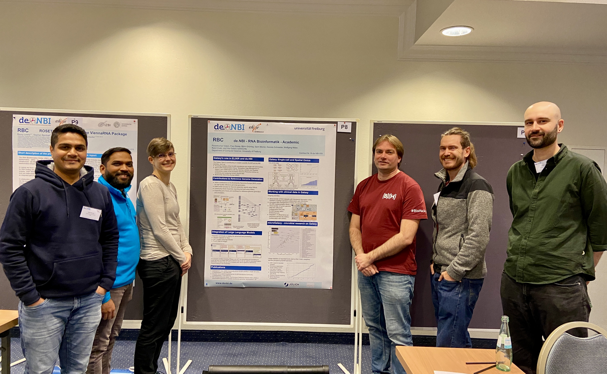

# The Freiburg Galaxy Team participated in the **de.NBI / ELIXIR-DE All Hands Meeting** in Berlin on November 28–29, 2024.  

The team showcased their work through two posters:  
1. Highlighting Galaxy as a cloud service provided by the Freiburg de.NBI node.  
2. Presenting research advances achieved using Galaxy.  
  We had interesting discussions with researchers from all over Germany on Galaxy tools, workflows and research data management. The poster covered topics like microGalaxy, Single-cell, working with clinical data or contributions to reference Genome Generation but also Large Language Models.

Additionally, **Björn** delivered a talk about the **Freiburg Service Cluster (RBC)**, emphasizing its capabilities and contributions.  

The team actively engaged in all the new de.NBI working groups, contributing in the following areas:  
- **WG Service and Service Monitoring**:  
  Paul and Saim provided discussion points from a Galaxy perspective, some of which were incorporated into the ongoing updates to the *de.NBI/ELIXIR-DE Guidelines for Node Services Selection Process and Quality Management*.  
- **WG Training**  
  Pavan, Teresa, Rand and Daniela joined the Working Group meeting on Training and talked - among others - about possibilities of the Galaxy Training Network and how to make being a trainer more attractive.
- **WG Cloud**  

For more details, the complete agenda of the All Hands Meeting can be found [here](https://www.denbi.de/images/Events/Agendaentwurf_All_Hands_2024_V6.pdf).  

The Team had a good time in Berlin and nice interactions with other German Bioinformatic researchers!

