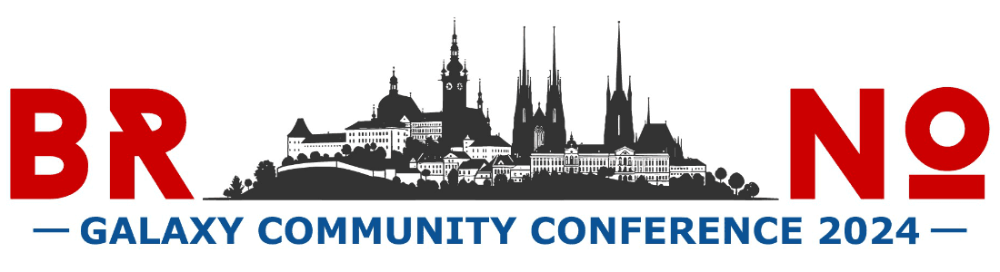
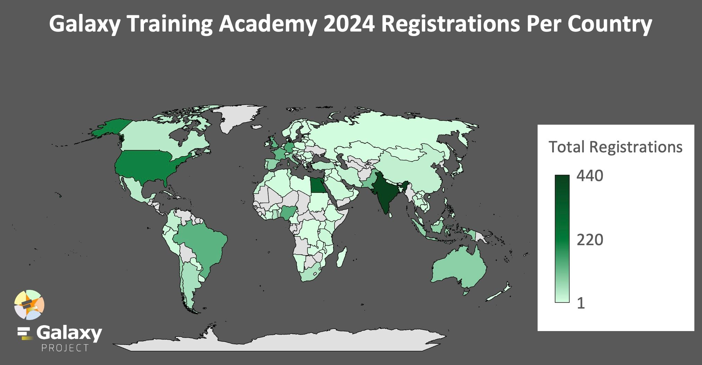
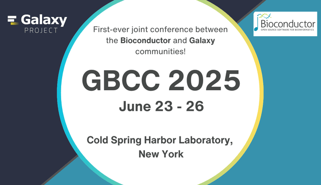

December 2024

Hello, Galaxy Community

As we close out 2024, we are grateful for each of you who engaged with us this year, whether through training sessions, conferences, research initiatives, or as part of the Galaxy community at large. This year's final newsletter celebrates the major achievements, events, and milestones that have strengthened our community. It’s been a remarkable year of growth, learning, and impact across various scientific domains.

Thank you for tuning in and for being a part of Galaxy!

---

# **Galaxy 2024 Milestones**

2024 has been a landmark year for Galaxy\! This year, we celebrated a significant milestone with over [**20,000 research citations**](https://scholar.google.com/citations?hl=en&user=3tSiRGoAAAAJ) referencing Galaxy, a testament to the platform’s pivotal role in advancing research across multiple scientific disciplines. Additionally, we celebrated the achievement of reaching over **500k registered users** across all UseGalaxy servers\!

Other major milestones from the year include:

* Over **20,000 interactions on GitHub**, highlighting the active development and collaboration within the Galaxy ecosystem.  
* Galaxy EU reached over **100,000 users**.  
* On YouTube, Galaxy content reached new heights with **620,000 impressions**, **58,000 views**, and over **4,500 hours of content watched** in 2024 alone.  
* Galaxy AU hit over **10 million jobs**.
* The [Galaxy Training Network](https://training.galaxyproject.org/training-material/) celebrated the release of their **400th tutorial**.

These milestones reflect the dedication of our global community and the growing influence of Galaxy in fostering open science, education, and innovation.

---

# **Galaxy Releases in 2024: Key Updates and Features** 

2024 has been an exciting year for Galaxy, with a host of new features and enhancements that make data analysis, collaboration, and sharing more intuitive and efficient. Here are some highlights from this year’s releases:

* **ColabFold on Galaxy**: Galaxy now supports ColabFold, enabling ultra-fast **protein structure prediction** by combining MMseqs2 with AlphaFold2 or RoseTTAFold. This powerful tool splits the process into two streamlined steps: Multiple Sequence Alignment (MSA) and AlphaFold2 predictions, offering speed, accuracy, and iterative refinement options—all within the Galaxy environment.

* **Workflow Comments**: Collaboration within workflows is now easier than ever with the new Workflow Comments feature in the Galaxy Workflow Editor. Add **text comments, markdown explanations, and even freehand drawings** to enhance communication and improve workflow structure and organization.

* **Enhanced Published Workflow Sharing**: Sharing workflows has been revolutionized with a redesigned Published Workflow Sharing page. The updated layout includes a read-only mode, an embedded interactive editor view, and improved responsiveness, making it more straightforward for users to **share, navigate, and collaborate on workflows**.

* **Seamless InvenioRDM Integration**: Galaxy now integrates directly with InvenioRDM, allowing users to **import files** from InvenioRDM repositories into Galaxy and **publish Galaxy records** (like Histories and datasets) to InvenioRDM. This integration streamlines data import/export processes, offering greater flexibility and efficiency.

* **Activity Bar Enabled by Default**: The Activity Bar is now enabled by default, providing users with **quick access to essential features** and improving overall workflow navigation.

* **Workflow Invocation Graph View**: The new **graph view** in the workflow invocation summary clearly represents job states for each workflow step. Clicking on a step reveals detailed information, **improving monitoring and troubleshooting** capabilities.

* **Zenodo Integration**: The Zenodo file source plugin simplifies integration with Zenodo and Invenio repositories. New schemes (`invenio://` and `zenodo://`) enhance alignment with these platforms while maintaining support for existing exports using `gxfiles://`.

These updates are a testament to Galaxy’s commitment to improving user experience, enhancing collaboration, and supporting seamless data sharing. We’re excited to see how the community uses these new features to advance their research and workflows\!

---

# **Galaxy Community Conference 2024** 

The [**Galaxy Community Conference 2024**](https://galaxyproject.org/news/2024-07-19-gc-c2024-meeting-report/) **(GCC2024)** brought together **151 participants from 28 countries** in Brno, Czech Republic, for a dynamic and collaborative event celebrating the Galaxy ecosystem. This year’s conference featured **54 talks**, **55 posters and demos**, **14 Birds of a Feather sessions**, and two days of **Collaboration Fest (CoFest)**, where attendees advanced projects and strengthened the Galaxy platform.

The conference showcased Galaxy’s global impact with **three inspiring keynote speakers**:

* **Jana Klánová** shared insights on exposomics and environmental health.  
* **Ute Gunsenheimer** discussed the European Open Science Cloud (EOSC) and FAIR principles.  
* **Daria Onichtchouk** highlighted Galaxy’s role in zebrafish research and developmental biology.

The program offered dual tracks—**Analysis** and **Enablement**—featuring cutting-edge research, tool development, and community outreach efforts. **Tailored training sessions** provided hands-on learning for new users, educators, tool developers, and system administrators.

**Networking and community building** were at the heart of GCC2024, with social events like walking tours, a VENUS (Women & Nonbinary Empowerment) lunch, and a memorable conference dinner at the historic Augustinian Abbey.

The conference also spotlighted six exceptional fellowship recipients, supported by the **JXTX \+ GCC2024 Scholarship**, who shared their innovative research through talks and posters.

In the collaborative spirit of Galaxy, CoFest participants initiated projects such as a **workflow-centric landing page** and subdomain unification for regional servers, ensuring continued innovation.

As we celebrate the success of GCC2024, we thank the participants, organizers, and sponsors who made this event possible. Stay tuned for next year's milestone Galaxy event\!

---

# **Galaxy Training Academy 2024** 

The Galaxy Training Academy 2024 was a global success. From October 7th to 11th, over 2,800 registered participants participated in an asynchronous, self-paced learning event. 

This year’s Academy featured **eight scientific tracks**, each offering individualized learning paths:

* **Proteomics**  
* **Assembly**  
* **Transcriptomics**  
* **Single-cell analysis**  
* **Microbiome research**  
* **Bacterial genomics**  
* **BY-COVID**  
* **Machine learning**

Participants could dive deep into these domains with curated tutorials and pre-recorded lectures while benefiting from **24/7 support on Slack**. The Academy started with an introductory day designed to help new users get familiar with Galaxy or enhance foundational skills through interactive activities like the **Data Manipulation Olympics**. The week concluded with a **"choose your own adventure"** format, offering access to the entire GTN training library and a FAIR (Findable, Accessible, Interoperable, and Reusable) training to promote open science.

This event was made possible by the dedication of the **GTN community**, with **80 contributors** updating **53 tutorials**, producing **27 new training videos**, and hosting **24 expert speakers**. Popular tracks included **Transcriptomics**, **Assembly**, and **Machine Learning**, and participants gave high marks to the engaging content and real-time support.

**Plans for the Future** 

Missed the event? No problem\! The training materials remain available online and will continue to be updated. Looking ahead, we’re already planning the next Galaxy Training Academy for **Spring 2025**, where we aim to expand on this year’s success with new tracks, updated materials, and even more opportunities for global collaboration.

Thank you to everyone who participated in and contributed to the Galaxy Training Academy 2024\. Your enthusiasm and support make events like this possible, and we can’t wait to see you next year\!

---

# **Other 2024 Events** 

Galaxy was featured at numerous conferences throughout the year, reflecting our **interdisciplinary reach and adaptability**. Here’s a closer look at some of the key events where Galaxy shined:

* Biological Data Science 2024  
* Anvil Community Conference  
* Sc-verse Conference  
* Gateways 2024  
* Biology of Genomes  
* Advances in Genome Biology and Technology  
* PAG2024

Galaxy’s robust training lineup this year covered critical topics, from **introductory sessions to advanced techniques**, ensuring that researchers and professionals alike could strengthen their Galaxy skills. Below are some of our 2024 workshops, each of which provided participants with practical, hands-on experience:

* An Introduction to **HighPerformance Computing**  
* Exploring the Galaxy Application for Data Sciences  
* Workshop in **High-Throughput Data Analysis**  
* Awareness in **Data Management and Analysis** for Industry and Research  
* de.NBI Galaxy Training Course - **RNAseq Analysis**  
* Making Clinical Dataset **FAIR**  
* An Introduction to Scaffolding with **Hi-C Data** in Galaxy  
* FAIR data management in **single-cell analysis**  
* Strategies for training and knowledge exchange with a consulting perspective   
* Get Started with Galaxy  
* A practical introduction to **bioinformatics and RNA-seq** using Galaxy  
* Webinar on data management with **DataHub**  
* **BRC Analytics** Webinar  
* Galaxy for **Oceanographic** Insights

These sessions collectively equipped participants with critical skills, from data management and analysis to the application of Galaxy in specialized fields. We look forward to continuing more training offerings in 2025 and beyond\!

---

# **Upcoming: Galaxy and Bioconductor Community Conference 2025 (GBCC2025)**

We’re already gearing up for the first-ever **Galaxy and Bioconductor Community Conference 2025 (GBCC2025)**, where we’ll bring together experts, practitioners, and enthusiasts from the Galaxy and Bioconductor communities. This conference represents a unique convergence of two powerful open-source bioinformatics platforms, allowing attendees to dive deep into shared advancements, collaborative projects, and community-led developments. 

**Why GBCC2025?**  
GBCC2025 represents the convergence of two powerful open-source bioinformatics platforms, Galaxy and Bioconductor. By combining their strengths, this conference will foster a deeper understanding of their shared advancements, facilitate collaborative projects, and highlight community-led developments that drive impactful research.

**What to Expect:**

* **Keynote Talks:** Inspiring speakers from the Galaxy and Bioconductor communities will share insights into cutting-edge research and advancements.  
* **Collaborative Workshops:** Hands-on sessions to enhance skills, build workflows, and solve real-world bioinformatics challenges.  
* **Networking Opportunities:** Connect with researchers, developers, and educators who share your passion for open science.

**Get Involved\!**  
The GBCC2025 Logo Design Contest has officially concluded, and we’re excited to reveal the winning logo soon—stay tuned\!

We’re also **seeking volunteers to join the Scientific Committee**, where members will play a vital role in reviewing abstract submissions and shaping the scientific program. If you’re passionate about supporting open science and want to contribute to GBCC2025 in a meaningful way, we’d love to hear from you\! [Please register your interest using this form.](https://docs.google.com/forms/d/e/1FAIpQLSefPmRCOb5cothVs1VJeTuP7mCvLijoQNuVs26KPdy2KGHfxA/viewform)

Whether you’re a Galaxy user, a Bioconductor enthusiast, or new to both platforms, GBCC2025 promises to be an inclusive and engaging conference that **bridges communities and inspires innovation**. Save the date, and stay tuned for updates as we continue to unveil more details about this exciting event.

---

# **Galaxy in Research** 

Looking back on 2024, we’re excited to celebrate the new recurring feature in our News section: *Galaxy in Research*. This series has **spotlighted new and exciting studies from around the world**, showcasing how researchers leverage Galaxy to tackle complex scientific questions. From population genetics to structural biology, these stories have not only highlighted the versatility of Galaxy but also the incredible innovations of our community. We hope you’ve enjoyed these features as much as we’ve loved sharing them\!

[**Galaxy in Research: Transforming life in the tropics using genomic technologies for One Health**](https://galaxyproject.org/news/2024-11-21-galaxy-in-research-calcino2024/)  
*How can genomics improve health, food production, and biodiversity in tropical regions? A new review explores how cutting-edge technologies, including Galaxy, are shaping a sustainable future for the tropics.*

[**Galaxy in Research: Microbial life at Arctic hydrothermal vents**](https://galaxyproject.org/news/2024-10-30-galaxy-in-research/)  
*How do hydrothermal vents at the bottom of the Arctic Ocean fuel microbial life? A new study explores the microbial ecosystems thriving at the Aurora and Polaris seamounts, revealing key insights into how hydrogen and sulfur power deep-sea life.*

[**Galaxy in Research: New insights into antibody activation using AlphaFold in Galaxy**](https://galaxyproject.org/news/2024-10-01-galaxy-in-reseach-degn/)  
*How do antigens trigger B-cell receptors (BCRs), and can a single mechanism explain the activation of all BCR types? This study explores a unifying model that integrates various mechanisms of BCR triggering, providing fresh perspectives on antibody activation.* 

[**Galaxy in Research: Uncovering the evolutionary secrets of wild loquats using comparative chloroplast genomics**](https://galaxyproject.org/news/2024-09-05-galaxy-in-research-lin2024/)  
*A new study has sequenced and analyzed two wild loquat chloroplast genomes, revealing key insights into their evolutionary history and the genetic diversity of loquat species.*

[**Galaxy in Research: Advancing quantum materials research with Galaxy**](https://galaxyproject.org/news/2024-19-08-galaxy-in-research/)  
*At Oak Ridge National Laboratory, scientists have harnessed the power of Galaxy to bring together cutting-edge computing resources, paving the way for new discoveries in quantum materials through advanced neutron scattering data analysis.*

[**Galaxy in Research: Exploring DNA methylation and aging across diverse human tissues**](https://galaxyproject.org/news/2024-08-14-galaxy-in-research/)  
*How does DNA methylation correlate with aging across different human tissues? A new study provides insights into this question, revealing tissue-specific and shared epigenetic patterns.*

[**Galaxy in Research: Exploring Genetic Variability in Almond Blooming**](https://galaxyproject.org/news/2024-07-30-galaxy-in-research-mir/)  
*Learn how genetic variations influence the blooming periods of almond cultivars, revealing key insights into their molecular regulation.*

[**Galaxy in Research: Unlocking genetic secrets of Lake Baikal’s endemic sponges**](https://galaxyproject.org/news/2024-07-17-galaxy-in-research/)  
*Explore the depths of Lake Baikal and discover how cutting-edge genetic research in Galaxy is unraveling the complex relationships between its unique sponge species.*

[**Galaxy in Research: Molecular secrets of minnow adaptation to salinity stress**](https://galaxyproject.org/news/2024-07-03-galaxy-in-research/)  
*Discover how advanced transcriptomic analyses in Galaxy reveal the intricate molecular adaptations of minnows to freshwater salinization.*

[**Galaxy in Research: Decoding chromatin interactions with asteRIa**](https://galaxyproject.org/news/2024-06-05-galaxy-in-research/)  
*Find out how Galaxy helps researchers unlock the mysteries of gene expression regulation through chromatin studies.*

[**Galaxy in Research: Investigating Food Safety Threats**](https://galaxyproject.org/news/2024-06-03-galaxy-in-research/)  
*Learn how Galaxy can be used to detect and analyze drug-resistant bacteria threatening food safety in Egypt.*

[**Galaxy in Research: Exploring the Hidden World of Antarctic Toxins with Galaxy**](https://galaxyproject.org/news/2024-05-14-galaxy-in-research/)  
*Discover how Galaxy is helping to unravel the hidden world of peptide toxins in an Antarctic marine invertebrate.*

---

# **Upcoming Events** 

| DATE | EVENT | VENUE/LOCATION |
| :---- | :---- | :---- |
| 19 December 2024 | [Small Scale Galaxy Admins Meeting](https://galaxyproject.org/events/2024-12-small-scale/) | Online, Global |
| 10–15 January 2025 | [Plant and Animal Genome Conference (PAG32)](https://www.intlpag.org/2025/) | San Diego, CA, USA |
| 16 January 2025 | [Small Scale Galaxy Admins Meeting](https://galaxyproject.org/events/2025-01-small-scale/) | Online, Global |
| 20 February 2025 | [Small Scale Galaxy Admins Meeting](https://galaxyproject.org/events/2025-02-small-scale/) | Online, Global |
| 10–14 March 2025 | [Workshop on high-throughput sequencing data analysis with Galaxy](https://galaxyproject.org/events/2025-03-10-galaxy-workshop-freiburg/) | University of Freiburg, Germany |
| 12–14 March 2025 | [E-Science-Tage 2025](https://galaxyproject.org/events/2025-03-12-e-science/) | Heidelberg, Germany |
| 27 April – 1 May 2025 | [European Geosciences Union (EGU) 2025](https://galaxyproject.org/events/2024-10-24-egu2025/) | Vienna, Austria |
| 23–26 June 2025 | [Galaxy and Bioconductor Community Conference (GBCC2025)](https://galaxyproject.org/news/2024-09-03-gbc-c2025/) | Cold Spring Harbor, NY, USA |

---

*Thank you for being a part of Galaxy\!*

**Get more timely info by following us on [Mastodon](https://mastodon.social/@galaxyproject@mstdn.science), [Bluesky](https://bsky.app/profile/galaxyproject.bsky.social), and [LinkedIn](https://www.linkedin.com/company/galaxy-project)\!**   

