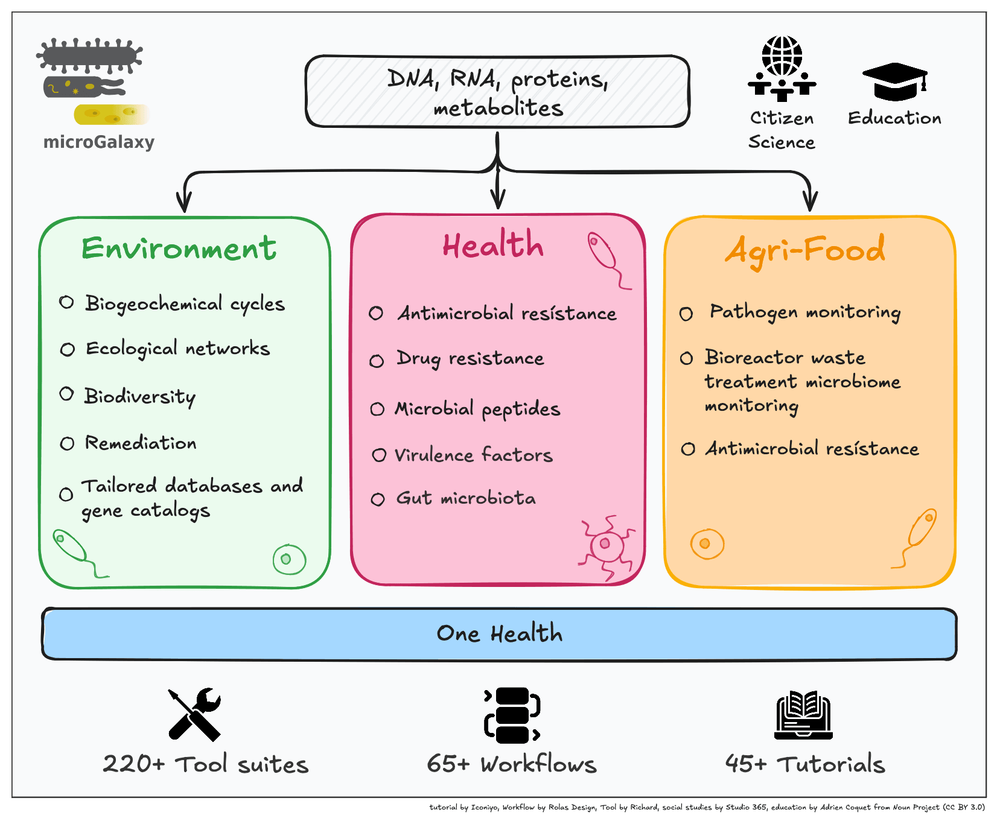

We are thrilled to announce the release of our preprint, **"microGalaxy: A gateway to tools, workflows, and training for accessible, reproducible, and FAIR microbial data analysis,"** now available on [bioRxiv](https://www.biorxiv.org/content/10.1101/2024.12.23.629682v1.full.pdf)!

This work represents a significant step forward in making microbial research accessible to a broader community. The microGalaxy platform integrates cutting-edge tools, workflows, and training resources designed specifically for microbial data analysis. It's built on the FAIR (Findable, Accessible, Interoperable, and Reusable) principles, ensuring that researchers can not only perform robust analyses but also share and reuse their data with confidence.

### What is microGalaxy?

microGalaxy is an ecosystem of Galaxy tools, workflows and training dedicated to microbial research. The platform provides:

- **Community-curated tools** for outine and real-world microbial research practice
- **Ready-to-use workflows** for various microbial research applications.
- **Training materials** to empower researchers, regardless of their computational background.
- **A community-driven approach** to ensure continuous development and innovation.

It is hosted on Galaxy Europe Serveur ([microgalaxy.usegalaxy.eu](https://microgalaxy.usegalaxy.eu/)) for now and soon on other UseGalaxy.*

The preprint highlights how microGalaxy bridges the gap between advanced bioinformatics methods and researchers tackling complex microbial questions.

### Key Highlights

- **Comprehensive Workflows**: From genome assembly to metagenomic analysis, microGalaxy offers workflows tailored for diverse microbial datasets.
- **FAIR Principles in Action**: The platform ensures that all tools and workflows adhere to FAIR guidelines, promoting transparency and collaboration.
- **Training and Support**: Extensive training materials and community support make it easy for researchers to get started and expand their expertise.
- **Comparison of Platforms**: The preprint includes a detailed table comparing microGalaxy's features to those of other microbial data analysis platforms, showcasing its unique capabilities.

### Why It Matters

Microbial research is at the forefront of addressing critical challenges in health, agriculture, and environmental sustainability. By providing a robust and reproducible platform, microGalaxy empowers researchers to:

- Explore microbial ecosystems more effectively.
- Share and reuse data and workflows seamlessly.
- Foster collaboration across disciplines and institutions.

### Get Involved

We'd love to hear your feedback! Explore the preprint below (and on [bioRXiV](https://www.biorxiv.org/content/10.1101/2024.12.23.629682v1.full.pdf)), try out the microGalaxy platform ([microgalaxy.usegalaxy.eu](https://microgalaxy.usegalaxy.eu/)), and join our growing [community](/community/sig/microbial) of microbial researchers.

Stay tuned for more updates as we work towards publishing this exciting research and further developing the microGalaxy ecosystem. Together, we can advance microbial research and tackle global challenges with cutting-edge science and technology.

Let us know what you think by tagging us on Bluesky ([@galaxyproject.bsky.social](https://bsky.app/profile/galaxyproject.bsky.social)), Mastodon ([@galaxyproject@mstdn.science](https://mstdn.science/@galaxyproject)), [LinkedIn](https://www.linkedin.com/company/galaxy-project/) or by joining the conversation on [our microGalaxy Matrix channel](https://matrix.to/#/#galaxyproject_microGalaxy:gitter.im).

<embed src="https://www.biorxiv.org/content/10.1101/2024.12.23.629682v1.full.pdf" width="100%" height="700" type='application/pdf'>

