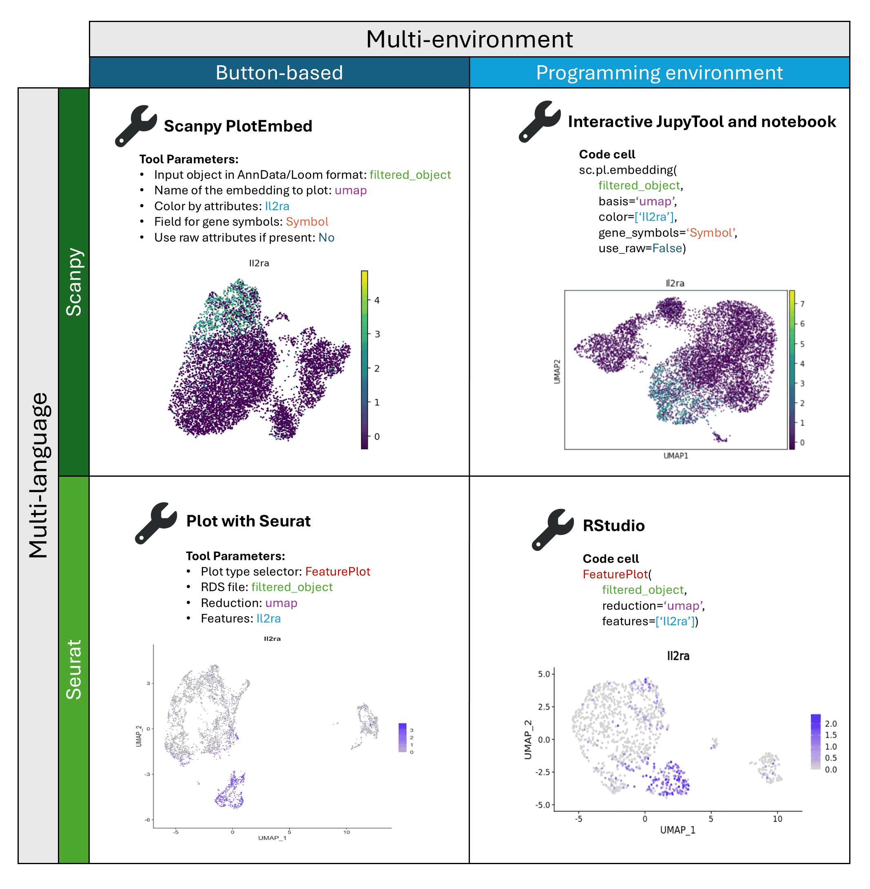

We are excited to announce the Gigascience publication of the Galaxy Single Cell Team’s manuscript entitled [“Galaxy as a gateway to bioinformatics: Multi-Interface Galaxy Hands-on Training Suite (MIGHTS) for scRNA-seq”](https://doi.org/10.1093/gigascience/giae107). The suite presents 11 tutorials spanning the alignment of scRNA sequencing reads, filtering, plotting, and exploring preliminary data through differential expression analyses and trajectory inferences. The use of parallel learning pathways (both [button based](https://gxy.io/GTN:P00020) and [programming environments](https://gxy.io/GTN:P00024)) enables scRNA-seq analysis for anyone who’s interested—no matter their experience with bioinformatics nor their comfort with coding. We hope MIGHTS will empower its users to embrace bioinformatics to whatever extent they seek inspire them to explore further [training materials in the single-cell domain]()!
Thank you to the Galaxy Community and especially the [Single-cell & sPatial Omics Community (SPOC)](https://galaxyproject.org/community/sig/singlecell/) for supporting the development and testing of the MIGHTS tutorials. We would also like to thank Wendi Bacon for her leadership throughout. 

**Background**
Bioinformatics is fundamental to biomedical sciences, but its mastery presents a steep learning curve for bench biologists and clinicians. Learning to code while analyzing data is difficult. The curve may be flattened by separating these two aspects and providing intermediate steps for budding bioinformaticians. Single-cell analysis is in great demand from biologists and biomedical scientists, as evidenced by the proliferation of training events, materials, and collaborative global efforts like the Human Cell Atlas. However, iterative analyses lacking reinstantiation, coupled with unstandardized pipelines, have made effective single-cell training a moving target.

**Findings**
To address these challenges, we present a Multi-Interface Galaxy Hands-on Training Suite (MIGHTS) for single-cell RNA sequencing (scRNA-seq) analysis, which offers parallel analytical methods using a graphical interface (buttons) or code. With clear, interoperable materials, MIGHTS facilitates smooth transitions between environments. Bridging the biologist–programmer gap, MIGHTS emphasizes interdisciplinary communication for effective learning at all levels. Real-world data analysis in MIGHTS promotes critical thinking and best practices, while FAIR data principles ensure validation of results. MIGHTS is freely available, hosted on the Galaxy Training Network, and leverages Galaxy interfaces for analyses in both settings. Given the ongoing popularity of Python-based (Scanpy) and R-based (Seurat & Monocle) scRNA-seq analyses, MIGHTS enables analyses using both.

**Conclusions**
MIGHTS consists of 11 tutorials, including recordings, slide decks, and interactive visualizations, and a demonstrated track record of sustainability via regular updates and community collaborations. Parallel pathways in MIGHTS enable concurrent training of scientists at any programming level, addressing the heterogeneous needs of novice bioinformaticians.

