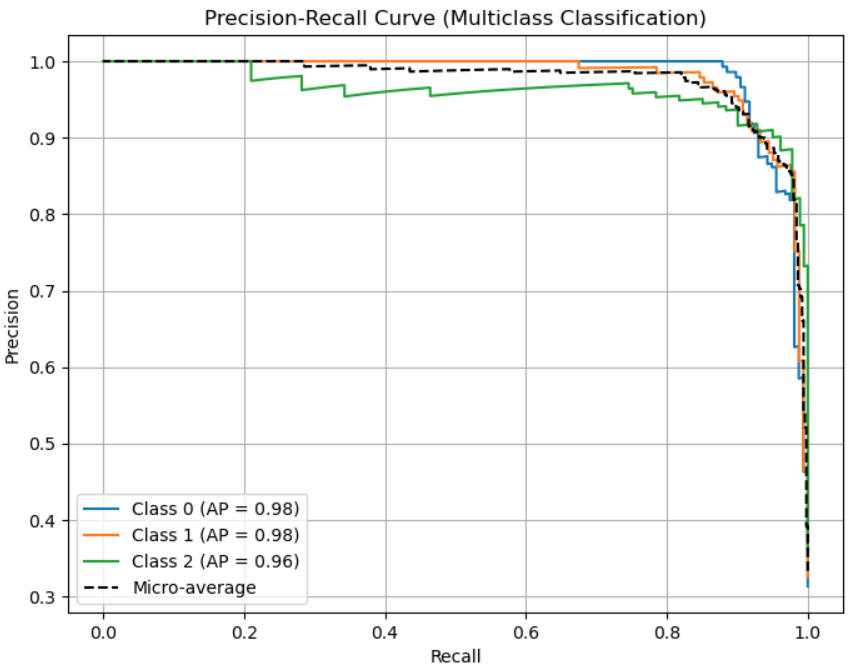
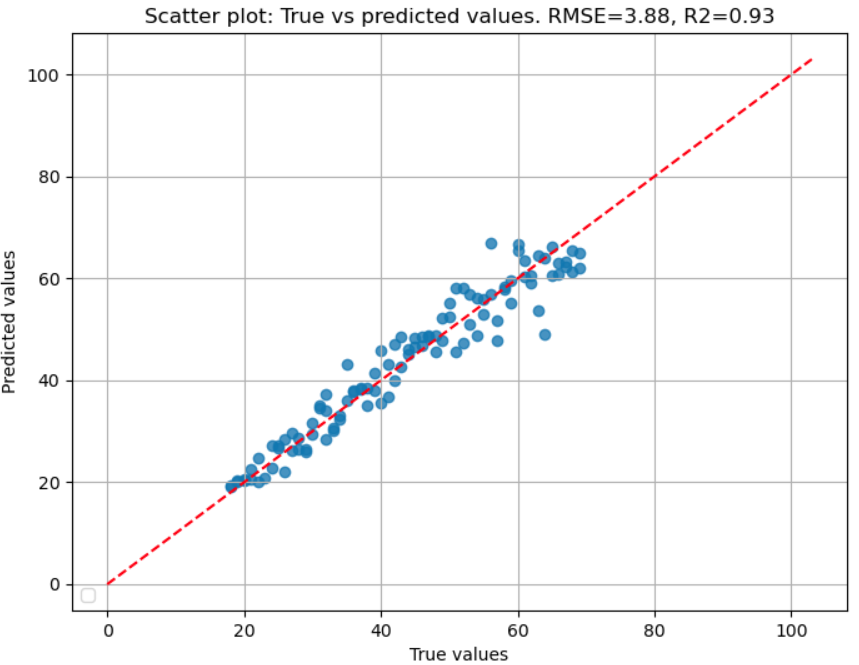

### Introduction

Machine learning for tabular data is a critical task in various domains, from healthcare to finance. Traditional approaches like decision trees, gradient boosting, and deep learning require extensive training and hyperparameter tuning. However, a new approach called TabPFN (Tabular Prior-data Fitted Network) has the potential to revolutionise tabular classification by enabling zero-shot learning—predicting labels without additional training.

The TabPFN Galaxy tool integrates this powerful model into the Galaxy platform, allowing researchers to leverage cutting-edge tabular prediction without the need for extensive ML expertise. This post explores the TabPFN methodology, its implementation in Galaxy, and how you can use it for your own datasets.

TabPFN, introduced in the Nature paper by [Hollmann et. al.](https://doi.org/10.1038/s41586-024-08328-6), is a pretrained transformer-based model designed for tabular classification. Unlike conventional ML models that require training on a given dataset, TabPFN is already trained on millions of synthetic tabular datasets, allowing it to generalize immediately to new data without further optimization.

### Why Use TabPFN in Galaxy?
Galaxy is a widely used open-source platform for reproducible computational research. The [TabPFN Galaxy tool](https://usegalaxy.eu/tool_runner?tool_id=toolshed.g2.bx.psu.edu%2Frepos%2Fbgruening%2Ftabpfn%2Ftabpfn%2F2.0.3%2Bgalaxy1) integrates TabPFN into Galaxy’s workflow ecosystem, enabling users to:

- Make predictions on any tabular dataset without writing computer programs
- Use TabPFN in automated workflows alongside other bioinformatics and data science Galaxy tools
- Prediction accelerated by GPUs
- Interpret results via performance plots

### Performance plots on classification and regression tasks

#### Precision-recall plot for classification task

A [Precision-Recall](https://scikit-learn.org/stable/auto_examples/model_selection/plot_precision_recall.html) plot is a visualization used to evaluate the performance of a classification model, especially useful in imbalanced datasets where one class is much rarer than the other(s). It shows the trade-off between precision and recall across different decision thresholds. The performance on the test data can be evaluated using this plot which is integrated with the TabPFN Galaxy tool. 

#### R2 plot for regression task

An [R2 plot](https://scikit-learn.org/stable/modules/generated/sklearn.metrics.r2_score.html) is a visualization used to evaluate the goodness of fit for a regression model. It helps understand how well the model’s predictions align with actual values. Similar to the precision-recall plot, R2 plot is also integrated into TabPFN Galaxy tool for measuring the performance of regression on test data.

### How to use in Galaxy
  1. Upload Your Data. Ensure your dataset is in a tabular format (CSV or TSV) with the last column containing class labels.

  2. Select the TabPFN Tool. Search for "TabPFN" in the Galaxy tool panel and launch the tool.

  3. Configure Parameters:
    - Select machine learning task type - classification or regression
    - Input tabular files: Train data with labels and test data with or without labels.
    - Run tool
  4. TabPFN Galaxy tool will return a file with predicted class labels of the test data and performance on test data as plot (if the provided test data has labels).

## Useful links
- [TabPFN GitHub](https://github.com/PriorLabs/TabPFN)
- [Hollmann et. al.](https://doi.org/10.1038/s41586-024-08328-6)
- [TabPFN Galaxy tool](https://usegalaxy.eu/tool_runner?tool_id=toolshed.g2.bx.psu.edu%2Frepos%2Fbgruening%2Ftabpfn%2Ftabpfn%2F2.0.3%2Bgalaxy1)
