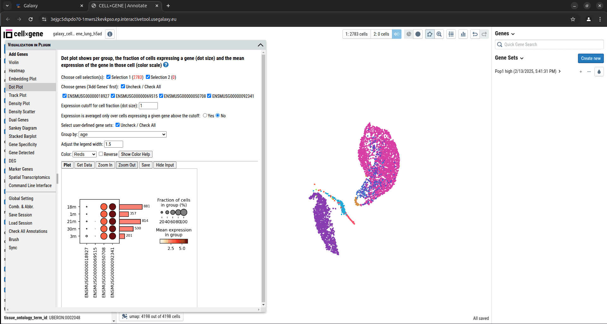

CELLxGENE-VIP (Visualization In Plugin) is an extension of the original [CELLxGENE](https://github.com/chanzuckerberg/cellxgene) tool developed by the Chan Zuckerberg Initiative.
It can efficiently extract deep insights from single-cell RNA sequencing, spatial transcriptomics, and emerging multiome datasets.

This integration enhances the capabilities of high-throughput data exploration and visualization, bridging the gap between computational power and user-friendly analysis.
While CELLxGENE focuses on fast and interactive visualization of single-cell data, CELLxGENE-VIP goes a step further by integrating interactive processing and customized visual analytics, providing deeper insights into the data.

+ It generates a comprehensive set of over eighteen commonly used quality control and analytical plots in high resolution with highly customizable settings.
+ It provides more advanced analytical functions to gain insights into cellular compositions and deep biology, such as marker gene identification, differential gene expression analysis, and gene set enrichment analysis.
+ It pioneers methods to visualize multi-modal data, such as spatial transcriptomics embedding aligned with histological images and the latest 10x Genomic Multiome dataset.

 
Different QC plots by CELLxGENE in no-time!

 

  

  

  
Spatial transcriptomics embedding aligned with histological image on one slice!

  

  
Multiome data visualization showing the spectral embedding and TSS enrichment score

  

CELLxGENE-VIP helps researchers go beyond visualization, making single-cell analysis more intuitive, reproducible, and insightful.
Whether you are an experienced programmer or not, with this tool you can generate multiple QC plots fast and dive deep into your data and unlock new discoveries in your research.

[CELLxGENE-VIP Documentation](https://interactivereport.github.io/cellxgene_VIP/tutorial/docs/)

Try it out on <strong>Galaxy</strong> today and take your analysis to the next level!

    <a href="https://usegalaxy.eu/?tool_id=interactive_tool_cellxgene_vip&version=latest">
      <button type="button" class="btn btn-primary btn-lg">Start CELLxGENE VIP now</button>
    </a>

