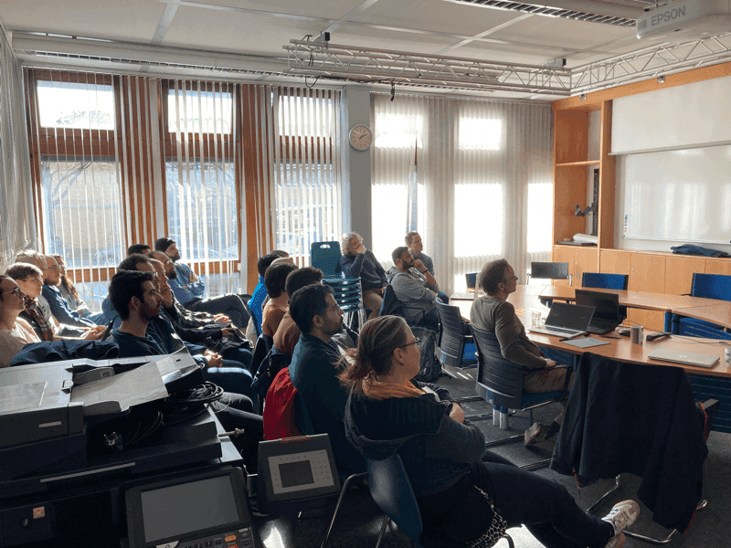

On February 27, 2025, the Galaxy Freiburg team hosted Dr. Tilo Mathes from RSpace, who gave a talk titled "Research Data Management with RSpace and Galaxy".
RSpace offers electronic lab notebook ([ELN](https://en.wikipedia.org/wiki/Electronic_lab_notebook)), research data management (RDM),
inventory and sample management systems, and tool integration services to teams, institutions, and individuals. Since [June 2024](https://www.researchspace.com/blog/research-space-embraces-open-source-to-empower-fair-data-workflows),
RSpace has been completely open-source under [AGPL 3.0 license on GitHub](https://github.com/rspace-os) and is open for individual contributions. In this talk, Dr. Mathes presented various solutions related to
RDM by RSpace and engaged the audience for a brainstorming session on potential Galaxy-RSpace collaboration.

*Figure: Dr. Tilo Mathes presenting Research Data Management with RSpace and Galaxy*

The first part of this talk focused on vertical interoperability and how different research tools could be connected within the
[RSpace framework](https://www.researchspace.com/blog/the-time-is-now-vertical-interoperability-between-research-tools-an-essential-enabler-for-the-fairification-of-data).
Horizontal tool interoperability refers to the interoperability between tools that fall into the same tool categories, such as data repositories ([RO-Crate](https://www.researchobject.org/ro-crate/) format),
data management planning tools ([DMP](https://zenodo.org/records/10658522)), and electronic lab notebooks ([ELN format](https://github.com/TheELNConsortium/TheELNFileFormat)).
Researchers use both domain-specific and general tools, which highlights the importance of vertical interoperability.
Vertically interoperable tools provide benefits such as reducing manual effort and potential mistakes during the transfer of data and metadata across tools, automating connections between (meta)data across services, and improving traceability.
All of this can enhance the FAIRness of research data and the reproducibility of research efforts.

Dr. Mathes then discussed the trend towards the professionalization and data stewards in the field of RDM as well as the important role of funding and regulatory agencies
(such as compliance with the [NIH Data Sharing Policy via RSpace](https://www.researchspace.com/research-integrity)) in supporting interoperable workflows, tools, and DMPs.
In this regard, RSpace facilitates bidirectional flow of information between [DMPtool](https://dmptool.org/) and repositories such as [Dataverse](https://dataverse.org/), [figshare](https://figshare.com/), [DRYAD](https://datadryad.org/),
and [Zenodo](https://zenodo.org/). RSpace also helps its users improve the Findability of their research by using [controlled vocabularies and ontologies](https://documentation.researchspace.com/article/8ujmvpa1no-tagging-documents).
Furthermore, while the use of Persistent IDentifiers (PIDs) has become a norm for publication and citable data, this is not the case for samples and temporary data.
PIDs are essential for connecting data, metadata, and context, as well as ensuring research reproducibility. RSpace offers various PID options such as International Generic Sample Numbers ([IGSNs](https://ev.igsn.org/)), Open Researcher and Contributor ID ([ORCID](https://orcid.org/)), Research Activity Identifier ([RAiD](https://raid.org/)), Research Organization Registry ([ROR](https://ror.org/)), and Persistent Identification of Instruments ([PIDINST](https://docs.pidinst.org/en/latest/)). Having said that, there are still unresolved issues, such as the extra focus on the design of a specific tool rather than considering the broader ecosystem, the burden that RDM can bring without a proper automation in the workflow, and a late start in a project. These could be solved via integration of existing APIs, workflows, and improving the interoperability of the new tools.

<figure class="figure">
    
    <figcaption class="figure-caption">
        RSpace Ecosystem Graphic (source: 
        <a href="https://www.researchspace.com/blog/the-time-is-now-vertical-interoperability-between-research-tools-an-essential-enabler-for-the-fairification-of-data" target="_blank">
            ResearchSpace.com
        </a>)
    </figcaption>
</figure>

To increase the FAIRification of research data, Galaxy and RSpace will focus on computational research with a particular emphasis on workflow integration between Galaxy and RSpace frameworks.
This necessitates ongoing collaboration from both parties to provide feedback from various angles and to develop user-friendly tools and interfaces to reduce the technical burden.
To accomplish this, we decided to focus on a few examples of Galaxy and RSpace integration to identify strengths and areas for improvement.

*Figure: Brainstorming session between RSpace and Galaxy*