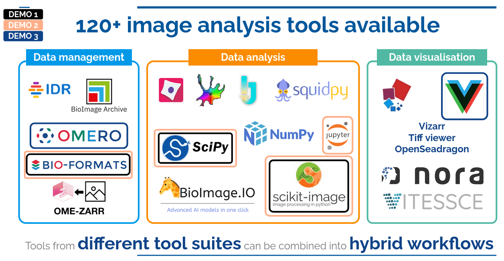

## The GloBIAS BioImage Analysis (BIA) seminar series

The primary goal of the [GloBIAS seminar series](https://www.globias.org/activities/bia-seminar-series) is to provide a dynamic platform for 
bioimage analysts, enabling the community to stay up to date with the latest
developments in the field and foster community interactions.
The seminars are designed to cater to intermediate and advanced analysts, 
focusing on practical, high-level content that extends beyond basic 
instruction.

On the 26th of February, **Beatriz Serrano-Solano**, **Anne Fouilloux**, **Leonid Kostrykin** and 
**Riccardo Massei** held the webinar **"Image analysis using Galaxy"** where they introduced the [Galaxy Image Analysis Community](https://galaxyproject.org/community/sig/image-analysis/) and highlighted
its mission to advance the development of FAIR and reproducible image analysis workflows.
 
## Galaxy as a web-based, accessible, reproducible, and transparent platform for image analysis

The seminar began by exploring Galaxy's capabilities in integrating popular image analysis tools, interactive 
environments, and notebooks, making it a versatile web platform for image processing. An overview of existing 
imaging tools, the web-based user interface, and the workflow 
construction was provided to the seminar attendees. This included giving 
a feel for the potential use of Galaxy in image processing and analysis. Additionally, 
an overview of the training materials and the [Galaxy Training Network](https://training.galaxyproject.org/training-material/topics/imaging/) was given.

## Galaxy live demos
During the live demonstration, a showcase of various Galaxy features for image analysis took place.

First, a workflow for basic image analysis tasks was demonstrated, including image preprocessing and image enhancement, segmentation, and feature extraction. [This workflow](https://training.galaxyproject.org/training-material/topics/imaging/tutorials/imaging-introduction/tutorial.html) illustrated how to utilize 
Galaxy tools to interactively create a reproducible image analysis pipeline, save it, and re-execute 
it in a reproducible manner on a large number of images.

Next, the same analysis was repeated using [Jupyter Notebook as an interactive tool](https://training.galaxyproject.org/training-material/topics/galaxy-interface/tutorials/jupyterlab/tutorial.html) within Galaxy. 
The demonstration showed how a similar analysis can be performed outside of a workflow by simply 
using an interactive tool within Galaxy. This included installing Python libraries suitable for the 
analysis and converting the final output to a OME-Zarr format.

Finally, the live demonstration concluded by highlighting the integration of image data management
and interactive visualization in Galaxy. The features of the [OMERO-suite](https://training.galaxyproject.org/training-material/topics/imaging/tutorials/omero-suite/tutorial.html) were showcased, which merges 
image analysis with data management by automatically transferring images to a target OMERO server.
Additionally, the possibility to visualize data directly from [IDR](https://idr.openmicroscopy.org/) using the recently developed Vizarr
tool was demonstrated.

## Session wrap-up
In the final wrap-up, the audience showed high interest in the webinar by asking questions
in the chat were they were actively answered by the speakers. An overview on the Q&A was shared 
and posted on [image.sc](https://forum.image.sc/t/globias-bioimage-analysis-seminar-series-image-analysis-using-galaxy/109386).

The full presentation is available on [Zenodo](https://zenodo.org/records/14944040).