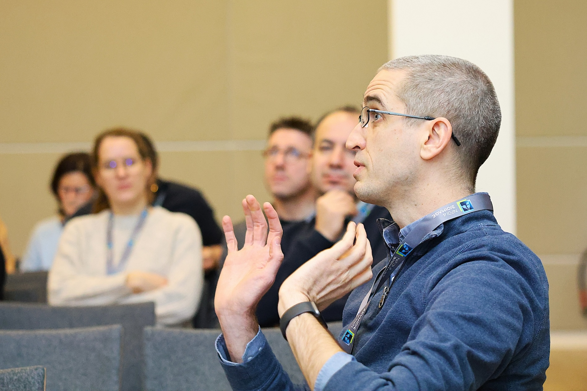

# NFDI4Bioimage All-Hands Meeting: A Look Back

## February 4th - 6th, 2025 | Düsseldorf, Germany 🚀

From **February 4th to 6th**, members of the **Galaxy Community Members** joined the **NFDI4Bioimage All-Hands Meeting** in Düsseldorf, diving into discussions on **bioimage analysis** and **image data management**. Researchers, analysts, and technical experts came together to share insights, showcase progress, and shape the future of the field. The event was filled with energy and collaboration, highlighting the growing potential of bioimage research.  

📷 © Christian Schmidt | NFDI4Bioimage

## Key Discussions

**Keynote speakers** explored the future of **bioimage informatics**, **metadata standards**, and **interoperability**, while task area representatives presented updates, challenges, and next steps. A key discussion posed the question:  _What can we do now that was not possible before?_  
This sparked engaging conversations on how recent advancements are transforming imaging data analysis.

## Poster Sessions & Knowledge Exchange

The poster sessions and open exchanges provided a space for networking and deeper discussions. Our posters,  
**_["Advancing FAIR Image Analysis in Galaxy: Tools, Workflows, and Training"](https://zenodo.org/records/14979253)_** and **_["Galaxy Meets OMERO! Overview on the Galaxy OMERO-suite and Vizarr Viewer"](https://zenodo.org/records/14975462)_** fostered meaningful knowledge exchange on community-driven innovation, existing Galaxy tools and workflows, and the future potential of bioimage analysis in Galaxy. 🔬💡  

## Challenges and Opportunities

### Lack of Real-World Use Cases

One of the biggest challenges in bioimage analysis is the lack of real-world use-cases. While new technologies continue to push the field forward, many data science researchers struggle to apply these tools without clear **case studies** to follow. Discussions highlighted the need for well-documented examples and shareable datasets to help scientists make better use of available methods.

### OMERO Integration

Another key focus was **OMERO** as a tool and platform for managing image data. **Josh Moore** discussed ongoing efforts to make OMERO more accessible in research workflows, enabling scientists to store, organize, and analyze data more efficiently. A structured approach to data management could help researchers track their work and share results more effectively.

📷 © Christian Schmidt | NFDI4Bioimage

### Workflow Standardization

Ensuring consistent image analysis workflows remains a challenge. **Bioimage data** varies widely, whether used to answer questions related to signal intensity measurement, cell movement tracking, spatial pattern analysis, or stained tissue examination, among others. Developing workflows that can adapt to diverse imaging needs while ensuring reliable and reproducible results is no small feat. Discussions emphasized the need for flexible tools that strike a balance between adaptability and well-defined methodologies, making them applicable to broader imaging datasets despite the specificity of individual research questions.

### Metadata Gaps

Another major issue is **missing metadata**, the background information needed to interpret imaging data properly. Analysts often receive datasets without key details, such as imaging conditions, experimental setup, or sample preparation. Without this information, it’s difficult to compare results or repeat experiments. Strengthening collaboration between lab scientists and data analysts, along with setting clearer metadata guidelines, could help address this gap.

### Training and Awareness

Despite these hurdles, the meeting highlighted an exciting shift: **bioimage analysis tools are more advanced and accessible than ever**. However, some researchers aren’t fully aware of the available resources. The discussions emphasized the need for better training programs and easier access to learning materials. Providing scientists with the right knowledge and tools will be key to advancing research and improving reproducibility.

## Looking Ahead

Moving forward, the **bioimaging community** is committed to tackling these challenges. The focus will be on:
- Expanding **real-world use cases** to provide practical examples for researchers.
- Strengthening **OMERO integration** for **seamless image data management**.
- Improving **workflow interoperability** to ensure adaptable and reproducible analysis pipelines.
- Enhancing **metadata standards** to generate meaningful and reusable datasets.
- Increasing **training and community engagement** to help scientists **leverage the latest bioimage analysis tools**.

This meeting was a **reminder of how far we’ve come**, and how much work lies ahead. Through continued collaboration, we are shaping the future of **bioimaging**, one picture at a time! 🚀

## More Information

🔗 **[Galaxy Image Analysis Community](https://galaxyproject.org/community/sig/image-analysis/)**  
🔗 **[NFDI4Bioimage](https://nfdi4bioimage.de/)**  
