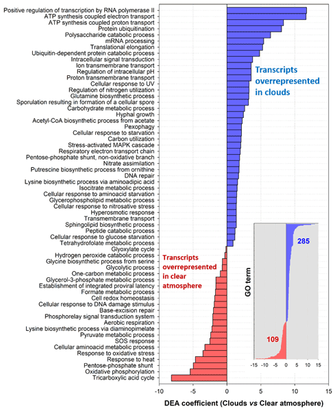

A new paper published in **Biogeosciences** by Péguilhan et al. explores how clouds influence airborne microorganisms. The research team, including Dr. Bérénice Batut and Engy Nasr from the Galaxy group in Freiburg, developed Galaxy workflows for metagenomic and metatranscriptomic analyses. These workflows enabled the investigation of microbial communities in aerosols collected from a high-altitude meteorological station under both cloudy and clear-sky conditions. The findings suggest that cloud environments promote microbial metabolic activity and influence stress responses, potentially shaping microbial diversity and biogeochemical cycles.

For more details, read the full [paper](https://doi.org/10.5194/bg-22-1257-2025)!

**Abstract:**

Airborne microorganisms can remain at altitude for several days, exposed to multiple environmental constraints that prevent or limit microbial activity, the most important of which is probably the lack of available liquid water. Clouds, i.e., air masses containing liquid water, could offer more favorable conditions. In order to investigate the influence of clouds on the functioning of airborne microorganisms, we captured aerosols in a nucleic acid preservation buffer from a high-altitude mountain meteorological station under cloudy and clear-atmosphere conditions and examined the metatranscriptomes. The specificities of aeromicrobiome's functioning in clouds and a clear atmosphere were then decrypted using differential expression analysis (DEA). The data reveal a higher RNA : DNA content in clouds than in the clear atmosphere, suggesting higher metabolic activity, and the overrepresentation of microbial transcripts related to energy metabolism, the processing of carbon and nitrogen compounds, intracellular signaling, metabolic regulations, and transmembrane transports. Stress response in clouds tends towards responses to osmotic shocks and starvation rather than oxidants in a clear atmosphere. Autophagy processes in eukaryotes (macropexophagy, i.e., the recycling of peroxisomes) could help to alleviate the limited amounts of nutrients in the restricted microenvironments provided by cloud droplets. The whole phenomenon resembles the rapid resumption of microbial activity in dry soils after rewetting by rain, which is known as the Birch effect and is described here for the first time for the atmosphere. This work provides unprecedented information on the modulations of an aeromicrobiome's functioning in relation to atmospheric conditions. In addition to contributing to the processing and fate of chemical compounds in the atmosphere, cloud-induced modulations of biological processes could have ecological repercussions by shaping airborne microbial diversity and their capacity to invade surface environments.

