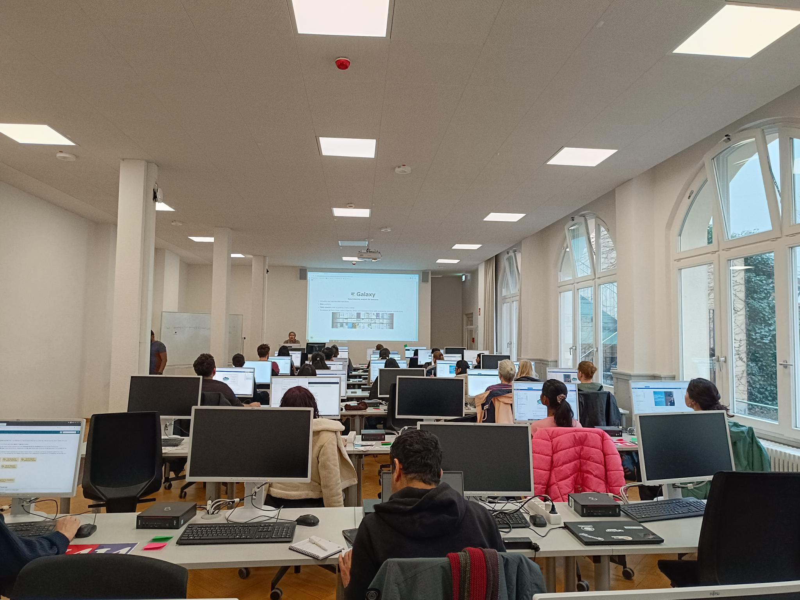

# 🚀 Time to Celebrate ​🎉 The Freiburg Galaxy Team hosts its 20th on-site workshop

This week, from March 10th to 14th, we are hosting the 20th High Throughput Sequencing Workshop in Freiburg. This one-week in-person workshop first started in 2013. Two instructors from the very first workshop, Björn and Pavan, have again taken on sessions for this milestone event.

The week's program provides a comprehensive overview of how to use Galaxy for various types of HTS analyses, including ChIP-Sequencing, RNA-Sequencing, Variant Calling/Exome Sequencing, and Metagenomics.

We are grateful to everyone — instructors, organizers, and workshop participants — who have made these workshops a success story. A special shout-out goes to the Galaxy Training Network and all its contributors, especially for the infrastructure it provides to host these types of workshops.

​🎉Thanks to:

<a style="text-decoration: none; color: #333;" href="https://github.com/erxleben">
Anika Erxleben-Eggenhofer
</a>
<a style="text-decoration: none; color: #333;" href="https://github.com/bgruening">
Björn Grüning
</a>
<a style="text-decoration: none; color: #333;" href="https://github.com/bebatut">
Bèrènice Batut
</a>
<a style="text-decoration: none; color: #333;" href="https://github.com/wm75">
Wolfgang Maier
</a>
<a style="text-decoration: none; color: #333;" href="https://github.com/hexylena">
Helena Rasche
</a>
<a style="text-decoration: none; color: #333;" href="https://github.com/paulzierep">
Paul Zierep
</a>
<a style="text-decoration: none; color: #333;" href="https://github.com/anuprulez">
Anup Kumar
</a>
<a style="text-decoration: none; color: #333;" href="https://github.com/engynasr">
Engy Nasr
</a>
<a style="text-decoration: none; color: #333;" href="https://github.com/pavanvidem">
Pavankumar Videm
</a>
<a style="text-decoration: none; color: #333;" href="https://github.com/dianichj">
Diana Chiang Jurado
</a>
<a style="text-decoration: none; color: #333;" href="https://github.com/sanjaysrikakulam">
Sanjay Kumar Srikakulam
</a>
<a style="text-decoration: none; color: #333;" href="https://github.com/Minamehr">
Mina Hojat Ansari
</a>
<a style="text-decoration: none; color: #333;" href="https://github.com/PlushZ">
Polina Polunina
</a>
<a style="text-decoration: none; color: #333;" href="https://github.com/Nilchia">
Amirhossein Naghsh Nilchi
</a>
<a style="text-decoration: none; color: #333;" href="https://github.com/SaimMomin12">
Saim Momin
</a>
<a style="text-decoration: none; color: #333;" href="https://github.com/Sch-Da">
Daniela Schneider
</a>
<a style="text-decoration: none; color: #333;" href="https://github.com/dadrasarmin">
Armin Dadras
</a>
<a style="text-decoration: none; color: #333;" href="https://github.com/deeptivarshney">
Deepti Varshney
</a>
<a style="text-decoration: none; color: #333;" href="https://github.com/teresa-m">
Teresa Müller
</a>
<a style="text-decoration: none; color: #333;" href="https://github.com/torhou">
Torsten Houwaart
</a>
<a style="text-decoration: none; color: #333;" href="https://github.com/asrichter">
Andreas Richter
</a>
<a style="text-decoration: none; color: #333;" href="https://github.com/gallardoalba">
Cristóbal Gallardo
</a>
<a style="text-decoration: none; color: #333;" href="https://github.com/thomasmanke">
Thomas Manke
</a>
<a style="text-decoration: none; color: #333;" href="https://github.com/friedue">
Friederike Dündar
</a>
<a style="text-decoration: none; color: #333;" href="https://github.com/sarah-peter">
Sarah Peter
</a>
<a style="text-decoration: none; color: #333;" href="https://github.com/kilpert">
Fabian Kilpert
</a>
<a style="text-decoration: none; color: #333;" href="https://github.com/dpryan79">
Devon Ryan 
</a>
<a style="text-decoration: none; color: #333;" href="https://github.com/stephanflemming">
Stephan Flemming
</a>
<a style="text-decoration: none; color: #333;" href="https://github.com/fidelram">
Fidel Ramirez
</a>
<a style="text-decoration: none; color: #333;" href="https://github.com/joachimwolff">
Joachim Wolff
</a>
<a style="text-decoration: none; color: #333;" href="https://github.com/mtekman">
Mehmet Tekman
</a>
<a style="text-decoration: none; color: #333;" href="https://github.com/blankclemens">
Clemens Blank
</a>
<a style="text-decoration: none; color: #333;" href="https://github.com/heylf">
Florian Heyl
</a>
<a style="text-decoration: none; color: #333;" href="https://github.com/vivekbhr">
Vivek Bhardwaj 
</a>
<a style="text-decoration: none; color: #333;" href="https://github.com/LeilyR">
Leily Rabbani
</a>
<a style="text-decoration: none; color: #333;" href="https://github.com/rgilsbach">
Ralf Gilsbach
</a>
<a style="text-decoration: none; color: #333;" href="https://github.com/mira-miracoli">
Mira Kuntz
</a>
<a style="text-decoration: none; color: #333;" href="https://github.com/gmauro">
Gianmauro Cuccuru
</a>

