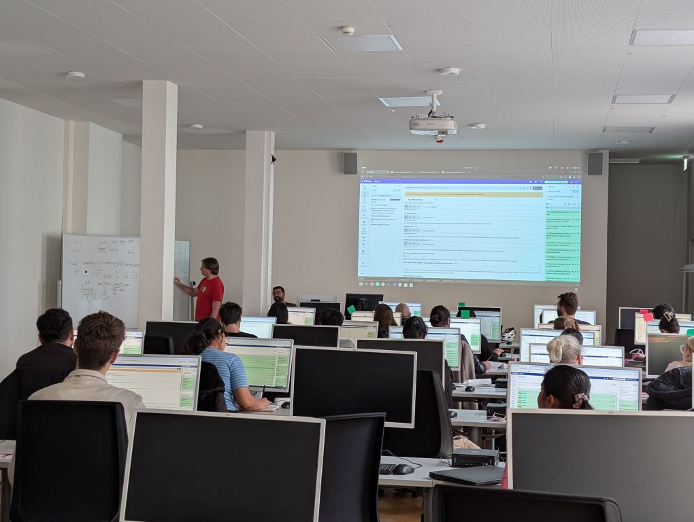

# 🚀 Time to Celebrate ​🎉 The Freiburg Galaxy Team hosts its 20th on sight workshop

This week, from March 10th to 14th, we are hosting the 20th High Throughput Sequencing Workshop in Freiburg. This one-week in-person workshop first started in 2013. Two instructors from the very first workshop, Björn and Pavan, have again taken on sessions for this milestone event.

The week's program provides a comprehensive overview of how to use Galaxy for various types of HTS analyses, including ChIP-Sequencing, RNA-Sequencing, Variant Calling/Exome Sequencing, and Metagenomics.

We are grateful to everyone — instructors, organizers, and workshop participants — who have made these workshops a success story. A special shout-out goes to the Galaxy Training Network and all its contributors, especially for the infrastructure it provides to host these types of workshops.
