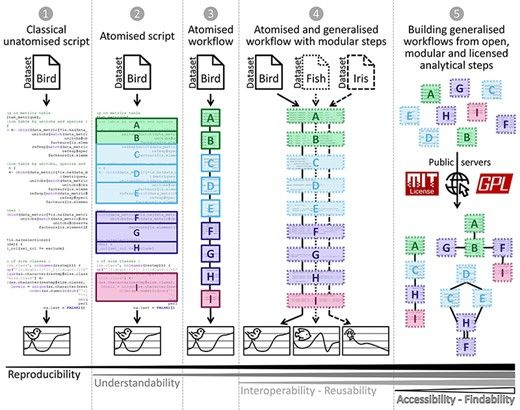

We are excited to share our recent publication in *GigaScience*: "Guidance framework to apply best practices in ecological data analysis: lessons learned from building Galaxy-Ecology." This paper presents a practical framework aimed at improving transparency, reproducibility, and efficiency in ecological research by leveraging the Galaxy-Ecology platform.

## The Need for Best Practices in Ecology

Ecological research often involves complex datasets and analytical procedures. To enhance the reliability and reproducibility of ecological studies, adopting best practices in data analysis is essential. Our framework introduces two key concepts:

- **Atomization:** Breaking down analytical procedures into discrete, manageable steps ("atoms"), facilitating clarity and modularity.

- **Generalization:** Developing analytical steps that are broadly applicable across various studies, promoting standardization and reusability.

## Galaxy-Ecology: A Platform for Reproducible Research 
Galaxy-Ecology is a web-based platform that embodies these principles, offering:

- **Accessible Workflows:** User-friendly interfaces for constructing and executing complex ecological analyses without extensive programming knowledge.

- **Reproducibility:** Standardized contributions (tools, workflows) ensure that analyses can be replicated and validated by other researchers.

- **Community Collaboration:** A platform for sharing tools, workflows, and best practices, fostering a collaborative research environment.

## Key Takeaways from the Paper

Our experiences in developing Galaxy-Ecology have led to several insights:

- **Framework Application:** Implementing atomization and generalization enhances the clarity and efficiency of ecological data analyses.

- **Platform Benefits:** Galaxy-Ecology serves as a practical tool for applying these best practices, making advanced analyses more accessible.

- **Community Engagement:** Collaborative efforts are crucial in refining and expanding the platform to meet diverse research needs.

## Getting Started with Galaxy-Ecology
Researchers can access Galaxy-Ecology through [https://ecology.usegalaxy.eu/](https://ecology.usegalaxy.eu/).

The platform provides a range of tools and workflows tailored for ecological data analysis, along with comprehensive training materials available via the [Galaxy Training Network](https://training.galaxyproject.org/).

## Join the Galaxy-Ecology Community

We invite ecologists, data analysts, and educators to engage with the Galaxy-Ecology community. Your contributions, whether through utilizing the platform, developing new tools, tutorials, or participating in discussions, are vital for advancing reproducible and efficient ecological research.

## Read the Full Paper
For an in-depth understanding of our framework and the development of Galaxy-Ecology, read our full paper in *GigaScience*: [https://academic.oup.com/gigascience/article/doi/10.1093/gigascience/giae122/8010442](https://academic.oup.com/gigascience/article/doi/10.1093/gigascience/giae122/8010442).

We look forward to your feedback and collaboration as we continue to enhance ecological data analysis practices together!
