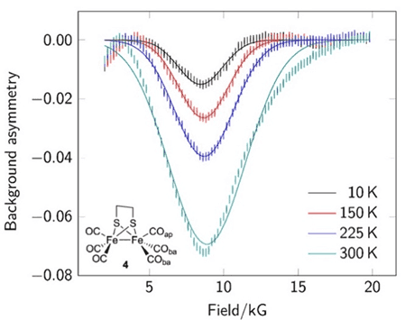

Muons are subatomic particles that are produced at four active muon sources around the world: ISIS in the UK; J-PARC in Japan; TRIUMF in Canada and PSI in Switzerland.
In this paper, muon spectroscopy (μSR) experiments and simulations were carried out on materials for energy applications. Specifically, the experiments were done on redox-active metal hydrides,
which are of central importance in novel hydrogen generation methods.

In recent years, computer simulations for the interpretation of μSR experiments have become a necessity for many of the members of the international muon community.
This has accelerated the development of many software tools for µSR experiments, which currently have a growing community of users.
Among those tools are the ones being developed by the [Muon Spectroscopy Computational Project (MSCP)](https://muon-spectroscopy-computational-project.github.io ), an initiative based in the Scientific Computing Department (SCD) at the Science and Technologies Facilities Council in the UK. The MSCP is an active
member of the [EuroScienceGateway project](https://galaxyproject.org/projects/esg/ ), were sustainable and easily accessible Galaxy tools and associated
tutorials have been developed to support the community of users of the MSCP, who are mainly muon scientists and researchers.

The computational simulations presented in this paper were performed using the [Galaxy](https://materialsgalaxy.stfc.ac.uk ) tools associated to
the MSCP’s [MuSpinSim](https://iopscience.iop.org/article/10.1088/1742-6596/2462/1/012017) software.  
  
*μSR experimental results for the redox-active metal hydride compound*  
  
The full paper can be read here: [Hydrogen Radical Chemistry at High-Symmetry {2Fe2S} Centers Probed Using a Muonium Surrogate J. A. Wright; L. Liborio, et al. Inorg. Chem. 2025, 64, 10, 5053–5058](https://doi.org/10.1021/acs.inorgchem.4c05126)
