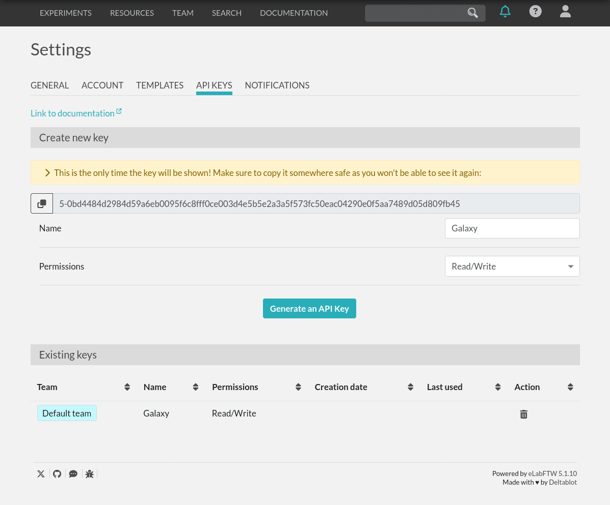
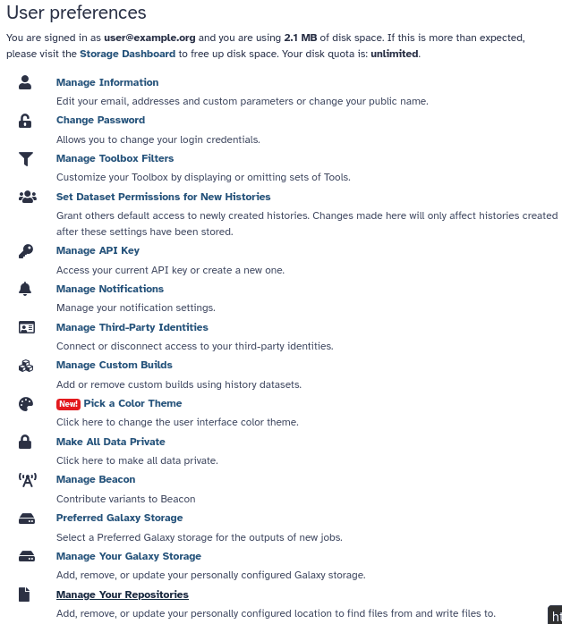
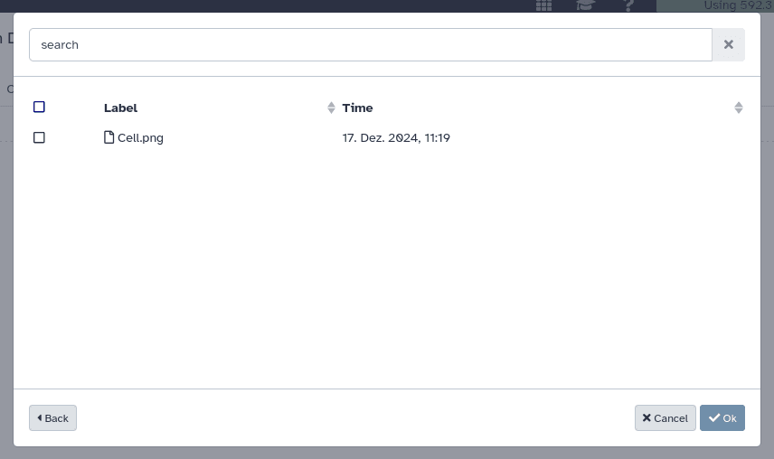
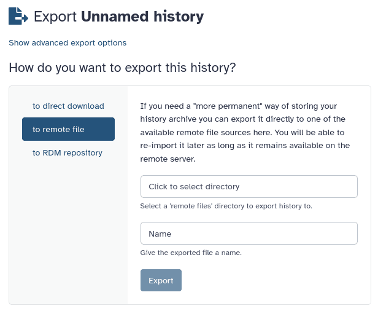

[eLabFTW](https://www.elabftw.net/) is a free and open source electronic lab notebook from
[Deltablot](https://www.deltablot.com/about/). It can keep track of experiments, equipment and materials from a research
lab. Each lab can either [host their own installation](https://doc.elabftw.net/#introduction) or go for Deltablot's
[hosted solution](https://www.deltablot.com/elabftw/). A live demo showcasing its features is available [here](https://demo.elabftw.net/).

And from now on, it is integrated with Galaxy! eLabFTW support has been deployed to
[usegalaxy.eu](https://usegalaxy.eu), and the file source will be brought onboard to upstream Galaxy in release 25.0.
This means that files attached to eLabFTW [experiments](https://doc.elabftw.net/user-guide.html#experiments) and
[resources](https://doc.elabftw.net/user-guide.html#resources) can be imported to
[histories](https://training.galaxyproject.org/training-material/topics/galaxy-interface/tutorials/history/tutorial.html)
with just a few clicks. After the analysis is complete, datasets and histories can be exported back as attachments to an
experiment or resource.

## Getting started

Before it can be used, the feature _must be enabled by a Galaxy administrator_. Once enabled, navigate to the _Settings_
page on your eLabFTW server and go to the _API Keys_ tab.   

Generate a new API key and copy it. Choose "Read/Write" permissions to enable both importing and exporting data. "Read
Only" API keys work for importing data to Galaxy, but not for exporting data to eLabFTW.

On Galaxy, configure a new eLabFTW file source under user preferences _Manage Your Repositories_ > _Create_ > _eLabFTW_.

Assign a name to your eLabFTW file source, enter the URL to your eLabFTW instance, and enter the API key you just
generated. If you are using a "Read Only" API key, disable the toggle "Allow Galaxy to export data to eLabFTW?".
Click _Create_.

## Importing files to a Galaxy history

To import files from eLabFTW to a Galaxy history, click _Upload_ on the sidebar and then _Choose remote files_. 

After selecting _eLabFTW_, Galaxy shows two folders, one that contains all experiments and another that contains all
resources.

Inside each, all experiments or resources are listed as folders. Attached files are located within each of the folders.

## Exporting histories to eLabFTW

Clicking _Export History to File_ under _History options_ opens the history export screen. There, select _to remote 
file_, choose a name, and finally use the box _Click to select directory_ to open the remote file source browser. The
same screen displayed when importing files will be shown, from where you can select a target experiment or resource.

Keep in mind that you have to create the experiments and resources themselves on eLabFTW beforehand.

## Exporting datasets to eLabFTW

Individual datasets may also be exported with the help of the
[dataset export](https://usegalaxy.eu/?tool_id=export_remote&version=latest) tool. First, choose the datasets to export
under the _What would you like to export?_ section. Then click _Select_ under _Directory URI_ to open the remote file
source browser, which allows to select the target experiment or resource.

