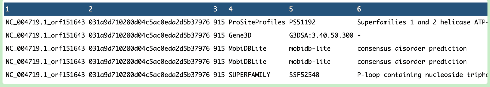
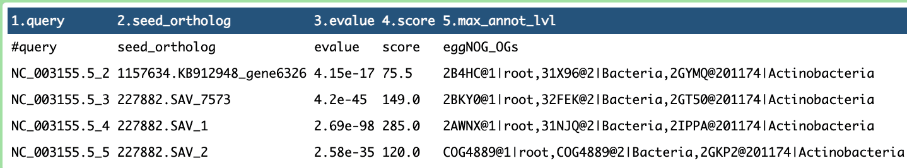

## MGnify Mettannotator Pipeline v1.0

In this current technologically advance age, the discovery of novel species is at its peak time. This has lead to a surge in prokaryotic genome assemblies both from isolated organisms and environmental samples. The necessity to annotate and represent novel taxa led to the creation of *mettannotator*, a scalable Nextflow pipeline by <a href="https://github.com/EBI-Metagenomics/mettannotator?tab=readme-ov-file" target="_blank">EBI</a>.  
Although it is an excellent addition to other genome annotation tools available, it requires usage experience in nextflow for its execution. This is where the advantage of porting this pipeline to Galaxy comes from. Galaxy not only provides an extensive library of features, is easily accessible but also its web-based platform makes it transparent for researchers, regardless of their programming background to access it.   
One additional feature of Galaxy is its flexibility, allowing users to easily extend and customize the workflows based on specific research needs. Some examples where we can extend our workflow are:   
<a href="https://training.galaxyproject.org/training-material/news/2021/12/01/assembly-annotation.html" target="_blank">Genome Annotation with Funannotate</a>  
<a href="https://training.galaxyproject.org/training-material/news/2021/06/04/apollo.html" target="_blank">Genome Annotation with Apollo</a>  
Moreover, Galaxy has the ability to directly fetch public databases and coupled this with its workflow parameterization, version control makes it an unquestionable choice.  

This diagram illustrates the MGnify Mettannotator Pipeline v1.0 workflow for prokaryotic genome annotation. It starts by processing the data using Prokka or Bakta to identify protein-coding genes in Archaeal genomes/bacterial genomes, followed by various steps such as Biosynthetic gene cluster annotation.

## Background
The mettannotator pipeline functions to provide coding, non-coding regions, predict protein functions, including antimicrobial resistance and delineates gene clusters for prokaryotic genome annotation. One of it's core functionality is carried out in the form of identification of larger gene clusters providing contextual information.
One imposing challenge that the pipeline aimed to tackle is the annotation of novel genomes as they are less likely to be present in reference databases and thus, have less functional information. Not only that, the pipeline is aimed at handling genomes even without a species-level taxonomic label and predicting larger biosynthetic gene clusters while compressing it in a single GFF file, thus, helping it scale further. 

## Step-by-step Pipeline Creation

Tools which are currently included in the pipeline:

1. Prokka  
It is used to annotate bacterial, archaeal and viral genomes, identifying features in a set of genomic sequences.

2. Bakta  
It is a tool used for annotation of bacterial genomes from both isolates and MAGs

3. AMRFinderPlus  
It is designed to find out antimicrobial resistance genes and point mutatations in protein/nucleotide sequences.

4. InterProScan  
Is used to provide functional analysis of protein sequences. It classifies the information into families and predict the presence of domains.

5. eggNOG Mapper  
It is used for the functional annotation of novel genome sequences.

6. GECCO  
Gene Cluster prediction with Conditional Random Fields is a scalable tool that helps in identifying putative novel Biosynthetic Gene Clusters.

7. Sanntis  
It is a tool used for identifying Biosynthetic gene clusters.

8. AntiSmash  
It is utilized for annotation and analysis of Biosynthetic gene clusters in bacterial and fungal genomes.

9. tRNA prediction  
It is a tool used for detection of transfer RNA. 

The working schema:   
1. The pipeline takes as an input a file that can include one or many genomes that needs to be analyzed. The user has the option of going the Bakta route (bacterial genome annotation) or Prokka route(archaeal genomes). 
2. The output from Prokka or Bakta is then supplemented by InterProScan and eggNOG-mapper.
3. The next step after the individual protein assignment is to detect biosynthetic gene clusters and noncoding RNA.
4. The pipeline individually outputs key files from each tool in an organized manner. 

## Availability on Galaxy

Version 1.0 of the MGnify mettannotator pipeline (Bakta) is now fully available on the Galaxy EU server, bringing advanced metagenomic analysis workflow to researchers/scientists through an accessible, web-based interface.
The following consists of both the workflows, one with Bakta and another with Prokka. 

<iframe title="Galaxy Workflow Embed_Bakta" style="width: 100%; height: 700px; border: none;" src="https://usegalaxy.eu/published/workflow?id=cc59ae1a9878942c&embed=true&buttons=true&about=false&heading=false&minimap=true&zoom_controls=true&initialX=-20&initialY=-20&zoom=1"></iframe>

<iframe title="Galaxy Workflow Embed_Prokka" style="width: 100%; height: 700px; border: none;" src="https://usegalaxy.eu/published/workflow?id=a448400f69594135&embed=true&buttons=true&about=false&heading=false&minimap=true&zoom_controls=true&initialX=-20&initialY=-20&zoom=1"></iframe>

These workflows make it easier for users to customize and visualize their analysis results, enhancing the overall utility of the pipeline.

## Missing Tools
Following are the tools that are missing from the current version of the pipeline but will be integrated in future updates. 
1. UniFIRE
2. run_dbCAN
3. CRISPRCasFinder
4. VIRify
5. pyCirclize
6. DefenceFinder
7. Pseudofinder

Out of these, VIRify and pyCircilize are not part of the direct pipeline but take the output from the pipeline to visualize the results. 
This makes sure that the pipeline has room for further development down the road. These continues updates will allow the new tools to be well integrated into the pipeline and streamline the annotation process further. 

## Testing the pipeline
During the process, the ported pipeline was tested, yielding promising results.
<figure style="text-align: center;">
  
  <figcaption>Figure 1: Overview of AMRFinderPlus tool output</figcaption>
</figure>
<figure style="text-align: center;">
  
  <figcaption>Figure 2: Overview of InterProScan tool output</figcaption>
</figure>
<figure style="text-align: center;">
  
  <figcaption>Figure 3: Overview of GECCO tool output</figcaption>
</figure>
<figure style="text-align: center;">
  
  <figcaption>Figure 4: Overview of eggNOGMapper tool output</figcaption>
</figure>

## What's Next?
The porting of mettannotator pipeline advances the process of complex combination of tools that give comprehensive output in Galaxy. This version is not only sophisticated but provides a similar and clearer apporach to understanding the process, while utilizing an ample amount of relevant databases. The next step is to incorporate the remaining tools to give a complete and holistic view of genome annotation. 
