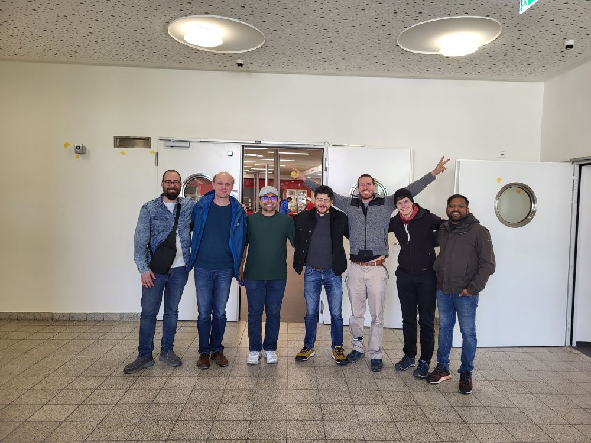

# 🥳 Mensa Opening at the Technical Faculty!

Coming to Freiburg for a lab exchange and planning to visit [**Galaxy Europe (EGD)**](https://galaxyproject.org/events/2025-10-01-egd2025/) ?  
Not sure where to grab a quick, affordable bite nearby?

**Fear not — your lunch solution has finally arrived!**

After a wait of more than **five years**, the **Mensa at the Technical Faculty**, located *right across from the Galaxy Europe office*, has officially opened its doors today — and trust us, it was worth the wait.

We stopped by for the grand opening, and we were **not disappointed**. From tasty meals to super convenient access, this new spot is set to become a lunchtime favorite.

In times of rising food prices and inflation, having an affordable and reliable place to eat makes a real difference — especially for employees who don’t benefit from student discounts. The Mensa offers a solid meal without breaking the bank, just a short walk from your desk.

Not only is it delicious and fast, but it’ll also likely boost **Galaxy Europe's lunchtime productivity** — no more long treks or pricey options!

### 💸 Prices:
- **Students:** €3.90  
- **Employees:** €5.99

---

# 📸 First Impressions

A few snapshots from our first visit:

  
*Happy faces = good food!*

  
*Looks good, tastes better.*

