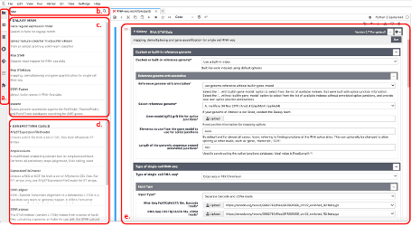

The Galaxy and Jupyter ecosystems bring two different, successful approaches to the problem of accessible, reproducible bioinformatics research. Galaxy provides thousands of bioinformatics tools in a web-accessible format, removing the need for installation, compatibility issues, and compute resource allocation. Jupyter offers the ability to combine scientific exposition and executable code into a single research narrative document. To bring these approaches together, we have developed Genomics to Notebook ([g2nb](http://www.g2nb.org)), an environment that integrates Jupyter with Galaxy and other bioinformatics platforms, allowing Galaxy analyses to be created as notebook cells and providing non-programming scientists with accessibility to thousands of bioinformatics tools from within a notebook interface.

## Galaxy in Jupyter

Standard Jupyter notebook cells can contain text, images, multimedia or code. We have added a cell type that presents the interface to a Galaxy tool as a cell within the notebook. From the notebook, scientists can log into any accessible Galaxy server and choose from the available analyses. The g2nb environment also displays a user’s Galaxy histories and allows for switching between them. 

## Other tools

In addition to Galaxy, the g2nb environment currently also supports notebook-adapted versions of the Integrative Genomics Viewer ([IGV](https://igv.org/)), [Cytoscape](https://github.com/cytoscape/ipycytoscape) and [GenePattern](http://www.genepattern.org). You can see more features in the image below: 

A tools panel (a) provides tabs that display all available analysis tools, Galaxy histories, files, and other data. In this example, the analysis tools tab is selected and the user searches for the STAR sequence alignment tool (b). Tools with STAR in their name or description are displayed for the two servers currently connected: (c) the Galaxy Main server and (d) the GenePattern cloud server. (e) A Galaxy analysis cell shows the interface to the STARsolo tool on Galaxy Main after it has been selected by the g2nb user. Input files are selected as they would in the original platforms. 

## The g2nb Workspace

The g2nb environment is available on the public [g2nb workspace](http://g2nb.org). There, you can create, run, and publish g2nb notebooks. Since g2nb is an extension of the Jupyter environment, any Jupyter notebook will run in g2nb. The workspace also features:

* **A notebook library** containing g2nb notebooks you can use as templates for your own research. They include bulk and single-cell RNA-seq workflows, machine learning methods and more.  
* **Project spaces** that let you create separate projects, each with its own libraries, packages and dependencies. 

## Features for programmers

For those with programming experience, g2nb gives you seamless interaction between Python and Galaxy analysis cells. You can load the result file from an analysis directly into a Python variable or Pandas dataframe. You can also insert a Python variable name as an input to any analysis and g2nb will use its value when the analysis is run.

It is also possible to download and run g2nb on your own computer using either [Docker Hub](https://hub.docker.com/r/g2nb/lab/tags) or the [PIP package manager](https://pypi.org/project/g2nb/). To do so, see the [local installation guide](https://docs.g2nb.org/en/latest/local-installation/).

## Need more information?

* [Visit the g2nb website](https://www.g2nb.org/)  
* [Read the user guide](https://www.g2nb.org/getting-started/)  
* [Reach us on our help forum](https://community.mesirovlab.org/c/g2nb/)  
* [Watch a video](https://youtu.be/u3Sd3_W2-TE) on how to use Galaxy in g2nb

<iframe width="560" height="315" src="https://www.youtube.com/embed/u3Sd3_W2-TE" title="How to use Galaxy in g2nb" frameborder="0" allow="accelerometer; autoplay; clipboard-write; encrypted-media; gyroscope; picture-in-picture; web-share" referrerpolicy="strict-origin-when-cross-origin" allowfullscreen></iframe>
