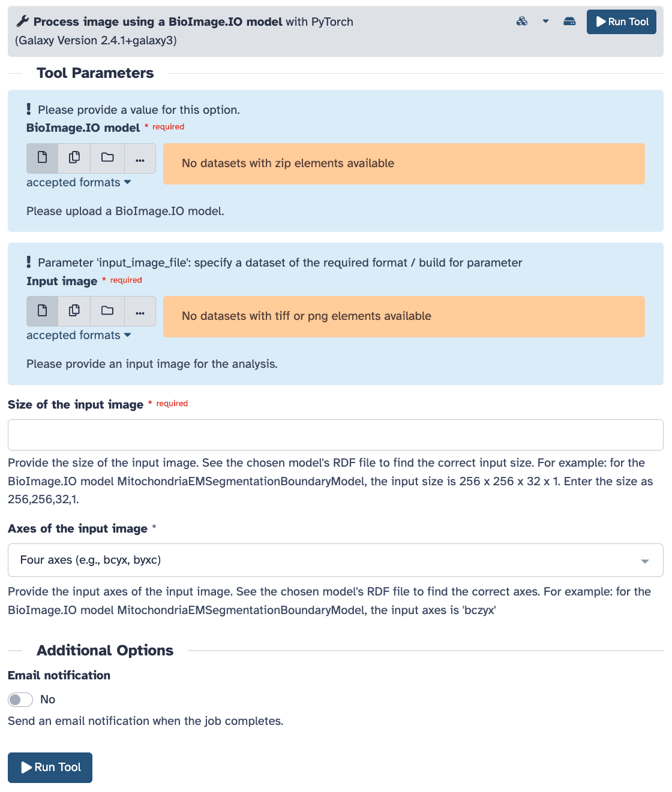

A new Galaxy integration enables researchers to access AI models from the [BioImage Model Zoo (BioImage.IO)](https://bioimage.io/#/).
This integration bridges open-source AI models and an accessible, workflow-based computational environment, allowing scientists across disciplines to include deep learning
models in their workflows.
This integration is a leap forward for the AI4Life project, which aims to democratize AI in life sciences. “We’re broadening our focus to engage a wider community of
users by expanding the reach of the BioImage.IO Model Zoo,” explains Diana Chiang Jurado, who, together with Leonid Kostrykin, developed a dedicated tutorial to support users.
“Using the Galaxy infrastructure, we’re not only lowering technical barriers but also making sure that researchers with no access to local computational resources can still run their analyses.”

Galaxy's established ecosystem brings some benefits: cloud-based computing, reproducibility through workflow provenance, and a collaborative environment thousands of scientists use worldwide.

Integrating these models wasn’t without its challenges. “The BioImage Model Zoo hosts models built on different architectures and frameworks,” notes Anup Kumar,
the leading developer behind the integration. “One of the most exciting outcomes,” Anup adds, “is the accessibility it provides. Scientists who don’t have a background
in AI, or who work at underfunded institutions, can now use powerful models with just a few clicks. That’s the kind of impact we’re aiming for.”

With AI-driven image analysis becoming increasingly relevant across scientific fields, from biology to earth sciences or astronomy, the integration sets the stage
for new cross-disciplinary collaborations like those outlined in the [OSCARS-FIESTA project](https://www.oscars-project.eu/projects/fair-image-analysis-across-sciences).
“Workflows created in Galaxy are easy to share and adapt,” says Leonid. “That means a model trained on biological data could inspire solutions in climate science or vice versa. It’s about breaking down silos.”

By combining rich model repositories with user-friendly, FAIR workflows, this integration makes advanced image analysis more approachable, adaptable, and impactful for scientists everywhere.

Try the tutorial developed by Diana and Leonid here: [Using BioImage.IO models for image analysis in Galaxy](https://training.galaxyproject.org/training-material/topics/imaging/tutorials/process-image-bioimageio/tutorial.html).

]

