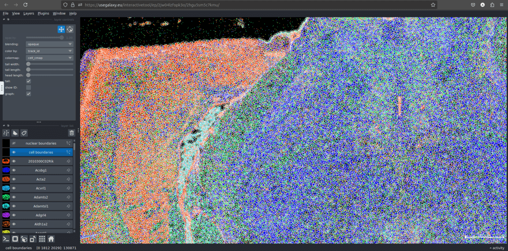
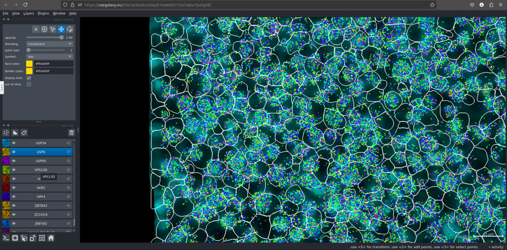

[BellaVista](https://github.com/pkosurilab/BellaVista), a lightweight open-source tool for interactive visualization and exploration of imaging-based spatial transcriptomics data,
is now available as an interactive tool in Galaxy.

# What is BellaVista?

BellaVista provides researchers with simple means for simultaneous visualization of images, transcripts, and cell/nuclei segmentation boundaries in spatial transcriptomics data.
The interactive tool in Galaxy supports data from multiple platforms including:

* Xenium (10x Genomics)
* MERSCOPE (Vizgen)

# What can I visualize with BellaVista?

Bellavista can visualize both cell and nuclei segmentation and gene expression pattern over spatial image.

This enables researchers to:

* Visualize spatial gene expression patterns
* Evaluate cell segmentation accuracy
* Validate spatial analysis discoveries

# How does it work?

To use this new interactive tool, first create an account in Galaxy and log in with your credentials. Then, you can find in the Tool panel “BellaVista Interactive”
or go to [this link](https://usegalaxy.eu/?tool_id=interactive_tool_bellavista&version=latest). Then select the technology you are using (i.e. MEROSCOPE or Xenium) and
provide images, transcripts and segmentation inputs and click "Run Tool". You can check the status of running ITs [here](https://usegalaxy.eu/interactivetool_entry_points/list).

 

Xenium data

 

MEROSCOPE data

 

# Acknowledgment

The BellaVista integration into Galaxy was accomplished during the [Galaxy Imaging Hackathon 2025](https://galaxyproject.org/events/2025-04-22-galaxy-imaging-hackathon/) at Freiburg, Germany. We would like to thank all participants and organizers who contributed to this project, making spatial transcriptomics analysis more accessible to the bioinformatics community.

Have a look at the [BelllaVista Documentation](https://bellavista.readthedocs.io/en/latest/) for more information.

Try it out on <strong>Galaxy</strong> today and explor your spatial data!

    <a href="https://usegalaxy.eu/?tool_id=interactive_tool_bellavista&version=latest">
      <button type="button" class="btn btn-primary btn-lg">Start BellaVista now</button>
    </a>

