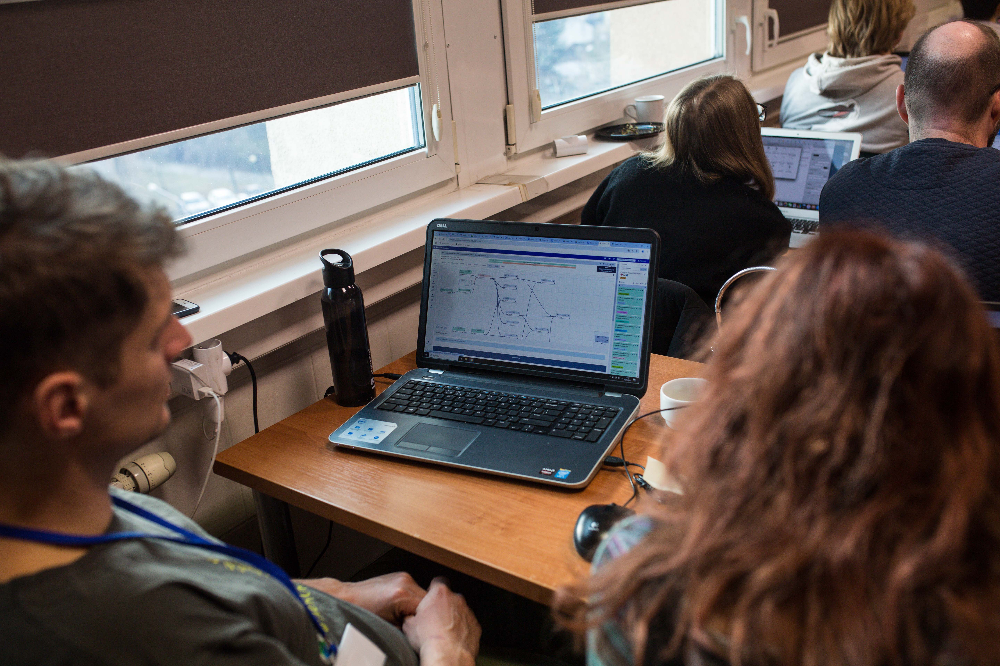

## Biodiversity Genomics in Europe

As part of the Biodiversity Genomics Europe project ([BGE](https://biodiversitygenomics.eu/)), Galaxy and TIaaS were used to teach young researchers how to produce high-quality <i>de-novo</i> genome assemblies and annotations for eukaryotic organisms. Workshops have so far been run in University of Łódź, Poland and at the Berlin Centre for Genomics in Biodiversity Research (BeGendiv), Germany making use of the Galaxy compute infrastructure and TIaaS services. Both the [BRIGHT](https://biodiversitygenomics.eu/2025/04/11/bge-joint-network-training-biodiversity-research-integrating-barcoding-genomics-and-high-throughput-technologies-bright/) and [BeGenDiv](https://biodiversitygenomics.eu/2025/01/14/a-recap-of-the-bge-workshop-at-the-berlin-center-for-genomics-in-biodiversity-research/) workshops for dna barcoding and reference genome generation introduced young researchers to the data, tools and workflows used by the biodiversity genomics community to generate high-quality genomic data for non-model organissm, including reference genome assemblies and annotations for all species across the tree of life.

{width="550"}

## Reference Genome Generation in Galaxy

In total over 50 young researchers from across Germany and Poland were introduced to the Galaxy Europe system and learned how to work with genomic data, build their own workflows, and run published workflows to generate and evaluate chromosome-scale genome assemblies and high-quality genome annotations. Using the Galaxy Europe compute resources, we were able to generate and evaluate genomes from fungi, nematodes and algae to pseudo-chromosome scale, giving the workshop participants a view as to how genomes are produced within the framework of the European Reference Genome Atlas [ERGA](https://www.erga-biodiversity.eu/) and Earth Biogenome Project [EBP](https://www.earthbiogenome.org/), aiming to produce high-quality reference genomes for all eukaryotic organisms in Europe and across the globe, respectively.

All workflows used as part of the training follow the recommendations of the ERGA Sequencing and Assembly Committee ([SAC](https://www.erga-biodiversity.eu/team-1/sac---sequencing-and-assembly-committee)) and were developed by Diego De Panis (IZW) and published for reuse by researchers anywhere openly in [{width="150"}](https://workflowhub.eu/collections/27).

{width="800"}

Example workflow generating contigs from PacBio HiFi long-reads followed by quality control of the generated assembly.

